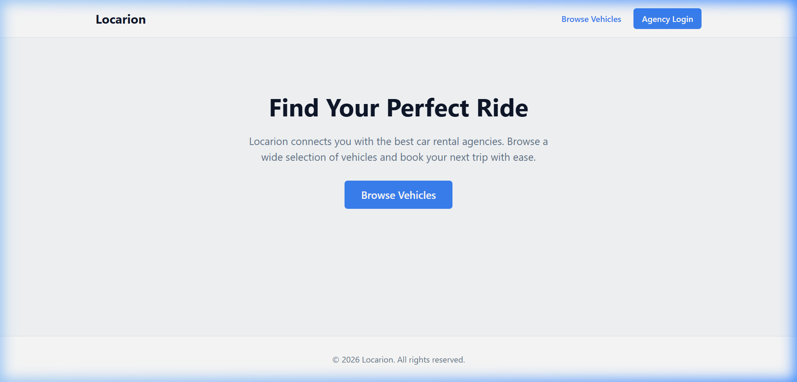
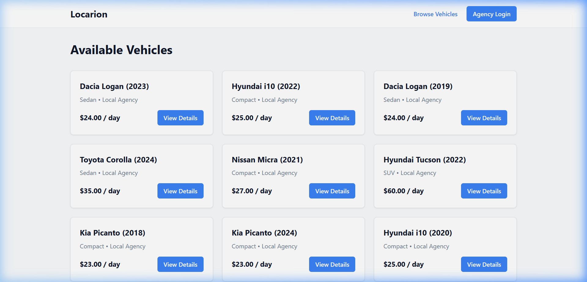
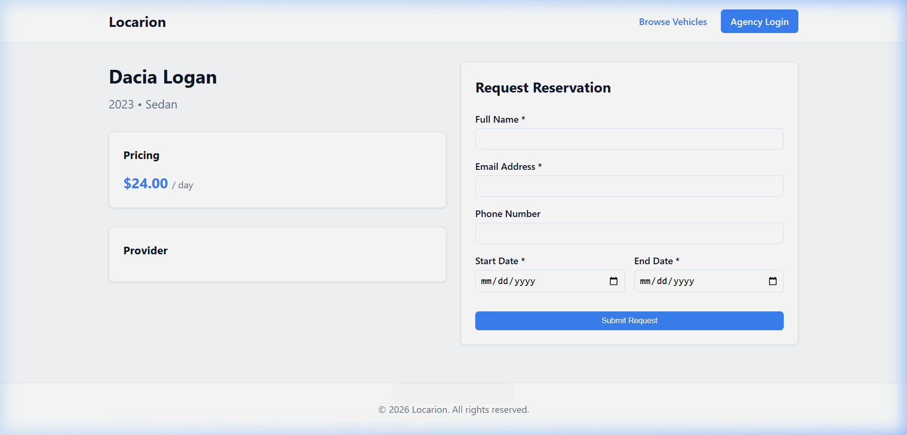
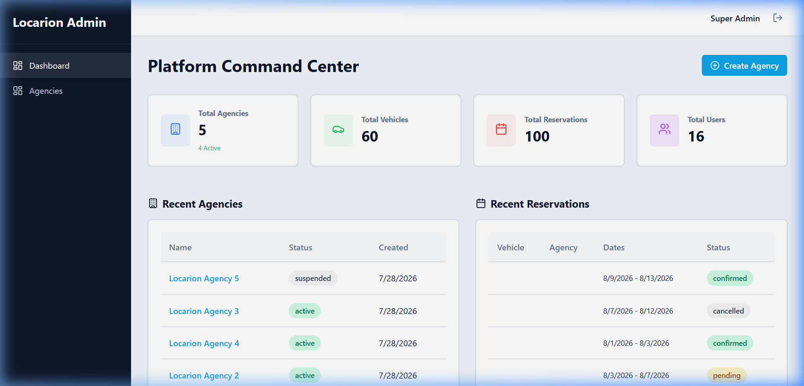
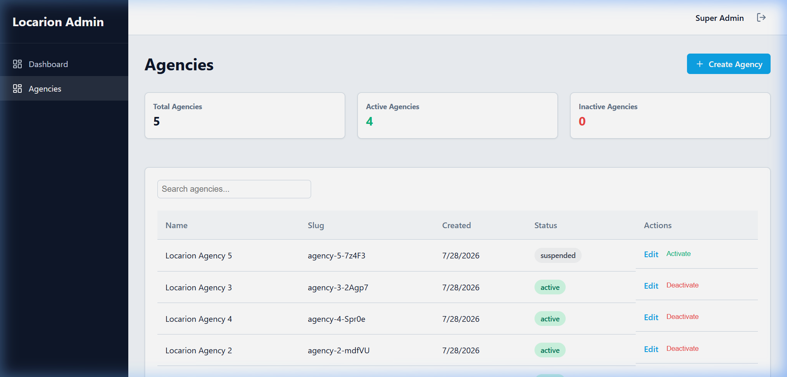
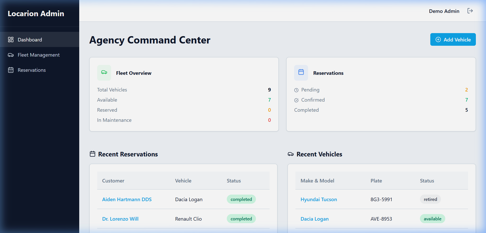
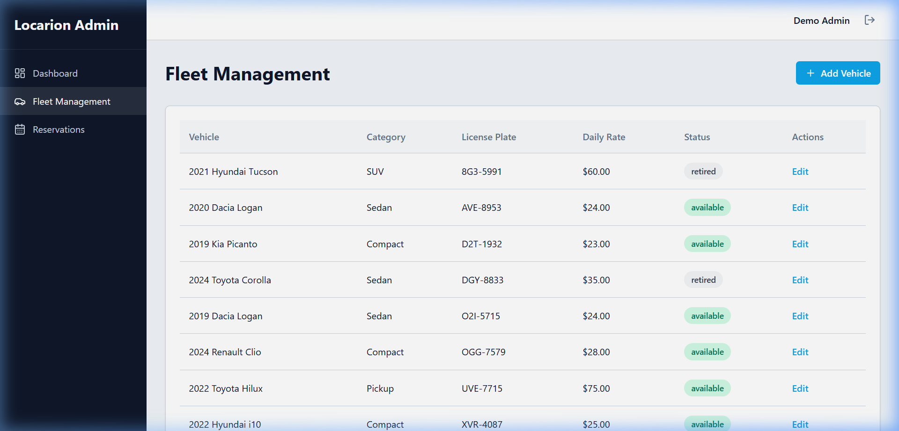
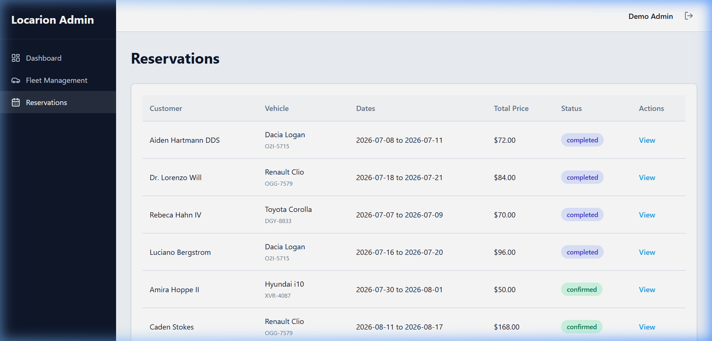
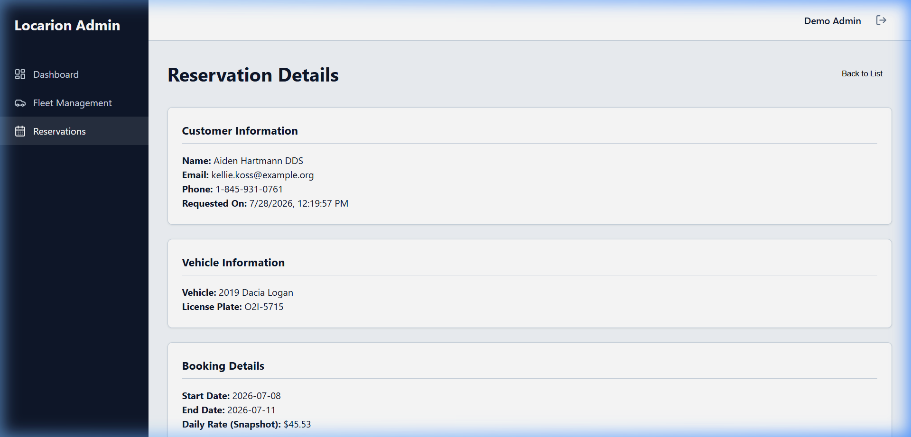

# Locarion

<p align="center">
  
</p>

Locarion is a modern, enterprise-grade Car Rental SaaS designed to seamlessly manage multi-agency fleets and reservations. Built with a Domain-Oriented Architecture, it provides an unparalleled experience for customers renting vehicles and for agency administrators managing their operations.

## ✨ Features

- **Authentication & RBAC**: Secure Sanctum SPA authentication with Spatie Roles & Permissions. Distinct roles for Super Admins, Agency Admins, and Employees.
- **Multi-Tenancy**: Complete tenant isolation at the agency level. Data scoping is automatically enforced globally.
- **Fleet Management**: Comprehensive CRUD for vehicles, categories, maintenance statuses, and dynamic pricing.
- **Reservations**: Advanced availability algorithms preventing double-bookings. Seamless workflow from Pending to Confirmed to Completed.
- **Agency Management**: Super Admins can orchestrate the entire platform, manage agency statuses, and overview operations.
- **Dashboard Command Center**: Real-time operational intelligence. Actionable insights natively tailored for both platform administrators and individual agency managers.
- **Public Vehicle Search**: A beautiful, responsive customer portal for discovering available vehicles across all active agencies.
- **Docker Ready**: Fully containerized environment for effortless deployment and CI/CD pipelines.

## 🚀 Technology Stack

### Backend
- **Framework**: Laravel 12
- **Database**: SQLite (Development) / PostgreSQL (Production)
- **Authentication**: Laravel Sanctum
- **Authorization**: Spatie Permission

### Frontend
- **Framework**: React 19 + TypeScript
- **Build Tool**: Vite
- **Styling**: Modern Vanilla CSS (No Tailwind)
- **HTTP Client**: Axios

### Operations
- **Containerization**: Docker & Docker Compose
- **CI/CD**: GitHub Actions
- **Code Quality**: Laravel Pint, PHPUnit, TypeScript Strict Mode

## 🏗 Architecture

Locarion breaks away from standard MVC patterns by adopting a highly maintainable **Domain-Oriented Architecture (DOA)**. 
Business logic is grouped into tightly focused domains (`Identity`, `Tenancy`, `Fleet`, `PlatformAdmin`, `Dashboard`) rather than traditional `app/Models` and `app/Http/Controllers`.

Each Domain encapsulates:
- Models & Policies
- Single-Responsibility Actions
- Data Transfer Objects (DTOs) & Requests
- API Resources

## ⚙️ Installation

Locarion provides a complete Docker environment for rapid onboarding.

### Prerequisites
- Docker & Docker Compose installed
- Git

### Steps
1. **Clone the repository**
   ```bash
   git clone https://github.com/yourusername/locarion.git
   cd locarion
   ```

2. **Start the Docker Stack**
   ```bash
   docker-compose up -d
   ```

3. **Install Dependencies**
   ```bash
   docker-compose exec app composer install
   cd apps/back-office && pnpm install
   cd ../public-web && pnpm install
   ```

4. **Environment Setup**
   ```bash
   docker-compose exec app cp .env.example .env
   docker-compose exec app php artisan key:generate
   ```

5. **Database Migration & Seeding**
   ```bash
   docker-compose exec app php artisan migrate:fresh --seed
   ```

6. **Running Locally**
   Start the frontend development servers:
   ```bash
   # Terminal 1 (Back-Office)
   cd apps/back-office && pnpm run dev

   # Terminal 2 (Public Web)
   cd apps/public-web && pnpm run dev
   ```

## 🔐 Demo Credentials

Use the following accounts to explore the application after seeding the database:

| Role | Email | Password | Access |
|---|---|---|---|
| **Super Admin** | `admin@locarion.com` | `password` | Platform Management |
| **Agency Admin** | `admin@demo-agency.com` | `password` | Demo Agency Management |
| **Employee** | `employee@demo-agency.com` | `password` | Restricted Agency Access |

## 📁 Project Structure

```text
locarion/
├── backend/                  # Laravel 12 API
│   └── app/Domain/           # Core Domain Logic
│       ├── Dashboard/        # Orchestration metrics
│       ├── Fleet/            # Vehicles & Reservations
│       ├── Identity/         # Users & Authentication
│       ├── PlatformAdmin/    # System-wide settings
│       └── Tenancy/          # Multi-tenant isolation
├── apps/
│   ├── back-office/          # React SPA for Admins
│   └── public-web/           # React SPA for Customers
├── docs/                     # Architecture & Documentation
├── docker/                   # Docker environment configurations
└── .github/workflows/        # CI/CD Pipelines
```

## 📸 Screenshots

### Public Experience
| Vehicle Search | Vehicle Details |
|---|---|
|  |  |

### Super Admin
| Command Center | Agency Management |
|---|---|
|  |  |

### Agency Admin
| Dashboard | Fleet Management |
|---|---|
|  |  |
| **Reservations** | **Reservation Details** |
|  |  |

## 🔮 Future Improvements

- **Stripe Integration**: Seamless online payments for reservations.
- **Contract Generation**: Automated PDF generation for rental agreements.
- **Advanced Maintenance Tracking**: Logging repair costs and scheduling routine checkups.
- **Fleet Telematics**: GPS tracking and mileage telemetry via OBD2 devices.

## 📄 License

A license has not yet been selected for this project.

The repository is currently provided for portfolio and demonstration purposes. A formal open-source license may be added in a future release.

---
*Built with ❤️ for scalable fleet management.*