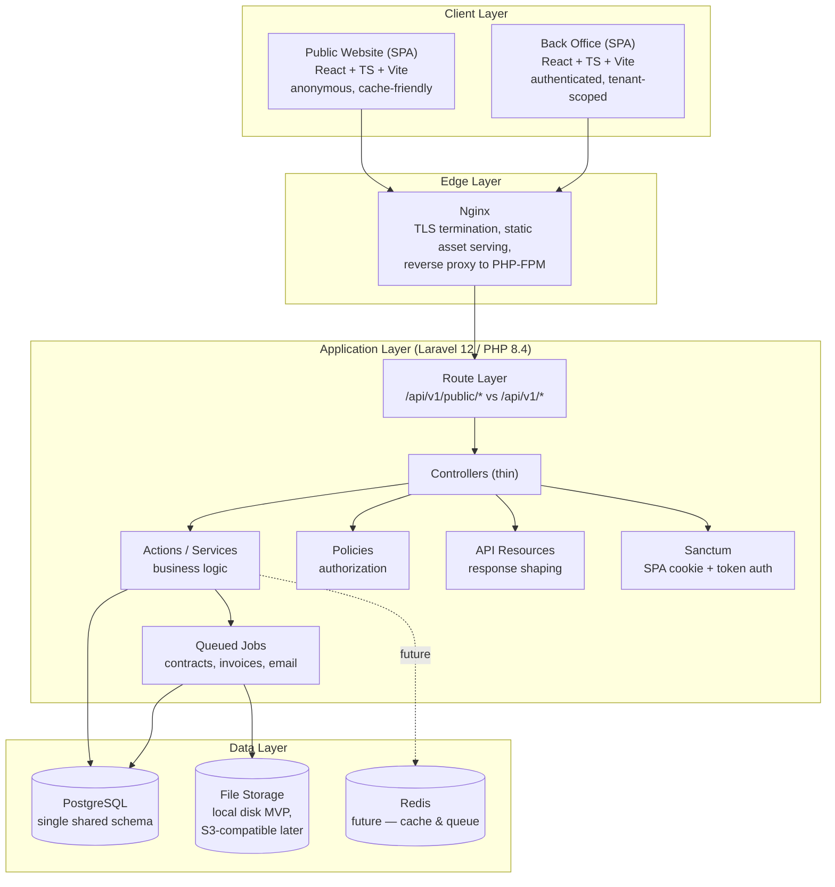
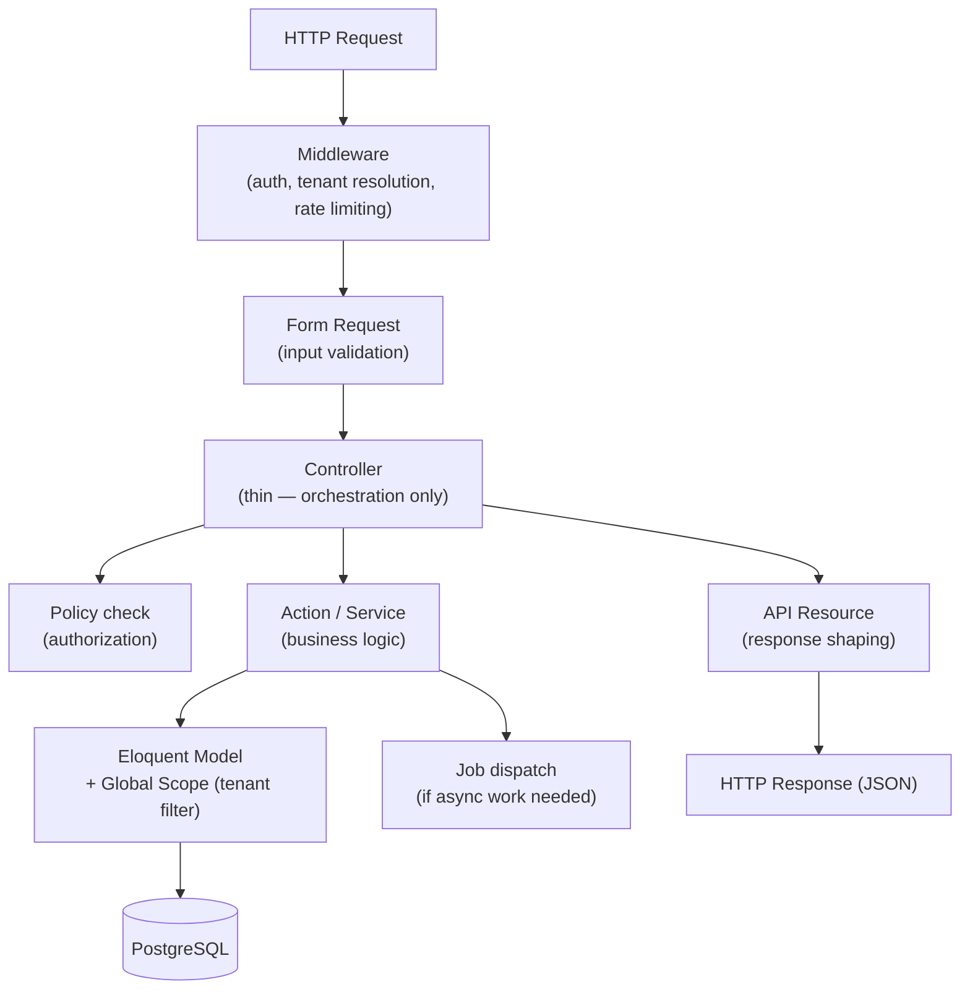
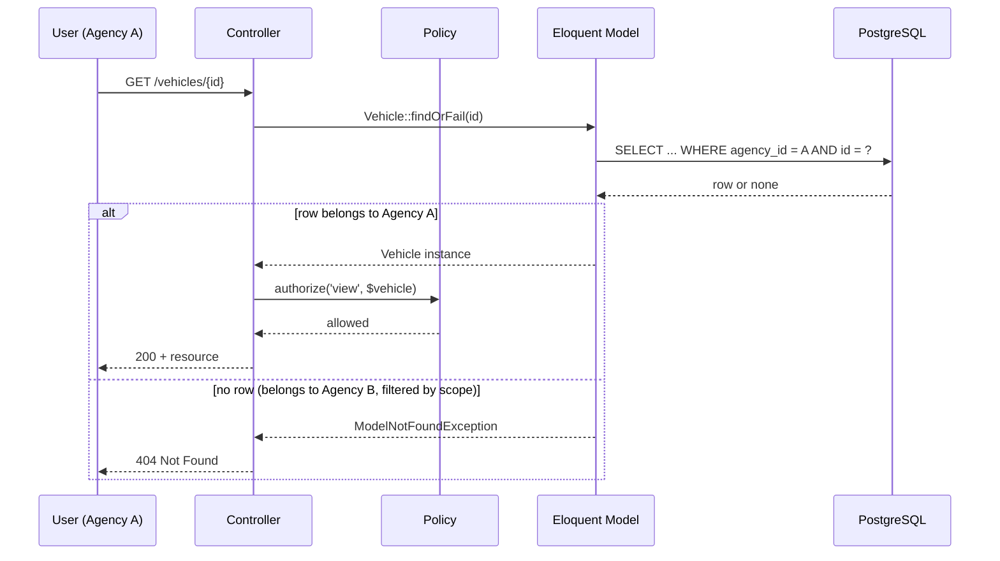
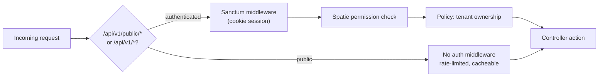
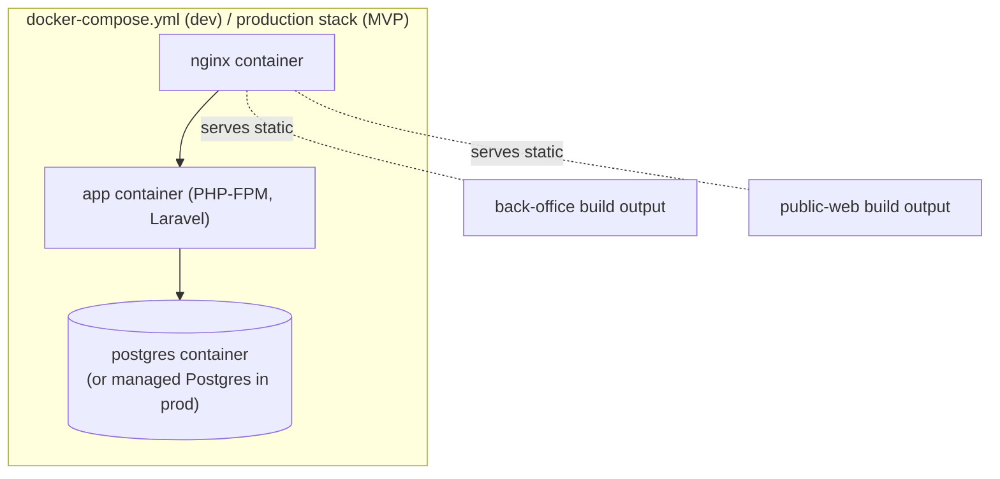

# 01 — System Architecture
## Locarion — Multi-Tenant SaaS Car Rental Platform

> **Document status:** Version 1.0 (Frozen)
> **Source of truth:** `PROJECT-BLUEPRINT.md` (frozen). This document expands the Blueprint into an implementation-ready architecture specification. It introduces no new business features and contradicts nothing in the Blueprint. Where the Blueprint is silent or ambiguous, an explicit assumption is stated inline as **`> Assumption:`**.
> **Audience:** Engineering team, technical reviewers, future maintainers.
> **Companion documents (later, not yet written):** `02-database-design.md`, `03-authorization-and-roles.md`, `04-api-design.md`, `05-cicd-and-deployment.md`, `06-testing-strategy.md`.

---

## Table of Contents

1. [Purpose](#1-purpose)
2. [High-Level Architecture](#2-high-level-architecture)
3. [Backend Architecture](#3-backend-architecture)
4. [Frontend Architecture](#4-frontend-architecture)
5. [Database Layer](#5-database-layer)
6. [Authentication & Authorization](#6-authentication--authorization)
7. [File Storage](#7-file-storage)
8. [API Layer](#8-api-layer)
9. [Infrastructure Overview](#9-infrastructure-overview)
10. [Cross-Cutting Concerns](#10-cross-cutting-concerns)
11. [Architectural Decision Records (ADR)](#11-architectural-decision-records-adr)
12. [Future Evolution](#12-future-evolution)

---

## 1. Purpose

### 1.1 Architecture Goals

This document exists to translate the Blueprint's product and technical intent (§7, §8, §12, §13 of the Blueprint) into a concrete, buildable architecture that a development team can implement without needing to re-derive design intent from first principles. Concretely, the architecture must:

| Goal | Why it matters here |
|---|---|
| **Enforce agency data isolation at multiple layers** | Blueprint §2 and §10 declare isolation "non-negotiable." A single missed `WHERE` clause must never be the only thing separating two tenants' data. |
| **Keep the public site and the back office architecturally distinct, even inside one codebase** | Blueprint §2 and §7 note these are different problems (read-heavy/cacheable vs. write-heavy/consistency-sensitive). The architecture must let them evolve independently in performance characteristics without becoming two separate systems to operate. |
| **Stay a modular monolith, not a distributed system** | Blueprint §7 explicitly rejects microservices at this scale. The architecture must impose enough internal structure (domain modules) that extraction is *possible* later without paying distributed-systems tax *now*. |
| **Be interview-defensible** | Blueprint §3 states this is a dual-purpose project. Every structural decision below should be one an engineer can explain and justify in a technical interview, not just "it works." |
| **Support an MVP timeline** | Blueprint §15 has a real (indicative) roadmap. The architecture must not introduce speculative infrastructure (Redis, message queues beyond Laravel's own, Kubernetes) before the Blueprint's own Future Enhancements (§19) call for it. |

### 1.2 Design Principles

1. **Boring technology where it doesn't matter, sharp engineering where it does** (Blueprint §2, verbatim principle carried forward). Concretely: authentication, tenancy scoping, and data integrity are over-engineered relative to the app's current size on purpose. Everything else (queue driver, cache driver, CSS approach) uses the simplest option that works.
2. **Isolation by construction, not by convention.** Tenant scoping is not something a developer must "remember to add" per query — it is structurally difficult to bypass (global scopes + policies + tenant-aware route binding, detailed in §3.6 and §6).
3. **One domain model, two audiences.** The public site and the back office read from the same Fleet/Tenancy data because the Blueprint explicitly requires no drift between what the public sees and what agencies manage (Blueprint §7 table). Architecturally this means: same database, same domain services, different route surfaces and different caching policies — not different data stores.
4. **Thin controllers, explicit business logic.** Every non-trivial decision (pricing, availability, status transitions) lives in a named, unit-testable class (Blueprint §13). This is both a testability requirement and a portfolio-legibility requirement — a reviewer should be able to find "the code that decides if a reservation can be confirmed" in one place.
5. **The deployed artifact is the tested artifact.** Per Blueprint §17, the same Docker image moves from CI → staging → production unmodified. Architecture decisions (config via environment variables only, no environment-baked build steps) must support this.
6. **Additive, not defensive, extensibility.** Future Enhancements (Blueprint §19) — payments, customer accounts, Redis, mobile, schema-per-tenant — should each be describable as "add a module / swap a driver," never as "restructure the core." §12 of this document walks through each one explicitly.

### 1.3 Non-Goals

Carried directly from Blueprint §2 and §19, restated here so this document doesn't accidentally scope-creep during implementation:

- **Not** a microservices architecture. There is one deployable backend application.
- **Not** designed for multi-region or high-availability deployment. Single Linux VM is the explicit MVP target (Blueprint §17).
- **Not** building payment processing, customer self-service accounts, notifications, or multi-language UI in this phase — these are Future Enhancements and are only considered here in terms of "does the current design block them" (§12), never implemented.
- **Not** introducing Redis, Elasticsearch, or a message broker now. The Blueprint defers these explicitly (§8, §19) until volume justifies them.
- **Not** re-litigating the technology stack choices in Blueprint §8 (Laravel 12/PHP 8.4, React/TS/Vite, PostgreSQL, Sanctum, Spatie `laravel-permission`, Docker, GitHub Actions, Nginx). Those are frozen inputs to this document.

---

## 2. High-Level Architecture

### 2.1 System Overview

Locarion is a **modular monolith**: one Laravel application exposes a single REST API consumed by two independent, statically-built React SPAs. There is exactly one database. There is exactly one deployable backend artifact. Internal modularity (Blueprint §5) is enforced through code organization and dependency direction, not through network boundaries.



### 2.2 Major Components and Responsibilities

| Component | Responsibility | Explicitly NOT responsible for |
|---|---|---|
| **Public Website SPA** | Search/filter UX, vehicle & agency detail pages, booking request submission, SEO-friendly landing pages | Any authenticated action, any write beyond submitting a booking request |
| **Back Office SPA** | Authenticated, role-aware UI for agency staff and Super Admin: fleet, customers, reservations, billing, reports, platform admin | Public search rendering (shares data, not UI) |
| **Nginx** | TLS termination, static file serving for both SPA builds, reverse proxy to PHP-FPM, first line of rate limiting | Business logic, authentication decisions |
| **Router layer** (`/api/v1/public/*` vs `/api/v1/*`) | Structural separation of anonymous vs. authenticated concerns at the routing level, so the two audiences can never accidentally share middleware/rate-limit/caching policy | Enforcing tenant isolation itself (that's Policies + Global Scopes, §3.6) |
| **Controllers** | Validate request shape (via Form Requests), delegate to an Action, return an API Resource | Business rules, direct Eloquent queries beyond simple reads |
| **Actions / Services** | Encapsulate business logic: pricing, availability checks, reservation status transitions, invoice generation triggers | HTTP concerns (status codes, request parsing) |
| **Policies** | Authorize *who* can perform an action on *which* record, re-verifying tenant ownership independent of global scopes | Business rules unrelated to authorization |
| **API Resources** | Shape Eloquent models into stable, versioned JSON contracts | Fetching additional data outside what's passed in |
| **Sanctum** | SPA cookie-session auth for both first-party SPAs; token auth path kept open for a future mobile client | Role/permission logic (delegated to Spatie `laravel-permission` + Policies) |
| **Queued Jobs** | Anything slow or non-critical-path: PDF contract generation, invoice PDF generation, transactional email | Anything that must complete before the HTTP response (kept synchronous) |
| **PostgreSQL** | Single system of record for all tenant and platform data | Caching, session storage (MVP uses DB/file drivers per §9.4, not Postgres itself) |
| **File Storage** | Persisted binary artifacts: generated contract PDFs, invoice PDFs, vehicle images | Structured/query-able data (that stays in Postgres) |

### 2.3 Why This Shape (Rationale)

The Blueprint (§7) already justifies "one API, two SPAs" over "two backends" and "SPA over SSR." This document does not re-argue those; it operationalizes them. The one addition worth stating explicitly here: **the router-level split (`/api/v1/public/*` vs `/api/v1/*`) is the seam that makes the shared-codebase trade-off safe.** Because every route is unambiguously public or authenticated at the routing layer, there is no code path where a developer must remember "this particular controller action, despite living in the authenticated route group, is actually meant to be public." The seam is structural, not a documented convention.

---

## 3. Backend Architecture

### 3.1 Laravel Application Structure

The application deliberately does **not** use Laravel's default flat structure (`app/Http/Controllers`, `app/Models` as the only organizing units). Instead it is organized around the bounded contexts already defined in Blueprint §5.

```
app/
  Domain/
    Identity/            # users, roles, permissions, auth
    Tenancy/              # agency entity, tenant scoping primitives
    PlatformAdmin/        # regions, vehicle categories, global settings, agency lifecycle
    Fleet/                # vehicles, categories, availability, vehicle search (MVP)
    Customer/             # customer records (agency-scoped)
    Reservation/           # booking lifecycle, status transitions
    Contract/             # PDF contract generation
    Billing/              # invoices, payments
    Reporting/             # aggregated read-models over the above
    AgencyProfile/         # public-facing agency page
    BookingRequest/        # public -> back-office handoff
  Http/
    Controllers/
      Api/V1/
        Public/            # controllers behind /api/v1/public/*
        Admin/             # controllers behind /api/v1/admin/*
        ...                # controllers behind /api/v1/*
    Middleware/
    Resources/             # API Resources, mirroring Domain/ folder names
  Providers/
```

> **Assumption:** Vehicle search for the public site is handled within the `Fleet` domain during the MVP — this keeps the domain count low and avoids introducing a dedicated search module before it is justified. If advanced search capabilities (e.g., full-text, faceted filters, an external search engine) are added later, Search can become an independent module at that point without disrupting the Fleet domain.

Each `Domain/{Context}` folder contains, where relevant:

```
Domain/Fleet/
  Models/          # Eloquent models (Vehicle, VehicleCategory, ...)
  Actions/         # single-purpose business logic classes
  Policies/        # authorization rules for this domain's models
  Requests/        # Form Requests for this domain's endpoints
  Scopes/          # global scopes (e.g., TenantScope)
  Events/          # domain events, if/when needed
```

> **Assumption:** the Blueprint names this pattern ("Domain-oriented folders... each with their own Models, Actions/Services, Policies, and Requests") but does not fix an exact directory tree, deferring that explicitly ("Not in scope here: ... exact folder trees"). The tree above is this document's concrete proposal, consistent with that description, and is treated as authoritative from this point forward unless revised in a later document.

### 3.2 Layered Architecture



Each layer has one job, and the direction of dependency only ever points downward (Controllers depend on Actions; Actions never depend on Controllers or HTTP concerns). This is what keeps Actions unit-testable without booting the HTTP kernel.

### 3.3 Domain Organization

Domain boundaries mirror Blueprint §5's dependency graph exactly — this document does not alter that graph, only implements it as a folder/namespace dependency rule:

| Rule | Enforcement mechanism |
|---|---|
| `Fleet`, `Customer`, `Reservation`, `Contract`, `Billing`, `Reporting` may depend on `Tenancy` | Namespace convention, code review, and engineering discipline during the MVP |
| `Tenancy` may depend on `Identity` | Same as above |
| `AgencyProfile` may depend on `Fleet` / `Tenancy` but the reverse is forbidden | Same as above — public-facing modules are consumers, never dependencies, of agency-operational modules |
| `PlatformAdmin` may depend on `Identity`; `Tenancy` may depend on `PlatformAdmin` (e.g., a Region reference) | Same as above |

Architectural boundaries are maintained through documentation, code reviews, and engineering discipline during the MVP. No automated dependency-enforcement tooling (e.g., Deptrac or similar) is introduced at this stage.

### 3.4 Services (Actions Pattern)

Per Blueprint §13, business logic lives in single-purpose **Action** classes rather than services with broad responsibility. Convention:

- One class, one verb: `CreateReservationAction`, `CalculateReservationPriceAction`, `TransitionReservationStatusAction`, `GenerateInvoiceAction`.
- Each Action has a single public method (`execute()` or `__invoke()`), takes typed input (DTOs or typed arrays), and returns a typed result.
- Actions are the unit of unit-testing for business rules — they must be callable and fully testable without an HTTP request, a database transaction commit, or a queued job actually running.
- Controllers call exactly one primary Action per endpoint (composition of multiple Actions happens *inside* an orchestrating Action, not scattered across the controller method).

> **Assumption:** the Blueprint uses the phrase "Actions/Services" (§13) without distinguishing the two. This document standardizes on **Actions** as the single pattern for business logic, and reserves the word "Service" only for stateless integration wrappers (e.g., a future `PdfGenerationService`, a future `EmailService`) that Actions call into. This avoids two competing patterns for the same concept.

### 3.5 Repositories

> **Assumption/Decision:** the Blueprint does not mandate a Repository layer, and explicitly favors Laravel's own ORM conventions ("first-class ORM" is listed as a reason for choosing Laravel, Blueprint §8). This document does **not** introduce a generic Repository pattern on top of Eloquent. Reasoning: Eloquent models already act as the persistence abstraction; adding a Repository layer on top would duplicate that abstraction without adding testability (Actions are the testable seam, not data access) and would contradict the "boring technology where it doesn't matter" principle (§1.2). Query complexity that would normally justify a Repository (e.g., the public search query) is instead encapsulated in a dedicated **Query Object** or a model **scope** (e.g., `Vehicle::availableFor($dateRange)`), which is idiomatic Laravel and keeps the ORM as the single data-access layer.

### 3.6 Policies

Authorization is checked at two independent layers, per Blueprint §10's "defense in depth" requirement:

1. **Global Scope** — every tenant-scoped Eloquent model (`Vehicle`, `Customer`, `Reservation`, `Contract`, `Invoice`, `Payment`) has a `TenantScope` global scope that automatically injects `WHERE agency_id = :current_tenant` on every query, including relations.
2. **Policy** — every controller action that touches a tenant-scoped model additionally calls a Laravel Policy (`VehiclePolicy`, `ReservationPolicy`, ...) that independently re-checks `$model->agency_id === $user->agency_id`, regardless of whether the global scope already filtered the query.



The 404-not-403 behavior (Blueprint §10, point 3) is intentional: a global-scope miss and "this record belongs to someone else" are indistinguishable from the outside, which is exactly the point — Agency B never learns that a given ID exists in Agency A's data.

Full permission matrix, role definitions, and Policy method signatures are specified in the later **Authorization & Roles** document (`03-authorization-and-roles.md`). This document only fixes the *mechanism*, not the *matrix*.

### 3.7 Validation Strategy

- All input validation happens in **Form Requests**, colocated with the domain module they belong to (`Domain/{Context}/Requests/`), never inline in controllers.
- Form Requests are also where the request-level authorization pre-check can short-circuit obviously invalid tenant references (e.g., rejecting a `vehicle_id` that doesn't parse as a UUID before it ever reaches a query).
- Validation rules encode data integrity constraints that are *also* enforced at the database level (Blueprint §9's `NOT NULL` constraints, foreign keys) — the API validation is a fast, user-friendly fail path; the database constraint is the last-resort backstop, matching the same defense-in-depth philosophy applied to tenancy.
- Business-rule validation that depends on state (e.g., "this vehicle is already reserved for these dates") is **not** expressed as a Form Request rule — it belongs in the relevant Action, since it requires querying current state and returning a domain-specific error, not a generic validation failure.

---

## 4. Frontend Architecture

### 4.1 React Application Structure

Per Blueprint §12, the frontend is a monorepo with two applications and one shared package:

```
apps/
  back-office/        # authenticated SPA
  public-web/          # public marketing/search SPA
packages/
  ui/                  # shared design system, API client, generated types
```

> **Assumption:** the Blueprint names `pnpm`/`turbo` or npm workspaces as the acceptable tooling without picking one. This document assumes **pnpm Workspaces** for the MVP — the simplest option that provides monorepo package linking without additional tooling overhead. Turborepo or a similar task-orchestration layer can be introduced later if the project grows and build times or caching become a concern.

### 4.2 Routing

- Both apps use **React Router** (client-side routing), consistent with a pure SPA approach (Blueprint §7's SSR discussion — routing stays client-side for v1).
- `back-office` routing is role-aware: routes are grouped by minimum required permission (e.g., `/reports/*` only resolves for roles with reporting access), with a route-level guard component that checks the current user's permissions (sourced from `GET /me`) before rendering, falling back to a "not authorized" state rather than a hard error.
- `public-web` routing is structured around SEO-relevant, shareable URLs: `/search`, `/vehicles/:id`, `/agencies/:id`, matching the resource groups in Blueprint §11's Public API table.

### 4.3 Component Organization

Both apps follow a **feature-folder** structure rather than type-based folders (`components/`, `hooks/`, `pages/` flattened globally), so that a feature (e.g., "reservations") is self-contained and easy to locate:

```
apps/back-office/src/
  features/
    fleet/
    customers/
    reservations/
    billing/
    reports/
    agency-admin/
  app/               # routing shell, layout, providers
  lib/               # thin wrappers over packages/ui's API client
```

`packages/ui` owns anything genuinely shared: design tokens, primitive components (Button, Table, Form controls), the typed API client, and TypeScript types generated from the backend's API contract (see §8.4). Feature folders in each app compose these primitives; they do not redefine them.

### 4.4 State Management

Per Blueprint §12's table:

| State category | Tool | Rationale |
|---|---|---|
| **Server state** (anything fetched from the API) | React Query (`@tanstack/react-query`) in both apps | Caching, request de-duplication, background refetch, and loading/error states are exactly React Query's job — reimplementing this with raw `useEffect` is unnecessary complexity the Blueprint's "boring where it doesn't matter" principle argues against |
| **UI-local state** (back office: modals, form-in-progress, selected filters) | Local component state first; Zustand/Context only where state must cross more than 2 component levels | Avoids introducing a heavier global state library (Redux) for state that is fundamentally transient and UI-scoped |
| **Public site state** | Mostly URL/query-string driven (search filters live in the URL for shareability/SEO), React Query for the underlying data | A public search page's filters *should* be reflected in the URL so results are linkable — this is a public-web-specific requirement not shared by the back office |

### 4.5 API Communication

- Both apps talk to the Laravel API exclusively through a single generated/typed client living in `packages/ui`, never through ad-hoc `fetch` calls scattered in feature folders.
- `back-office` authenticates via Sanctum's SPA cookie flow (same-site cookie, CSRF token from `GET /sanctum/csrf-cookie` before the first state-changing request) — no tokens stored in `localStorage`, which would reintroduce XSS-token-theft risk that cookie-based Sanctum auth is specifically chosen to avoid.
- `public-web` calls only `/api/v1/public/*` endpoints and never carries auth state at all.
- Both clients treat the API's versioned envelope (pagination shape, error shape — see §8.3) as a fixed contract; the generated types in `packages/ui` are the mechanism that keeps frontend and backend from silently drifting apart.

---

## 5. Database Layer

### 5.1 PostgreSQL Responsibilities

PostgreSQL is the single system of record for all structured data in the platform — both tenant-scoped operational data and platform-level reference data (Blueprint §9). It is explicitly **not** used for:

- Session storage (MVP uses the `file` or `database` session driver per environment — see §9.4)
- File/binary storage (contracts, invoices, images — see §7)
- Caching (deferred to Redis per Blueprint §19; MVP uses the `database` or `array` cache driver where caching is used at all)

### 5.2 Data Ownership

Ownership boundaries mirror Blueprint §9 and §10 exactly:

| Data category | Owned by | Scoping |
|---|---|---|
| Agencies, Users, Roles, Permissions | `Tenancy` / `Identity` domains | Platform-level (Users belong to exactly one Agency, or none, for Super Admin) |
| Regions, Vehicle Categories, global settings | `PlatformAdmin` domain | Platform-level, referenced by all agencies, writable only by Super Admin |
| Vehicles, Customers, Reservations, Contracts, Invoices, Payments | Respective agency-operational domains | **Agency-scoped** — every row carries a non-null `agency_id` |

This table is a pointer, not a redefinition — the authoritative entity relationships and column-level schema live in the later **Database Design & ERD** document (`02-database-design.md`), consistent with the Blueprint's own scoping note ("full column-level schema... lives in the later Database Design & ERD document").

### 5.3 Migration Strategy

- **One migration history for the whole schema** (Blueprint §10's stated advantage of shared-schema tenancy: "one migration run updates every tenant"). There is no per-tenant migration runner in v1.
- Migrations are Laravel's standard versioned migration files, run as part of the deployment pipeline (see the later CI/CD document) — never run manually against production.
- Because IDs are UUIDs generated at the application layer (Blueprint §9), migrations never depend on auto-increment sequence behavior, which keeps the schema portable if a future schema-per-tenant or database-per-tenant split (Blueprint §19) is ever pursued for a specific large agency.
- Destructive migrations (column drops/renames affecting tenant-scoped tables) require a documented two-step rollout (add new / dual-write / backfill / remove old) once the platform has real production data — this convention is noted here and formalized in the later CI/CD document once the team is past MVP.

---

## 6. Authentication & Authorization

This section is intentionally **high-level only** — full mechanics (permission matrix, exact Policy method list, role seeding strategy) are the subject of the later `03-authorization-and-roles.md` document, per Blueprint §6's own note that role/permission mechanics are "detailed in the later Authorization & Roles document."

- **Authentication mechanism:** Laravel Sanctum, using its SPA cookie-session mode for both first-party SPAs (Blueprint §8, §11). Token auth is architecturally available (Sanctum supports both modes simultaneously) and is reserved for a future mobile client or partner API integration (Blueprint §19) — no redesign is needed to light that path up later.
- **Authorization mechanism:** Spatie `laravel-permission` provides the roles/permissions data model (Blueprint §8); Laravel Policies (§3.6 above) are the enforcement point that consult it, combined with tenant-ownership checks.
- **Roles are fixed at the architecture level** per Blueprint §6: Super Admin, Agency Admin, Employee (permission-scoped within an agency), Customer (no login in v1), Anonymous Visitor. This document does not add or remove roles.
- **Public routes require no authentication at all** — `/api/v1/public/*` is unauthenticated by design (§2.1, §8.1), which is why it is a separate route surface rather than a set of "some endpoints are public" exceptions inside the authenticated route group.



---

## 7. File Storage

### 7.1 Local Storage Strategy (MVP)

- Generated artifacts (rental contract PDFs, invoice PDFs) and uploaded vehicle images are stored using Laravel's **filesystem abstraction** (`Storage` facade), backed by the `local` disk driver in the MVP, with files written under a tenant-namespaced path (e.g., `storage/app/agencies/{agency_id}/contracts/{reservation_id}.pdf`) so that even at the filesystem level, tenant data is not interleaved arbitrarily.
- Files are served through authenticated, tenant-checked application routes (e.g., `GET /reservations/{id}/contract`) that stream the file after a Policy check — **never** through a directly web-accessible static path — so that file access inherits the same authorization guarantees as any other tenant-scoped resource.

### 7.2 Future Cloud Compatibility

> **Assumption:** the Blueprint does not explicitly name a storage driver beyond "File Storage" in its architecture diagram (§7). This document treats "local disk now, cloud-compatible later" as the correct reading of that diagram, consistent with the Blueprint's general pattern of deferring infrastructure upgrades (Redis, multi-host) until justified by real load (§19).

Because file access always goes through Laravel's filesystem abstraction rather than direct filesystem calls, migrating to an S3-compatible object store (AWS S3, or a self-hosted equivalent like MinIO) later is a **configuration change** (swap the `local` disk driver for `s3` in `config/filesystems.php` and set credentials), not a code change to any Action, Controller, or Job that currently calls `Storage::put()` / `Storage::get()`. This is the same "additive, not defensive" extensibility principle applied to storage (§1.2, principle 6).

---

## 8. API Layer

### 8.1 REST Principles

- Resourceful, convention-driven routes (`GET/POST /vehicles`, `PATCH /vehicles/{id}`, etc.) per Blueprint §11 — the API Design document formalizes the full route list; this document fixes the *conventions* those routes must follow.
- Two route surfaces, enforced at the routing layer (§2.3, §6): `/api/v1/public/*` (anonymous, cacheable, rate-limited) and `/api/v1/*` (authenticated, tenant-scoped), with `/api/v1/admin/*` as a Super-Admin-only subset of the latter.
- Every response is shaped through an API Resource (§3.1) — Eloquent models are never serialized directly to JSON, which keeps the API contract stable even if internal column names or relationships change.

### 8.2 Versioning Strategy

- The API is versioned from day one at the URL path level: `/api/v1/...` (Blueprint §11, explicit).
- A breaking change to any resource shape or endpoint contract requires a new version prefix (`/api/v2/...`) rather than an in-place breaking change to `v1` — this is a policy decision recorded here so it doesn't need re-litigating per endpoint later.
- Additive, backward-compatible changes (a new optional field, a new endpoint) do **not** require a version bump.

### 8.3 Error Handling Philosophy

- **Consistent error envelope** across the whole API (exact JSON shape specified in the later API Design document), so frontend error-handling code is written once, in `packages/ui`'s API client, rather than per-feature.
- **Validation errors** (Form Request failures) return `422` with field-level messages.
- **Authorization failures on a real record the tenant is allowed to know exists** (e.g., an Employee without billing permission trying to view an invoice within their own agency) return `403`.
- **Tenant-isolation failures** (a record that exists but belongs to a different agency) return `404`, never `403` — this is a deliberate re-statement of the Blueprint §10 rule, because from the API layer's perspective this is the one place the "usual" REST convention (403 for "exists but not allowed") is intentionally overridden for security reasons.
- **Unhandled server errors** return `500` with no internal detail leaked (stack traces, query text) to the client; full detail goes to structured logs (§10.1) instead.

### 8.4 Frontend Contract Generation

The backend will expose a machine-readable OpenAPI schema generated from the API Resources and Form Requests. The exact tooling is decided in the later API Design document (`04-api-design.md`). Automatic TypeScript type generation from this schema — the mechanism that lets both SPAs share one source of truth for request/response shapes without hand-maintained duplicate type definitions — is **deferred until after the MVP**, once the API surface has stabilised. During the MVP, types in `packages/ui` are maintained manually and kept consistent with the API contract through code review. Introducing generated types prematurely, before the API is stable, would add tooling overhead without a commensurate benefit.

---

## 9. Infrastructure Overview

### 9.1 Docker Overview



- The MVP Docker stack consists of exactly three containers: **nginx**, **app** (PHP-FPM running Laravel), and **db** (PostgreSQL).
- A dedicated **worker container** (`queue:work`) will be introduced later, when asynchronous background jobs (contract generation, invoice PDFs, email dispatch) become necessary. Deferring it keeps the initial deployment simpler and avoids operating a queue-worker process before it is needed.
- The same container image (app) is what CI builds and what production runs — the "same image dev to prod" principle (Blueprint §17) is the reason there is no separate `Dockerfile.prod`.
- Frontend apps are **not** run as long-lived containers in production — they are built to static assets (`apps/back-office/dist`, `apps/public-web/dist`) during CI and served directly by Nginx, consistent with Blueprint §17's deployment diagram.

### 9.2 Reverse Proxy

Nginx is the single entry point in every environment (Blueprint §7, §17):

- Terminates TLS (production only; dev uses plain HTTP or a self-signed cert).
- Serves the two SPA static builds directly (no PHP involvement for static assets).
- Proxies `/api/*` to PHP-FPM.
- Owns the first layer of rate limiting for `/api/v1/public/*` (Blueprint §11 calls this surface "rate-limited"), with application-level throttling (Laravel's rate limiter) as the second layer — another instance of the defense-in-depth pattern already established for tenancy.

### 9.3 Environment Configuration

- All environment-specific values (database credentials, `APP_ENV`, `APP_DEBUG`, storage driver, mail driver) are injected via environment variables / `.env` files, never baked into the Docker image at build time — a direct consequence of the "same image, dev to prod" principle (§1.2, §9.1).
- `APP_DEBUG` is **always** `false` outside local development — this is a security-relevant configuration rule worth stating explicitly here rather than leaving implicit, since a debug-mode stack trace leaking in production would itself be a tenant-isolation risk (query text, table names, occasionally bound parameter values).

### 9.4 Development vs. Production

| Aspect | Development | Production |
|---|---|---|
| Database | Postgres container, seeded with fixtures | Postgres container or managed Postgres instance (host TBD, see later CI/CD doc) |
| Queue driver | `database` (Laravel's DB-backed queue) | `database` (MVP) — see Blueprint §19 for the future Redis migration trigger |
| Session driver | `database` or `file` | `database` |
| Cache driver | `array` or `database` | `database` (MVP) |
| Frontend | Vite dev server with HMR, proxied to local API | Pre-built static assets served by Nginx |
| TLS | Optional/self-signed | Required (Let's Encrypt or equivalent) |
| Debug mode | `true` | `false` (always) |
| Logging | Verbose, human-readable (`single` or `stack` to stdout) | Structured (JSON), shipped to log aggregation once §14 Phase 5 is reached |

---

## 10. Cross-Cutting Concerns

### 10.1 Logging

- Laravel's built-in logging (`Monolog`) is used with the `stack` channel in all environments; production targets structured (JSON) output to `stdout`, which is the convention that plays well with container-based log collection (Blueprint §14, Phase 5 — "structured logs" is an explicit deliverable).
- Every log entry that occurs within a request includes the current `agency_id` (when authenticated) and a request ID, so that a production incident can be traced back to a specific tenant's request without needing to reproduce the bug against production data directly.
- Sensitive data (passwords, full payment details, full document numbers) is never logged — only presence/absence or a masked form, if logged at all.

### 10.2 Configuration

- Laravel's standard `config/*.php` files remain the single place configuration values are *read* from within application code; `.env` is the only place they are *set* per-environment. No component should read `getenv()` directly outside a `config/*.php` file — this keeps configuration centrally documented and testable (config values can be overridden in tests without touching real environment variables).

### 10.3 Validation

Restated from §3.7 for completeness as a cross-cutting concern: input-shape validation lives in Form Requests; state-dependent business validation lives in Actions; data-integrity validation is additionally backstopped by database constraints. All three layers exist simultaneously by design, not redundantly.

### 10.4 Exception Handling

- A single, centralized exception handler (Laravel's `app/Exceptions/Handler.php` or the equivalent Laravel 12 exception-handling registration) maps domain and framework exceptions to the API's consistent error envelope (§8.3).
- Domain-specific exceptions (e.g., `ReservationCannotBeConfirmedException`) are custom exception classes living alongside the Action that throws them, caught centrally and mapped to an appropriate HTTP status and a human-readable, non-leaky message.

### 10.5 Security

Beyond the tenancy-specific defense-in-depth already covered (§3.6, §5, §6):

- **CSRF protection** for the SPA cookie-auth flow, via Sanctum's built-in CSRF cookie mechanism (§4.5).
- **Rate limiting** on both route surfaces, more aggressive on `/api/v1/public/*` (anonymous, higher abuse surface) than on authenticated routes.
- **Mass-assignment protection** — every Eloquent model declares an explicit `$fillable` list; `agency_id` in particular is **never** mass-assignable from request input on any tenant-scoped model — it is always set server-side from the authenticated user's own agency, never trusted from the request body. This closes off the most direct possible tenant-isolation bypass (a malicious or buggy client simply sending a different `agency_id`).
- **Dependency and image scanning** as part of CI (formalized in the later CI/CD document), consistent with Blueprint §14's CI phase.

### 10.6 Localization

> **Assumption:** Blueprint §19 lists multi-language support (Arabic/French alongside English) as an explicit **future** enhancement, out of scope for v1. This document therefore does not build a localization framework into v1, but notes the structural hook for later: API Resources and validation messages should route through Laravel's standard translation helpers (`__()`, language files) from day one, even with only an `en` locale populated, so that adding `ar`/`fr` locale files later is additive (new language files) rather than a refactor of every string in the codebase. This is a low-cost hedge, not scope creep — no UI language switcher or `Accept-Language` negotiation is built in v1.

### 10.7 Time Zones

> **Assumption:** the Blueprint does not specify a time zone policy. This document assumes: **all timestamps are stored in UTC in PostgreSQL** (Postgres `timestamptz` columns), and all date/time presentation/formatting (e.g., reservation start/end dates, invoice dates) happens at the frontend layer in the agency's or user's local time zone. This is the conventional, low-risk default for a platform whose agencies may span multiple regions (Blueprint §9's `Region` entity implies exactly this multi-region reality), and avoids a whole class of off-by-one-day bugs in reservation date ranges that a naive local-time storage strategy would invite.

---

## 11. Architectural Decision Records (ADR)

This table indexes the architecturally significant decisions **already made by the Blueprint** and carried forward here as binding, plus the small number of implementation-level decisions this document adds on top. Each is phrased as a decision + rationale, in the standard ADR spirit, without the overhead of one file per decision at this stage.

| # | Decision | Rationale | Source |
|---|---|---|---|
| ADR-01 | Single Laravel REST API serving two independent React SPAs, rather than separate backends per audience | One source of truth for pricing/availability logic; avoids drift between public search and back-office data; one CI/CD pipeline | Blueprint §7 |
| ADR-02 | Modular monolith with enforced internal domain boundaries, not microservices | Correct trade-off at current scale (single team, single deployment); domain boundaries preserve a future extraction path without paying distributed-systems cost now | Blueprint §7, §5 |
| ADR-03 | Client-rendered SPA (not SSR) for the public site, with SEO mitigations (pre-rendered meta tags, sitemap) | Spec fixes React + Vite; SSR migration path (Next.js/Inertia+SSR) is kept open without an API redesign if SEO underperforms | Blueprint §7 |
| ADR-04 | Shared database, shared schema, row-level tenant scoping (`agency_id` column + global scopes), not schema-per-tenant or DB-per-tenant | Keeps migrations, backups, and cross-tenant platform analytics trivial at MVP scale; isolation risk mitigated via defense-in-depth rather than DB-level physical separation | Blueprint §10 |
| ADR-05 | Defense-in-depth tenant isolation: global scope + independent Policy check + tenant-aware route-model binding (404 not 403) + DB constraints | A single missed scope must never be the only thing separating two tenants' data | Blueprint §10 |
| ADR-06 | UUID primary keys on all tenant-exposed resources, not auto-increment integers | Prevents record-count/enumeration leakage across tenants over a public-facing REST API | Blueprint §9 |
| ADR-07 | No customer login/auth in v1; reservations entered by staff or promoted from a public booking request | Mirrors real small-agency operating practice; meaningfully shrinks v1 scope (no customer auth/reset/dashboard) | Blueprint §6 |
| ADR-08 | Laravel Sanctum (SPA cookie mode) for both first-party SPAs, with token-mode reserved for a future mobile/partner client | Avoids `localStorage` token storage (XSS risk) for first-party SPAs while keeping a non-disruptive path to token auth later | Blueprint §8, §11 |
| ADR-09 | Spatie `laravel-permission` for RBAC data model, enforced via Laravel Policies | Battle-tested primitives over hand-rolled ACL; Policies are the single enforcement seam that also carries the tenant-ownership re-check | Blueprint §8 |
| ADR-10 | Actions/Services pattern for business logic; thin controllers | Keeps pricing/availability/status-transition logic unit-testable in isolation from HTTP; controllers stay orchestration-only | Blueprint §13 |
| ADR-11 | No generic Repository layer on top of Eloquent | Eloquent already is the persistence abstraction at this scale; a Repository layer would duplicate it without adding testability, which lives in the Actions layer instead | This document, §3.5 |
| ADR-12 | Trunk-based Git with short-lived feature branches, not GitFlow | Fits solo/small-team, CI/CD-driven, frequent-release cadence; avoids GitFlow ceremony this project's scale doesn't justify | Blueprint §16 |
| ADR-13 | Same Docker image promoted unmodified from CI through staging to production | Structural guarantee that "what you tested is what you shipped"; environment differences live entirely in env vars, never in the image | Blueprint §17 |
| ADR-14 | Redis, Elasticsearch/Typesense, message broker deliberately deferred | Avoids premature infrastructure the current MVP scale doesn't justify; explicit triggers for revisiting are volume/load, not calendar time | Blueprint §8, §19 |
| ADR-15 | Local disk file storage in v1, behind Laravel's filesystem abstraction, with S3-compatible storage as a config-only future swap | Avoids provisioning/operating an object store before it's needed while keeping the migration a config change, not a code change | This document, §7 |
| ADR-16 | All timestamps stored in UTC (`timestamptz`); locale/time zone presentation is a frontend concern | Avoids off-by-one-day bugs for a platform whose agencies span multiple regions | This document, §10.7 |

---

## 12. Future Evolution

This section walks through each item in Blueprint §19's Future Enhancements list and states, explicitly, why the architecture above does not block it — the point being that none of these require a rewrite of the core, only an addition or a driver swap.

| Future item (Blueprint §19) | Why this architecture accommodates it without major redesign |
|---|---|
| **Online payments** (Stripe/local gateway) | Slots in as a new `Billing` sub-flow: a new Action (`InitiatePaymentAction`) and a webhook-receiving route on the existing API. Invoices/Payments tables already exist in the domain model (Blueprint §9) precisely so this is additive. |
| **Customer accounts** (self-service login, history) | `Customer` already exists as a first-class agency-scoped entity (Blueprint §6, §9). Adding auth to it means adding a new authenticatable guard/role, not restructuring the `Customer` domain or the Reservation lifecycle that already references it. |
| **Subscription billing for agencies** | A new `PlatformAdmin`-adjacent concern (agency-level billing state), independent of the existing per-reservation `Billing` domain — no overlap or conflict with existing invoice/payment modeling. |
| **Redis** (cache + queue driver) | Laravel's queue and cache are already accessed through their driver abstractions (`config/queue.php`, `config/cache.php`); introducing Redis is a driver/config change plus a new container in `docker-compose.yml`, not a code change to any Action or Job. |
| **Notifications** (email/SMS) | Laravel's Notification system sits naturally on top of the existing Queued Jobs mechanism (§3, §9.1) already built for contracts/invoices — a new Notification class per event, dispatched from existing Action classes at their existing state-transition points. |
| **Multi-language support** | The translation-helper hook is already in place (§10.6) even though only `en` is populated in v1; adding `ar`/`fr` is new language files, not a code refactor. |
| **Native mobile app** | Sanctum's token-auth mode is already architecturally live alongside SPA cookie mode (§6, ADR-08); a mobile client consumes the same `/api/v1/*` surface via token auth with zero backend redesign. |
| **Elasticsearch/Typesense for search** | The `Search` domain module (Blueprint §5) is already isolated from `Fleet`'s own storage; swapping its query backend from Postgres full-text to a dedicated search engine changes only the `Search` module's internals, not any other domain that depends on it. |
| **Schema-per-tenant / DB-per-tenant for a specific large agency** | Because every tenant-scoped table already carries `agency_id` as the isolation key (ADR-04, ADR-06), migrating one specific tenant to its own schema/database is a data-migration exercise, not a re-architecture — the application-level tenant-resolution concept (§6, §3.6) doesn't change, only where the resolved tenant's data physically lives. |
| **Horizontal scaling / multi-host / managed Postgres** | The application is already stateless at the app-container level (sessions/cache in DB or Redis, not in-process) — a requirement of the "same image, dev to prod" principle (§1.2, ADR-13) — so horizontal scaling is "run more copies of the same container behind Nginx/a load balancer," not a redesign of the app itself. |

**Overall principle carried forward:** every future item above extends a module, swaps a driver, or adds a new route/table — none require moving a domain boundary already fixed by Blueprint §5, changing the tenancy model fixed by Blueprint §10, or splitting the single API into multiple services. That is the concrete test this architecture was designed to pass.

---

## 13. Development Principles

The following concise guidelines govern day-to-day engineering decisions on this project. They are derived from the Blueprint's overall philosophy (§2, §13) and apply to every pull request and code review.

1. **Follow Laravel conventions.** Prefer idiomatic Laravel patterns over custom abstractions. When in doubt, ask: "what would a standard Laravel project do here?"
2. **Keep controllers thin.** Controllers validate input (via Form Requests), delegate to an Action, and return an API Resource. Business logic does not belong in controllers.
3. **One Action = one responsibility.** Each Action class encapsulates exactly one business operation. Composition of multiple operations is done inside an orchestrating Action, not by chaining Actions in a controller.
4. **Prefer simplicity over cleverness.** Code that is easy to read and reason about at 2 a.m. during an incident is more valuable than code that is elegant but opaque.
5. **Avoid premature optimization.** Do not introduce caching, queueing, denormalization, or infrastructure complexity until a real, measured problem justifies it.
6. **Build the MVP first.** Every feature, abstraction, and piece of infrastructure introduced before the MVP is shipped must be justified against the question: "does this unblock or accelerate the MVP, or is it speculative?"

---

*This document expands `PROJECT-BLUEPRINT.md` and introduces no features or decisions the Blueprint does not already imply, except where explicitly marked `> Assumption:`. Those assumptions are proposals, not settled fact, and should be confirmed or corrected before the next document (`02-database-design.md`) is written, since the database design will build directly on §5 and §11 of this document.*
