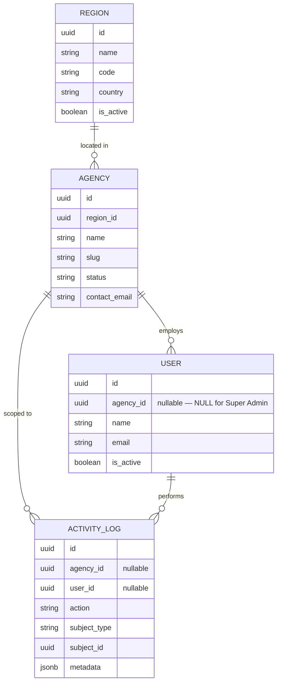
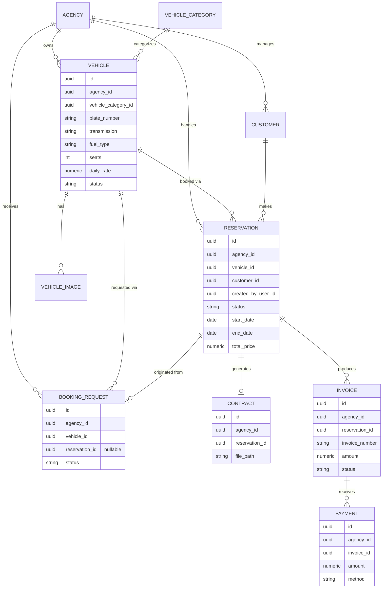
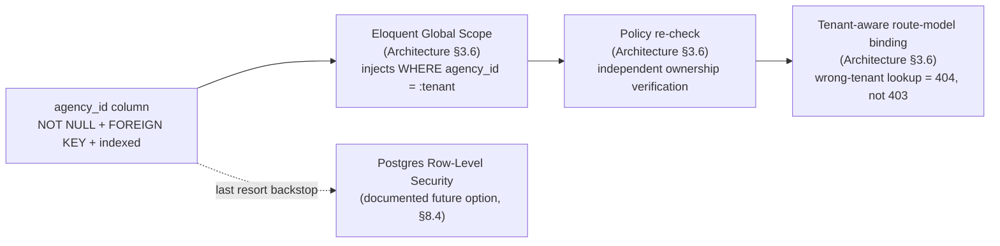

# 02 — Database Design
## Locarion — Multi-Tenant SaaS Car Rental Platform

> **Document status:** Version 1.0 (Frozen)
> **Source of truth (frozen, do not reinterpret):** `PROJECT-BLUEPRINT.md`, `01-system-architecture.md` (Version 1.0)
> **Purpose of this document:** translate the approved architecture into a production-quality, implementation-ready database design — detailed enough that Laravel migrations, Eloquent models, factories, seeders, and validation rules can be written directly from it.
> **Scope discipline:** this document introduces no new business features and redesigns no existing module. Where the Blueprint or the Architecture document is silent on a technical detail, an explicit assumption is stated inline as **`> Assumption:`**.
> **Companion documents:** `03-authorization-and-roles.md`, `04-api-design.md`, `05-cicd-and-deployment.md`, `06-testing-strategy.md`.

---

## Table of Contents

1. [Purpose](#1-purpose)
2. [Database Philosophy](#2-database-philosophy)
3. [Entity Overview](#3-entity-overview)
4. [Complete Entity Specifications](#4-complete-entity-specifications)
5. [Relationships](#5-relationships)
6. [Constraints & Business Rules](#6-constraints--business-rules)
7. [Indexing Strategy](#7-indexing-strategy)
8. [Multi-Tenancy Strategy](#8-multi-tenancy-strategy)
9. [Migration Strategy](#9-migration-strategy)
10. [Seed Data](#10-seed-data)
11. [Performance Considerations](#11-performance-considerations)
12. [Backup & Recovery Considerations](#12-backup--recovery-considerations)
13. [Architectural Decisions (ADR)](#13-architectural-decisions-adr)

---

## 1. Purpose

The database is the single system of record for Locarion (Architecture §5.1) and the layer where the platform's most important guarantee — **agency data isolation** (Blueprint §2, §10) — gets its final, physical backstop. This document exists to fix the exact schema so that:

| Objective | How the schema serves it |
|---|---|
| **Multi-tenancy** | Every tenant-scoped table carries a mandatory, indexed, foreign-keyed `agency_id` column (Blueprint §9, Architecture §3.6, §8 of this document) — the physical anchor that the application's global scopes and Policies both key off. |
| **Maintainability** | One shared schema, one migration history (Architecture §5.3), consistent naming and typing conventions (§2 of this document) so any engineer can predict a column's name/type before looking it up. |
| **Scalability** | UUID keys, proper indexing, and a schema that doesn't assume single-tenant scale, while explicitly avoiding premature optimizations (partitioning, read replicas) the MVP doesn't need yet (§11). |
| **Data integrity** | Foreign keys with explicit `ON DELETE` behavior, `NOT NULL` where business rules require it, `CHECK` constraints for date ranges, and unique constraints scoped correctly (globally vs. per-agency) — the database-level half of the defense-in-depth validation strategy already established in Architecture §3.7, §10.3. |
| **Performance** | Indexes chosen to match the platform's two real query shapes: public, filtered, read-heavy search (Blueprint §7) and authenticated, tenant-scoped CRUD (§7 of this document). |
| **Security** | UUIDs (not sequential IDs) to prevent enumeration (Blueprint §9), mass-assignment protection carried at the application layer (Architecture §10.5) reinforced by `NOT NULL`/`FOREIGN KEY` constraints here, and no sensitive data (raw documents, full payment credentials) stored beyond what the business genuinely needs. |

This document does not repeat *why* shared-schema row-level tenancy was chosen over schema-per-tenant or database-per-tenant — that decision is fixed by Blueprint §10 and ADR-04 in `01-system-architecture.md`. This document only implements it, precisely.

---

## 2. Database Philosophy

### 2.1 Shared-Schema Multi-Tenancy

One PostgreSQL database, one schema (`public`), shared by every agency. Isolation is a **column**, not a boundary the database engine itself is aware of (with one documented future exception — Row-Level Security, §8.4). This is the direct implementation of ADR-04: at MVP scale, one migration history and one backup job covering every tenant is a meaningfully simpler operational story than schema-per-tenant, and cross-agency platform analytics (Super Admin stats, Blueprint §4) are a plain `GROUP BY agency_id` rather than a fan-out query.

### 2.2 UUID Primary Keys

Every table's primary key is a UUID (v4), generated **at the application layer** — not by a Postgres default like `gen_random_uuid()` — consistent with Architecture §5.3's explicit statement that "IDs are UUIDs generated at the application layer." In practice this means every Eloquent model uses Laravel's `HasUuids` trait (or an equivalent boot-time assignment), and the `id` column is declared `uuid` with no database-level default.

**Why application-layer generation, not a DB default:** it lets application code (factories, tests, Actions) reference a new record's ID before the row is persisted (e.g., to pre-build a file path for a not-yet-saved Contract), and keeps ID generation logic in one place (Eloquent) rather than split between PHP and SQL defaults.

**Why UUIDs at all:** restated from Blueprint §9 — every tenant-scoped resource is exposed over a REST API; sequential integer IDs would leak record counts and enable enumeration across tenants (`GET /vehicles/1001` incrementing to `1002` is information Agency A should never be able to use to guess at Agency B's data). UUIDs close that off entirely, independent of any application-level access control.

### 2.3 UTC Timestamps

Every timestamp column is `timestamptz` (Postgres "timestamp with time zone", which internally normalizes and stores UTC). This directly implements Architecture §10.7: all storage is UTC; local time zone presentation is exclusively a frontend concern. No table stores a naive, zone-less timestamp.

### 2.4 Soft Deletes — Applied Selectively, Not Universally

> **Decision:** soft deletes (a nullable `deleted_at` column, Laravel's standard `SoftDeletes` trait) are used **only** on entities where a row's disappearance would orphan financially or legally significant history. They are **not** applied blanket-wide, to avoid the common anti-pattern of every query needing to reason about a `deleted_at IS NULL` condition on tables where it adds no real value.

| Entity | Soft-deleted? | Why |
|---|---|---|
| Agency, Vehicle, VehicleImage, Customer, Contract | **Yes** | Reservations, invoices, and contracts hold foreign keys into these tables; hard-deleting a Vehicle or Customer that has reservation history would either orphan that history or force a cascading delete of financial records — neither is acceptable. Deactivation (`status`/`is_active` fields, §4) is the everyday lifecycle action; soft delete is reserved for genuine removal (e.g., a mistakenly created duplicate) while preserving the row for any FK that still points to it. |
| Reservation, Invoice, Payment, BookingRequest | **No** | These are themselves the historical/financial record. A reservation is never "deleted," it is **cancelled** (`status = 'cancelled'`); an invoice is never deleted, it is **voided** (`status = 'void'`). Modeling lifecycle as a status transition (not a deletion) is both more truthful to the business process and avoids ever needing to ask "was this soft-deleted or genuinely cancelled?" |
| Region, VehicleCategory | **No** | Platform-level reference data. Deactivation uses `is_active`, matching Blueprint §6's read of Super Admin managing "platform config" rather than deleting reference data out from under agencies that already use it. |
| User | **Yes** | An offboarded employee's historical association with past reservations/contracts (`created_by_user_id`, `reviewed_by_user_id`) must remain resolvable; soft delete preserves the row while `is_active = false` handles day-to-day deactivation (e.g., blocking login) without any deletion at all. |
| ActivityLog | **No** | An audit log is append-only by definition; nothing in the schema ever deletes or soft-deletes a log row in the MVP (retention policy is an operational, not schema, concern — §12). |

### 2.5 Foreign Keys & Cascading Rules

- Every foreign key is a real, database-enforced `FOREIGN KEY` constraint — never an "implicit" relationship enforced only in application code. This is the database-level half of the defense-in-depth pattern Architecture §3.6/§10.3 already establishes for authorization and validation.
- **Default cascading behavior is `ON DELETE RESTRICT`.** A row that is referenced elsewhere cannot be hard-deleted while the reference exists. Combined with §2.4's soft-delete strategy, this means: in practice, the tables that support hard deletion (Region, VehicleCategory, VehicleImage) are restricted from deletion while referenced, and the tables that don't support hard deletion at all (Agency, Vehicle, Customer, Contract, User) simply never need `RESTRICT` to fire in normal operation, since "deletion" for them is always a soft delete.
- The one deliberate exception: `VehicleImage.vehicle_id` uses `ON DELETE CASCADE` — an image has no independent existence or business meaning once its Vehicle is gone, and Vehicle itself is soft-deleted (never hard-deleted while referenced by anything else), so this cascade only ever fires in the rare case of purging a truly orphaned/erroneous Vehicle row that was never linked to any reservation.

### 2.6 Naming Conventions

| Convention | Rule | Example |
|---|---|---|
| Table names | Plural, `snake_case` | `vehicles`, `booking_requests` |
| Primary key | Always `id` (uuid) | `id` |
| Foreign key | `{singular_table_name}_id` | `agency_id`, `vehicle_id`, `reservation_id` |
| Boolean columns | `is_` / `has_` prefix | `is_active`, `is_primary` |
| Timestamp columns | `_at` suffix, always `timestamptz` | `created_at`, `verified_at`, `paid_at` |
| Enumerated/status columns | Singular noun, `varchar` + `CHECK` (see §2.7) | `status`, `transmission`, `fuel_type` |
| Money columns | `numeric(10,2)`, never `float`/`double` | `daily_rate`, `amount` |

### 2.7 Enumerated Values

> **Assumption:** neither the Blueprint nor the Architecture document specifies how enumerated fields (reservation `status`, vehicle `transmission`, etc.) should be implemented at the database level. This document uses Laravel's portable `enum()` migration helper, which on PostgreSQL creates a `varchar` column with a `CHECK` constraint listing the allowed values — **not** a native Postgres `ENUM` type. Reasoning: adding a new allowed value later (e.g., a new fuel type) is a simple migration that redefines the `CHECK` constraint, whereas native Postgres enums require the more ceremonious `ALTER TYPE ... ADD VALUE` and cannot easily be used inside a single transaction in older Postgres versions. This favors maintainability over the marginal storage/performance benefit of a native enum at this scale.

### 2.8 Data Integrity Principles

1. **NOT NULL by default; nullable only when the business genuinely allows absence.** Every field's nullability in §4 is a deliberate decision, not an oversight.
2. **The database is the last line of defense, not the first.** Form Request validation (Architecture §3.7) is the fast, user-facing fail path; the schema's constraints exist so that a bug in application code can never produce an invalid row, full stop.
3. **Cross-column consistency that SQL can't express declaratively (e.g., "a Reservation's `agency_id` must match its Vehicle's `agency_id`") is enforced in the relevant Action, not via a database trigger.** This keeps the enforcement logic visible in one place (Actions, per Architecture §3.4) rather than split between PHP and database triggers. This is a deliberate simplicity trade-off, revisited in §6 and §13 (ADR-DB-06).
4. **Money is never a floating-point type.** All monetary columns are `numeric(10,2)` to avoid floating-point rounding error in financial calculations — non-negotiable for a platform with invoices and payments.

---

## 3. Entity Overview

| Entity | Domain (per `01-system-architecture.md` §3.1) | Description | Tenant-Scoped? |
|---|---|---|---|
| `Region` | PlatformAdmin | Geographic region used to group agencies and power location-based public search | No — platform-level |
| `VehicleCategory` | PlatformAdmin | Standardized vehicle category (Economy, SUV, ...) shared across all agencies | No — platform-level |
| `Agency` | Tenancy | A rental agency tenant; the root entity every tenant-scoped row ultimately points back to | No — *is* the tenant, not scoped to one |
| `User` | Identity | A platform user: Super Admin, Agency Admin, or Employee | Conditional — `agency_id` is `NULL` only for Super Admin |
| Roles / Permissions | Identity | Provided by the Spatie `laravel-permission` package (Blueprint §8); not redesigned here | Conditional — see §4.4 |
| `Vehicle` | Fleet | A rentable vehicle owned by one agency | Yes |
| `VehicleImage` | Fleet | An image associated with a vehicle | Yes |
| `Customer` | Customer | A customer record maintained by one agency (no login, Blueprint §6) | Yes |
| `Reservation` | Reservation | A booking of one vehicle, by one customer, within one agency | Yes |
| `Contract` | Contract | The generated PDF rental agreement for a reservation | Yes |
| `Invoice` | Billing | A billing document tied to a reservation | Yes |
| `Payment` | Billing | A payment record tied to an invoice | Yes |
| `BookingRequest` | BookingRequest | A public visitor's booking inquiry, pending staff review | Yes |
| `ActivityLog` | Identity (cross-cutting) | Audit trail of significant actions across the platform | Conditional — `agency_id` is `NULL` for platform-level Super Admin actions |

> **Note — Reporting and AgencyProfile have no dedicated tables.** Per Blueprint §5, `Reporting` is "aggregated views over the above" and `AgencyProfile` is "public-facing agency page" — both are **read models over existing entities** (`Agency`, `Region`, `Vehicle`, `Reservation`, `Invoice`), not independent data. `Reporting` is implemented as queries/aggregations in `Reporting` Actions (Architecture §3.4); if reporting query cost ever becomes a real, measured problem, a materialized view is the natural next step (§11) — not introduced now. `AgencyProfile` is simply `Agency` plus its `Region` and public `Vehicle` listing, rendered by the public-facing route surface (Architecture §2.1) — no schema of its own.

> **Note — Search has no dedicated table.** Per Architecture §3.1, public vehicle search is a capability of the `Fleet` domain for the MVP, implemented as filtered queries (an `availableFor()`-style scope, Architecture §3.5) directly over `vehicles` (joined with `vehicle_categories`, `agencies`, and `regions`) — not a separate search index or table. If Elasticsearch/Typesense is introduced later (Blueprint §19), it would consume this same data, not replace it.

---

## 4. Complete Entity Specifications

### 4.1 `Region` (PlatformAdmin)

**Purpose:** groups agencies geographically so the public site can filter search by region/city (Blueprint §4) and so an Agency has a stable, referenceable location.

| Field | Type | Nullable | Default | Notes |
|---|---|---|---|---|
| `id` | uuid | No | *(app-generated)* | Primary key |
| `name` | varchar(100) | No | — | Display name, e.g. "Central Region" |
| `code` | varchar(20) | No | — | Short unique code used in URLs/filters |
| `country` | varchar(100) | No | — | Country name |
| `is_active` | boolean | No | `true` | Deactivation without deletion (§2.4) |
| `created_at` | timestamptz | No | now() | |
| `updated_at` | timestamptz | No | now() | |

Constraints: unique on `code`.

### 4.2 `VehicleCategory` (PlatformAdmin)

**Purpose:** shared, platform-managed vehicle classification (Economy, Compact, SUV, Luxury, Van, ...) used identically by every agency and by public search filters (Blueprint §4).

| Field | Type | Nullable | Default | Notes |
|---|---|---|---|---|
| `id` | uuid | No | *(app-generated)* | Primary key |
| `name` | varchar(60) | No | — | e.g. "SUV" |
| `slug` | varchar(60) | No | — | URL-friendly identifier, unique |
| `description` | text | Yes | `NULL` | Optional public-facing description |
| `is_active` | boolean | No | `true` | Deactivation without deletion |
| `created_at` | timestamptz | No | now() | |
| `updated_at` | timestamptz | No | now() | |

Constraints: unique on `slug`.

### 4.3 `Agency` (Tenancy)

**Purpose:** the tenant root. Every agency-scoped row across the schema ultimately points back to a row here via `agency_id`.

| Field | Type | Nullable | Default | Notes |
|---|---|---|---|---|
| `id` | uuid | No | *(app-generated)* | Primary key; **this is the tenant-isolation key referenced everywhere else** |
| `region_id` | uuid | No | — | FK → `regions.id`, `ON DELETE RESTRICT` |
| `name` | varchar(150) | No | — | Trading name (Blueprint §9's `name`) |
| `slug` | varchar(150) | No | — | URL-friendly identifier for the public Agency Profile page, unique |
| `status` | varchar(20) | No | `'active'` | `active` \| `suspended` (Blueprint §9's `status`; enum via CHECK, §2.7) |
| `contact_email` | varchar(150) | No | — | |
| `contact_phone` | varchar(30) | Yes | `NULL` | |
| `address` | text | Yes | `NULL` | Physical address, public-facing |
| `logo_path` | varchar(255) | Yes | `NULL` | File Storage path (Architecture §7) |
| `description` | text | Yes | `NULL` | Public-facing "about the agency" copy |
| `created_at` | timestamptz | No | now() | |
| `updated_at` | timestamptz | No | now() | |
| `deleted_at` | timestamptz | Yes | `NULL` | Soft delete (§2.4) |

Constraints: unique on `slug`.

> **Assumption:** Blueprint §9 lists only `id`, `name`, `status` for Agency in its high-level ERD, explicitly noting that ERD is not the full column-level schema. The additional fields above (`slug`, contact/branding fields) are this document's concretization of Blueprint §4's "Company profile / Branding & settings" feature and Blueprint §5's "Agency Profile" module, which require *some* storage — they do not add a new feature, only the columns that feature already implied.

### 4.4 `User` (Identity)

**Purpose:** a platform login — Super Admin, Agency Admin, or Employee (Blueprint §6). Customers and Anonymous Visitors are explicitly **not** represented here (Blueprint §6: no customer login in v1).

| Field | Type | Nullable | Default | Notes |
|---|---|---|---|---|
| `id` | uuid | No | *(app-generated)* | Primary key |
| `agency_id` | uuid | **Yes** | `NULL` | FK → `agencies.id`, `ON DELETE RESTRICT`. `NULL` **only** for Super Admin; `NOT NULL` for Agency Admin/Employee — enforced at the application layer (§6, ADR-DB-07) |
| `name` | varchar(150) | No | — | |
| `email` | varchar(150) | No | — | Login identifier |
| `email_verified_at` | timestamptz | Yes | `NULL` | Standard Laravel auth field |
| `password` | varchar(255) | No | — | Hashed (bcrypt/argon2, Laravel default) |
| `is_active` | boolean | No | `true` | Day-to-day deactivation (blocks login) without deletion |
| `remember_token` | varchar(100) | Yes | `NULL` | Standard Laravel auth field |
| `created_at` | timestamptz | No | now() | |
| `updated_at` | timestamptz | No | now() | |
| `deleted_at` | timestamptz | Yes | `NULL` | Soft delete (§2.4) |

Constraints: unique on `email` (platform-wide — see assumption below).

> **Assumption:** the Blueprint does not state whether `email` uniqueness is global or per-agency. This document assumes **global** uniqueness — one email address identifies exactly one login account platform-wide — since Sanctum authenticates against a single `users` table with no agency-selection step in the login flow (Architecture §6). An Employee who happens to work with two different agencies would need two distinct email addresses, which is judged an acceptable, low-likelihood edge case for v1.

**Roles & Permissions:** provided as-is by the Spatie `laravel-permission` package (Blueprint §8), using the package's **teams** feature with `team_id` mapped to `agency_id`. This gives: `roles`, `permissions`, `model_has_roles`, `model_has_permissions`, `role_has_permissions` — each role/permission assignment scoped by `agency_id` where relevant, with Super Admin's role assignment carrying a `NULL` team (global scope, no agency). The package's standard migration/schema is not reproduced here; only this scoping decision is documented, since it is the one point where Locarion's tenancy model (§8) meets the package's own model. Full role/permission matrix: `03-authorization-and-roles.md`.

### 4.5 `Vehicle` (Fleet)

**Purpose:** a rentable vehicle owned by exactly one agency (Blueprint §9's explicit example entity).

| Field | Type | Nullable | Default | Notes |
|---|---|---|---|---|
| `id` | uuid | No | *(app-generated)* | Primary key |
| `agency_id` | uuid | No | — | FK → `agencies.id`, `ON DELETE RESTRICT` |
| `vehicle_category_id` | uuid | No | — | FK → `vehicle_categories.id`, `ON DELETE RESTRICT` |
| `plate_number` | varchar(20) | No | — | Blueprint §9's `plate_number` |
| `make` | varchar(100) | No | — | e.g. "Toyota" |
| `model` | varchar(100) | No | — | e.g. "Corolla" |
| `year` | smallint | No | — | Manufacture year |
| `transmission` | varchar(20) | No | — | `manual` \| `automatic` (Blueprint §9's `transmission`; enum via CHECK) |
| `fuel_type` | varchar(20) | No | — | `petrol` \| `diesel` \| `hybrid` \| `electric` (Blueprint §9's `fuel_type`; enum via CHECK) |
| `seats` | smallint | No | — | Blueprint §9's `seats` |
| `daily_rate` | numeric(10,2) | No | — | Current list price per day |
| `status` | varchar(20) | No | `'active'` | `active` \| `maintenance` \| `retired` (enum via CHECK) |
| `created_at` | timestamptz | No | now() | |
| `updated_at` | timestamptz | No | now() | |
| `deleted_at` | timestamptz | Yes | `NULL` | Soft delete (§2.4) |

Constraints: unique on (`agency_id`, `plate_number`).

> **Assumption:** plate-number uniqueness is scoped **per agency**, not globally, per this document's decision — two different agencies could (in imported/legacy data, or across regions) have overlapping plate records, and the platform does not need to arbitrate real-world plate-registry uniqueness. This is a data-integrity scoping decision, not a business rule change.

### 4.6 `VehicleImage` (Fleet)

**Purpose:** one or more images per vehicle, for both the public listing and back-office fleet management (Blueprint §4).

| Field | Type | Nullable | Default | Notes |
|---|---|---|---|---|
| `id` | uuid | No | *(app-generated)* | Primary key |
| `agency_id` | uuid | No | — | FK → `agencies.id`, `ON DELETE RESTRICT` — denormalized directly onto this table per the platform-wide rule that every tenant-scoped table carries its own `agency_id` (Blueprint §9), not only a lookup through `vehicle_id` |
| `vehicle_id` | uuid | No | — | FK → `vehicles.id`, `ON DELETE CASCADE` (§2.5) |
| `path` | varchar(255) | No | — | File Storage path (Architecture §7) |
| `is_primary` | boolean | No | `false` | Marks the main listing thumbnail |
| `sort_order` | smallint | No | `0` | Display order |
| `created_at` | timestamptz | No | now() | |
| `updated_at` | timestamptz | No | now() | |

No soft delete — an image is not an independent financial/legal record; removing one is a genuine deletion, not a lifecycle status.

### 4.7 `Customer` (Customer)

**Purpose:** a customer record maintained by agency staff (Blueprint §6: no customer login in v1; staff-entered or promoted from a `BookingRequest`).

| Field | Type | Nullable | Default | Notes |
|---|---|---|---|---|
| `id` | uuid | No | *(app-generated)* | Primary key |
| `agency_id` | uuid | No | — | FK → `agencies.id`, `ON DELETE RESTRICT` |
| `full_name` | varchar(150) | No | — | |
| `email` | varchar(150) | Yes | `NULL` | Optional — not every walk-in customer provides one |
| `phone` | varchar(30) | No | — | Primary contact method |
| `document_type` | varchar(30) | No | — | `national_id` \| `passport` \| `driver_license` (enum via CHECK) — supports Blueprint §4's "Document verification" |
| `document_number` | varchar(50) | No | — | |
| `document_verified_at` | timestamptz | Yes | `NULL` | Set when staff confirms the document; `NULL` = unverified |
| `created_at` | timestamptz | No | now() | |
| `updated_at` | timestamptz | No | now() | |
| `deleted_at` | timestamptz | Yes | `NULL` | Soft delete (§2.4) |

Constraints: unique on (`agency_id`, `document_type`, `document_number`).

> **Note — no cross-agency customer identity.** Consistent with Blueprint §6's decision that customers have no login/account, the same real person renting from two different agencies is stored as two independent `Customer` rows, one per agency. This is a direct, intended consequence of the Blueprint's own scope decision, not a new limitation introduced here.

### 4.8 `Reservation` (Reservation)

**Purpose:** a booking of one vehicle, for one customer, within one agency — the core transactional entity of the platform (Blueprint §9's explicit example entity).

| Field | Type | Nullable | Default | Notes |
|---|---|---|---|---|
| `id` | uuid | No | *(app-generated)* | Primary key |
| `agency_id` | uuid | No | — | FK → `agencies.id`, `ON DELETE RESTRICT` — denormalized directly per Blueprint §9's own ERD example, which shows `agency_id` on `RESERVATION` directly rather than derived through `vehicle_id` |
| `vehicle_id` | uuid | No | — | FK → `vehicles.id`, `ON DELETE RESTRICT` |
| `customer_id` | uuid | No | — | FK → `customers.id`, `ON DELETE RESTRICT` |
| `created_by_user_id` | uuid | No | — | FK → `users.id`, `ON DELETE RESTRICT` — the staff member who entered/approved the booking (Blueprint §6) |
| `status` | varchar(20) | No | `'pending'` | `pending` \| `confirmed` \| `active` \| `completed` \| `cancelled` (Blueprint §9's `status`; enum via CHECK) |
| `start_date` | date | No | — | Blueprint §9's `start_date` |
| `end_date` | date | No | — | Blueprint §9's `end_date` |
| `pickup_location` | varchar(255) | Yes | `NULL` | |
| `dropoff_location` | varchar(255) | Yes | `NULL` | |
| `daily_rate_snapshot` | numeric(10,2) | No | — | `Vehicle.daily_rate` captured at booking time, so a later price change never retroactively alters an existing reservation's economics |
| `total_price` | numeric(10,2) | No | — | Computed at creation/update time by the `CalculateReservationPriceAction` (Architecture §3.4) |
| `notes` | text | Yes | `NULL` | Internal staff notes |
| `created_at` | timestamptz | No | now() | |
| `updated_at` | timestamptz | No | now() | |

No soft delete: a reservation is a business/legal record; its lifecycle is fully expressed through `status`, including cancellation (§2.4).

Constraints: `CHECK (end_date > start_date)`.

> **Assumption:** `created_by_user_id` is `NOT NULL` — every reservation, whether entered directly by staff or approved from a `BookingRequest`, is attributed to the staff member who confirmed it, consistent with Blueprint §6's decision that reservations are always staff-entered or staff-approved, never self-service.

### 4.9 `Contract` (Contract)

**Purpose:** the generated PDF rental agreement for a reservation (Blueprint §5's "Contract Generation" module).

| Field | Type | Nullable | Default | Notes |
|---|---|---|---|---|
| `id` | uuid | No | *(app-generated)* | Primary key |
| `agency_id` | uuid | No | — | FK → `agencies.id`, `ON DELETE RESTRICT` |
| `reservation_id` | uuid | No | — | FK → `reservations.id`, `ON DELETE RESTRICT` |
| `file_path` | varchar(255) | No | — | File Storage path (Architecture §7) |
| `generated_at` | timestamptz | No | now() | |
| `created_at` | timestamptz | No | now() | |
| `updated_at` | timestamptz | No | now() | Updated (not a new row) if the contract is regenerated |

Constraints: unique on `reservation_id` (at most one Contract per Reservation).

> **Assumption:** Blueprint §9's ERD notation shows `RESERVATION ||--|| CONTRACT` (a mandatory one-to-one), but the Blueprint explicitly states that diagram is "a high-level entity map only," deferring exact cardinality/optionality to this document. In practice, a Contract does not exist until a Reservation reaches a confirmable state (Blueprint §5's "Contract Generation" depends on "Reservation" in the module dependency table) — so the implementation models this as `Contract` optionally referencing a `Reservation` (a reservation may have zero or one Contract row), enforced as "at most one" via the unique constraint above, rather than a database-mandated one-to-one that would require the Contract to exist at the same moment the Reservation is created.

### 4.10 `Invoice` (Billing)

**Purpose:** a billing document tied to a reservation (Blueprint §9: `RESERVATION ||--o{ INVOICE`, one reservation may produce several invoices — e.g., a deposit and a final invoice).

| Field | Type | Nullable | Default | Notes |
|---|---|---|---|---|
| `id` | uuid | No | *(app-generated)* | Primary key |
| `agency_id` | uuid | No | — | FK → `agencies.id`, `ON DELETE RESTRICT` |
| `reservation_id` | uuid | No | — | FK → `reservations.id`, `ON DELETE RESTRICT` |
| `invoice_number` | varchar(30) | No | — | Human-readable reference, unique **per agency** (§7) |
| `amount` | numeric(10,2) | No | — | |
| `status` | varchar(20) | No | `'draft'` | `draft` \| `issued` \| `paid` \| `void` (enum via CHECK) |
| `issued_at` | timestamptz | Yes | `NULL` | Set when status moves to `issued` |
| `due_at` | timestamptz | Yes | `NULL` | |
| `created_at` | timestamptz | No | now() | |
| `updated_at` | timestamptz | No | now() | |

No soft delete: an invoice is never deleted, only **voided** (`status = 'void'`) — the financial-record equivalent of the Reservation-cancellation pattern (§2.4).

Constraints: unique on (`agency_id`, `invoice_number`).

### 4.11 `Payment` (Billing)

**Purpose:** a payment record tied to an invoice (Blueprint §9: `INVOICE ||--o{ PAYMENT`, supporting partial/installment payments).

| Field | Type | Nullable | Default | Notes |
|---|---|---|---|---|
| `id` | uuid | No | *(app-generated)* | Primary key |
| `agency_id` | uuid | No | — | FK → `agencies.id`, `ON DELETE RESTRICT` |
| `invoice_id` | uuid | No | — | FK → `invoices.id`, `ON DELETE RESTRICT` |
| `amount` | numeric(10,2) | No | — | |
| `method` | varchar(20) | No | — | `cash` \| `card` \| `bank_transfer` \| `other` (enum via CHECK) |
| `reference` | varchar(100) | Yes | `NULL` | External reference (receipt number, transaction ID) |
| `paid_at` | timestamptz | No | — | |
| `created_at` | timestamptz | No | now() | |
| `updated_at` | timestamptz | No | now() | |

No soft delete or update-in-place correction: a payment row is treated as an **immutable ledger entry**; a refund or correction is recorded as a new, separately identifiable row (this document does not add a `type`/`refund` field, since Blueprint §19 explicitly defers online payments and richer billing to a future enhancement — noted here only as a modeling principle to carry forward, not a feature added now).

> **Assumption:** the Blueprint does not specify whether `Payment.amount` can be negative (to represent a refund). This document assumes all `Payment` rows are positive amounts in v1, since refund handling is out of scope until online payments (Blueprint §19) are built — recording a refund in the MVP, if it happens at all, is an operational/manual accounting matter outside this schema, not a feature this table needs to model yet.

### 4.12 `BookingRequest` (BookingRequest)

**Purpose:** a public visitor's booking inquiry (Blueprint §5's "public → back-office handoff"), pending staff review and possible promotion into a `Reservation`.

| Field | Type | Nullable | Default | Notes |
|---|---|---|---|---|
| `id` | uuid | No | *(app-generated)* | Primary key |
| `agency_id` | uuid | No | — | FK → `agencies.id`, `ON DELETE RESTRICT` — the request always targets a specific agency's vehicle |
| `vehicle_id` | uuid | No | — | FK → `vehicles.id`, `ON DELETE RESTRICT` |
| `customer_name` | varchar(150) | No | — | Freeform, since the requester is an Anonymous Visitor (Blueprint §6), not yet a `Customer` row |
| `customer_email` | varchar(150) | Yes | `NULL` | |
| `customer_phone` | varchar(30) | No | — | |
| `requested_start_date` | date | No | — | |
| `requested_end_date` | date | No | — | |
| `message` | text | Yes | `NULL` | Visitor's freeform note |
| `status` | varchar(20) | No | `'pending'` | `pending` \| `approved` \| `rejected` \| `expired` (enum via CHECK) |
| `reservation_id` | uuid | Yes | `NULL` | FK → `reservations.id`, `ON DELETE RESTRICT` — set once approved and converted |
| `reviewed_by_user_id` | uuid | Yes | `NULL` | FK → `users.id`, `ON DELETE RESTRICT` |
| `reviewed_at` | timestamptz | Yes | `NULL` | |
| `created_at` | timestamptz | No | now() | |
| `updated_at` | timestamptz | No | now() | |

No soft delete: rejected/expired requests are retained (with their terminal `status`) for conversion-rate reporting (Blueprint §4's "Reports & Analytics").

### 4.13 `ActivityLog` (Identity, cross-cutting)

**Purpose:** an append-only audit trail supporting Blueprint §4's "Employee Management → Activity log" feature.

| Field | Type | Nullable | Default | Notes |
|---|---|---|---|---|
| `id` | uuid | No | *(app-generated)* | Primary key |
| `agency_id` | uuid | Yes | `NULL` | FK → `agencies.id`, `ON DELETE RESTRICT`. `NULL` only for platform-level Super Admin actions (e.g., suspending an agency) |
| `user_id` | uuid | Yes | `NULL` | FK → `users.id`, `ON DELETE RESTRICT`. Nullable to allow system-triggered entries (e.g., an automated status expiry) |
| `action` | varchar(100) | No | — | Dotted action name, e.g. `vehicle.created`, `reservation.status_changed` |
| `subject_type` | varchar(100) | Yes | `NULL` | The affected entity's type, e.g. `Vehicle` |
| `subject_id` | uuid | Yes | `NULL` | The affected entity's ID |
| `metadata` | jsonb | Yes | `NULL` | Small, structured context (e.g., old/new status) — never full request payloads or sensitive data (Architecture §10.1) |
| `created_at` | timestamptz | No | now() | Only column tracking time — the log is immutable, there is no `updated_at` |

> **Assumption:** the Blueprint names "Activity log" as a feature (§4) without specifying its data model or the tooling behind it. This document proposes the lightest schema that satisfies the feature — a single, generic, append-only table — rather than adopting a dedicated audit-logging package, consistent with the "boring technology where it doesn't matter" principle (Architecture §1.2). If audit requirements grow (e.g., full before/after field diffing), a dedicated package (e.g., `spatie/laravel-activitylog`) can replace this table's population logic without changing how the rest of the schema relates to it.

---

## 5. Relationships

### 5.1 Cardinality Summary

| Parent | Relationship | Child | Cardinality |
|---|---|---|---|
| `Region` | hasMany | `Agency` | 1 : N |
| `Agency` | hasMany | `User` | 1 : N (0 for Super Admin, who has no `agency_id`) |
| `Agency` | hasMany | `Vehicle` | 1 : N |
| `Agency` | hasMany | `Customer` | 1 : N |
| `Agency` | hasMany | `Reservation` | 1 : N |
| `VehicleCategory` | hasMany | `Vehicle` | 1 : N |
| `Vehicle` | belongsTo | `Agency`, `VehicleCategory` | N : 1 |
| `Vehicle` | hasMany | `VehicleImage` | 1 : N |
| `Vehicle` | hasMany | `Reservation` | 1 : N |
| `Vehicle` | hasMany | `BookingRequest` | 1 : N |
| `Customer` | belongsTo | `Agency` | N : 1 |
| `Customer` | hasMany | `Reservation` | 1 : N |
| `Reservation` | belongsTo | `Agency`, `Vehicle`, `Customer`, `User` (creator) | N : 1 |
| `Reservation` | hasOne | `Contract` | 1 : 0..1 |
| `Reservation` | hasMany | `Invoice` | 1 : N |
| `Reservation` | hasOne | `BookingRequest` | 1 : 0..1 (inverse of the FK on `BookingRequest`) |
| `Invoice` | belongsTo | `Reservation` | N : 1 |
| `Invoice` | hasMany | `Payment` | 1 : N |
| `Payment` | belongsTo | `Invoice` | N : 1 |
| `BookingRequest` | belongsTo | `Agency`, `Vehicle` | N : 1 |
| `BookingRequest` | belongsTo (nullable) | `Reservation`, `User` (reviewer) | N : 1 |
| `User` | belongsTo (nullable) | `Agency` | N : 1 |
| `Agency` | hasMany | `ActivityLog` | 1 : N |
| `User` | hasMany | `ActivityLog` | 1 : N |

### 5.2 ERD — Tenancy, Identity & Platform Reference Data

### 5.3 ERD — Fleet, Reservations & Billing

---

## 6. Constraints & Business Rules

| # | Rule | Enforcement |
|---|---|---|
| 1 | Every `Vehicle` belongs to exactly one `Agency` | `agency_id NOT NULL` + `FOREIGN KEY ... RESTRICT` |
| 2 | Every `Reservation` requires exactly one `Vehicle` and one `Customer` — a Reservation cannot exist without either | `vehicle_id NOT NULL`, `customer_id NOT NULL`, both `FOREIGN KEY ... RESTRICT` |
| 3 | A `Reservation`'s `agency_id` must match both its `Vehicle.agency_id` and `Customer.agency_id` | **Application-level**, enforced in `CreateReservationAction`/`UpdateReservationAction` (Architecture §3.4) — not a pure-SQL constraint (§2.8, principle 3); see ADR-DB-06 |
| 4 | `Reservation.end_date` must be after `Reservation.start_date` | `CHECK (end_date > start_date)` |
| 5 | `BookingRequest.requested_end_date` must be after `requested_start_date` | `CHECK (requested_end_date > requested_start_date)` |
| 6 | No two `Reservation`s with overlapping date ranges may exist for the same `Vehicle` while both are in `confirmed` or `active` status | **Application-level**, enforced in the reservation-creation/confirmation Action via an explicit overlap query before insert/update (see note below) |
| 7 | Agency deletion is never a hard delete | `Agency` uses soft delete (§2.4) only; Super Admin's "Delete" action (Blueprint §4, §18 M1) sets `deleted_at`, never removes the row, preserving all historical `Invoice`/`Payment` references |
| 8 | Vehicles, Customers, and Contracts referenced by any `Reservation`/`Invoice` can never be hard-deleted | Soft delete only (§2.4); `ON DELETE RESTRICT` on the underlying FK is the backstop if a hard delete were ever attempted directly against the database |
| 9 | `Region` and `VehicleCategory` cannot be removed while referenced by any `Agency`/`Vehicle` | `ON DELETE RESTRICT`; day-to-day removal from active use is `is_active = false`, not deletion |
| 10 | A `Customer` record belongs to exactly one `Agency` — no cross-agency customer identity | `agency_id NOT NULL`; a person who books with two agencies is intentionally two separate `Customer` rows (Blueprint §6) |
| 11 | A `BookingRequest` can be converted into a `Reservation` at most once | `reservation_id` starts `NULL`, is set exactly once by the approving Action; the Action rejects re-approval if `reservation_id IS NOT NULL` |
| 12 | A `Reservation` has at most one `Contract` | Unique constraint on `contracts.reservation_id` |
| 13 | `Invoice` numbering is unique per agency, not globally | Unique constraint on (`agency_id`, `invoice_number`) |
| 14 | The sum of `Payment.amount` for an `Invoice` should not exceed `Invoice.amount` | **Application-level**, enforced in `RecordPaymentAction` (requires a `SUM()` aggregate, which is impractical as a pure `CHECK` constraint); see ADR-DB-06 |
| 15 | A `Vehicle`'s `plate_number` is unique within its own `Agency`, not globally | Unique constraint on (`agency_id`, `plate_number`) |
| 16 | A `Customer`'s identity document is unique within its own `Agency` | Unique constraint on (`agency_id`, `document_type`, `document_number`) |

> **Note on Rule 6 (availability/overlap prevention):** for the MVP, this is enforced purely at the application layer — the `CreateReservationAction`/`ConfirmReservationAction` queries existing `confirmed`/`active` reservations for the target vehicle and date range before proceeding, inside a database transaction. A stronger, database-level backstop is available (a Postgres `EXCLUDE` constraint using the `btree_gist` extension over `(vehicle_id, daterange(start_date, end_date))` for rows where `status IN ('confirmed','active')`), and is recorded here as a **documented future hardening option**, not implemented now — introducing a Postgres extension and partial exclusion constraint is judged more infrastructure than the MVP's transaction-scoped application check currently justifies, consistent with the "avoid premature optimization" principle (Architecture §1.2, §13). This is revisited in `06-testing-strategy.md` as a concurrency-testing concern.

---

## 7. Indexing Strategy

Every foreign key listed in §4 is indexed by the migration that creates it (Laravel's `foreignId`/`foreignUuid` column helpers index automatically) — this is the baseline, not called out per-table below. The indexes below are the **additional**, deliberately chosen ones that serve a known query pattern.

| Index | Table(s) | Why it exists |
|---|---|---|
| `(agency_id, status)` | `reservations` | The single most common back-office query: "this agency's reservations, filtered by status" (dashboard, reports) |
| `(vehicle_id, start_date, end_date)` | `reservations` | Powers the availability/overlap check (Rule 6, §6) — a per-vehicle date-range scan is the core of both public search and reservation creation |
| `(agency_id, status)` | `vehicles` | "This agency's active fleet" — the back-office fleet list and the basis of public search's per-agency filter |
| `(region_id)` | `agencies` | Public search filter by region (Blueprint §4) |
| `(vehicle_category_id)` | `vehicles` | Public search filter by category (Blueprint §4) |
| `(agency_id, invoice_number)` — **unique** | `invoices` | Enforces Rule 13 and doubles as the natural lookup index for "find this agency's invoice by number" |
| `(agency_id, plate_number)` — **unique** | `vehicles` | Enforces Rule 15 |
| `(agency_id, document_type, document_number)` — **unique** | `customers` | Enforces Rule 16 |
| `(reservation_id)` — **unique** | `contracts` | Enforces Rule 12 |
| `(agency_id, created_at)` | `activity_logs` | Chronological, per-agency audit queries ("show this agency's recent activity") |
| `(status)` | `booking_requests` | Staff inbox view: "pending requests awaiting review," across the agency's requests |

> **Deferred, not needed at MVP scale:** a GIN index on `activity_logs.metadata` (jsonb) would accelerate querying *inside* the JSON payload, but nothing in the MVP's feature set queries by metadata content — only by `agency_id`/`action`/`created_at`, which the index above already covers. Adding a GIN index preemptively would be exactly the kind of premature optimization this document is instructed to avoid (§11).

---

## 8. Multi-Tenancy Strategy

This section restates and grounds, at the schema level, the defense-in-depth strategy already fixed by Blueprint §10 and Architecture §3.6, §10.5.

### 8.1 The Physical Isolation Key

Every tenant-scoped table (`vehicles`, `vehicle_images`, `customers`, `reservations`, `contracts`, `invoices`, `payments`, `booking_requests`, and conditionally `users`/`activity_logs`) carries a `agency_id` column that is:

1. **`NOT NULL`** wherever the row is unambiguously agency-owned (all of the above except `users` and `activity_logs`, where `NULL` has a specific, narrow meaning — Super Admin/platform-level — documented per-table in §4).
2. **A real `FOREIGN KEY`** into `agencies.id`, so a row can never reference a non-existent agency.
3. **Indexed**, always as the leading column of at least one composite index (§7), so every tenant-scoped query the application issues (which always filters by `agency_id` first, per the Eloquent global scope, Architecture §3.6) hits an index rather than a sequential scan.

### 8.2 How This Meets the Application Layer

The schema's job is to make the first link in this chain (`Col`) impossible to get wrong: a row simply cannot be inserted without a valid `agency_id`, and no query executed by the application can accidentally read a different tenant's row *and* have that be the database's fault — every subsequent layer (global scope, Policy, route binding) is an application-level safeguard that assumes this column is always present and always correct, which the `NOT NULL` + `FOREIGN KEY` constraints guarantee.

### 8.3 Preventing Accidental Cross-Tenant Writes

- **Mass-assignment protection** (Architecture §10.5) means `agency_id` is never accepted from request input on any tenant-scoped model — it is always set server-side from the authenticated user's own `agency_id` before the Eloquent model is saved. The schema reinforces this indirectly: because `agency_id` is `NOT NULL` with no default, a developer *must* explicitly set it somewhere in code, which is exactly the seam where the "always from the authenticated user, never from the request" rule is applied.
- Cross-column consistency (e.g., a `Reservation.agency_id` that doesn't match its `Vehicle.agency_id`) is not something a single-table `CHECK` constraint can express in standard SQL; this is handled in the relevant Action (§6, Rule 3) rather than the database. This is a deliberate, documented trade-off (§2.8, principle 3; ADR-DB-06), not an oversight.

### 8.4 Row-Level Security — A Documented Future Hardening Option

> **Assumption:** Blueprint §10 explicitly lists "database-level... row-level security policies as a last-resort backstop" among its defense-in-depth layers, without specifying a timeline. This document treats Postgres **Row-Level Security (RLS)** as available but **not implemented in the MVP** — the existing three application-level layers (global scope, Policy, tenant-aware binding) plus the schema-level `agency_id` constraints already meet the Blueprint's isolation bar at MVP scale. RLS would require the database connection itself to carry the current tenant context (e.g., via `SET app.current_agency_id`) on every request, which is additional infrastructure ceremony not yet justified. It remains a natural, additive hardening step — enable RLS policies on tenant-scoped tables, no schema redesign required — if a future compliance or contractual requirement (e.g., a large enterprise agency, Blueprint §19) demands it.

---

## 9. Migration Strategy

### 9.1 Migration Order (Dependency-Driven)

Migrations run in the order below, each depending only on tables already created earlier in the sequence — standard Laravel migration ordering by timestamp prefix.

| Order | Migration | Depends on |
|---|---|---|
| 1 | `regions` | — |
| 2 | `vehicle_categories` | — |
| 3 | `agencies` | `regions` |
| 4 | Spatie `laravel-permission` package tables (`permissions`, `roles`, `model_has_permissions`, `model_has_roles`, `role_has_permissions`), published with the `team_id` (teams feature) migration option enabled | — |
| 5 | `users` | `agencies` |
| 6 | `vehicles` | `agencies`, `vehicle_categories` |
| 7 | `vehicle_images` | `vehicles`, `agencies` |
| 8 | `customers` | `agencies` |
| 9 | `reservations` | `agencies`, `vehicles`, `customers`, `users` |
| 10 | `contracts` | `agencies`, `reservations` |
| 11 | `invoices` | `agencies`, `reservations` |
| 12 | `payments` | `agencies`, `invoices` |
| 13 | `booking_requests` | `agencies`, `vehicles`, `reservations` (nullable FK), `users` (nullable FK) |
| 14 | `activity_logs` | `agencies` (nullable FK), `users` (nullable FK) |

> **Assumption:** Spatie `laravel-permission`'s tables are migrated early (step 4), immediately after `agencies` and before `users`, since role/permission assignment pivots reference `users.id` polymorphically but the package's own tables (`roles`, `permissions`) have no dependency on `users` existing first — only the *assignment* pivots do, and Laravel's migration runner resolves that within the package's own migration file. This ordering is the package's documented default and is not altered here.

### 9.2 Seed Order

Seeders run in the same dependency order as migrations, since seed data has the same foreign-key dependencies: `Region` → `VehicleCategory` → Roles/Permissions → `Agency` (a demo agency, non-production environments only) → `User` (Super Admin, all environments; demo Agency Admin/Employee, non-production only) → demo `Vehicle`/`Customer`/`Reservation` data (non-production only). See §10 for exact seed content.

### 9.3 Rollback Strategy

- Every migration implements a corresponding `down()` method; Laravel's `migrate:rollback` (per-batch) is the standard local-development rollback path.
- **Production migrations are never rolled back by rerunning `down()` against live data.** Per Architecture §5.3's expand/contract convention: a mistaken production migration is fixed by a new, forward-only migration that corrects the schema, not by rolling back — rolling back a migration that has already run against production data risks silently discarding data written under the new schema shape.
- Every production migration run is preceded by a fresh backup (§12), specifically so that a genuine restore (not a `migrate:rollback`) is always available as the true safety net.

### 9.4 Future Schema Evolution

Any future schema change (new column, new table, new enum value) follows the same additive philosophy already established in Architecture §12: add a column/table, backfill if needed, and only remove an old column/table in a later, separate migration once nothing references it — never a single migration that both adds and destructively removes in one step for a tenant-scoped table with live data.

---

## 10. Seed Data

| Seeder | Content | Environment |
|---|---|---|
| `RoleAndPermissionSeeder` | Creates the three fixed roles (Super Admin, Agency Admin, Employee) per Blueprint §6, and the permission set per module (full matrix defined in `03-authorization-and-roles.md`; this seeder only creates the records, it does not define the matrix) | All environments |
| `RegionSeeder` | A small set of illustrative regions (e.g., "North," "Central," "South," each with a `code` and `country`) | All environments — real, production region data is expected to be entered by Super Admin post-launch; the seeder exists so the platform is usable in a fresh environment without manual setup |
| `VehicleCategorySeeder` | Common categories: Economy, Compact, SUV, Luxury, Van | All environments |
| `SuperAdminUserSeeder` | Exactly one Super Admin `User` (`agency_id = NULL`), with email/password sourced from environment variables (never hardcoded), so a fresh deployment has an initial platform administrator | All environments |
| `DemoAgencySeeder` | One demo `Agency` with a handful of `Vehicle`, `Customer`, and `Reservation` rows across different statuses, for local development and staging demos | Local/staging only, never production |

> **Assumption:** exact region names/codes and vehicle category names are illustrative placeholders in this document, since the Blueprint does not name specific regions or a specific target market. Populating real regions is a Super Admin platform-configuration task (Blueprint §5's "Platform Admin" module), not a schema decision.

---

## 11. Performance Considerations

- **Expected scale (MVP):** many small-to-mid agencies (Blueprint §2), each with a fleet in the tens-to-low-hundreds of vehicles, and a public search surface that is read-heavy and cache-friendly by design (Blueprint §2, §7). This is explicitly **not** a single-agency-at-massive-scale problem — the schema is optimized for many tenants of modest individual size, which is exactly what the `(agency_id, ...)` composite indexes in §7 are built for.
- **Query patterns:**
  - *Public search* (`Fleet` domain, Architecture §3.1): filtered reads across `vehicles` joined with `vehicle_categories` and `agencies`/`regions`, scoped to `status = 'active'` vehicles only, and further filtered by availability (an anti-join against `reservations` for the requested date range). The `(agency_id, status)` and `(vehicle_category_id)` indexes on `vehicles`, plus `(vehicle_id, start_date, end_date)` on `reservations`, directly serve this.
  - *Back-office CRUD* (all other domains): near-universally scoped by `agency_id` first (the global scope, Architecture §3.6), so every composite index in §7 leads with `agency_id` deliberately.
- **Pagination:** standard Laravel offset-based pagination (`->paginate()`), consistent with Blueprint §11's "consistent pagination envelope," is sufficient at this scale. Cursor-based pagination is not introduced now — it solves a deep-offset performance problem this platform's expected table sizes do not yet have.
- **Future partitioning:** `reservations`, `invoices`, `payments`, and `activity_logs` are the tables most likely to grow large over time. Partitioning (by `agency_id` range, or by `created_at`/date) is a plausible future step **if and when** table size becomes a measured problem (Architecture §1.2's "avoid premature optimization" principle, explicitly restated by the requester of this document) — it is not implemented now, and the schema's use of standard tables (not pre-partitioned) does not preclude adding partitioning later without a full redesign, since the logical column set would not need to change.

---

## 12. Backup & Recovery Considerations

- **Backups:** consistent with Blueprint §14 Phase 6 ("Backups automated & tested"), the shared-schema design means a **single backup job** (e.g., nightly `pg_dump`, or a managed Postgres provider's automated snapshot feature — exact tooling decided in `05-cicd-and-deployment.md`) covers every agency's data simultaneously — one of the concrete operational benefits of the shared-schema decision (ADR-04 in `01-system-architecture.md`).
- **Restore strategy:** restore drills are an explicit exit criterion for Blueprint's Milestone M5 ("backups verified restorable," §18). This document's contribution is structural: because there is one schema and one migration history, a restore is a single `pg_restore`/snapshot-restore operation against one database — there is no per-tenant restore complexity to plan for at this stage.
- **Production migration safety:** every production migration run is preceded by a fresh, verified backup (§9.3), and migrations are first exercised against a throwaway/staging database in CI (Blueprint §14 Phase 2/3) before ever running against production — the same "what you tested is what you shipped" principle (Architecture ADR-13) applied to schema changes specifically.
- **Soft-deleted data and backups:** because destructive lifecycle actions (Agency/Vehicle/Customer/Contract removal) are soft deletes (§2.4), a backup restore recovers not just "the data" but the correct historical state of records that were soft-deleted — there is no scenario where a legitimate backup/restore cycle loses financially significant history that a hard delete would have already destroyed.

---

## 13. Architectural Decisions (ADR)

Database-specific decisions, indexed the same way as `01-system-architecture.md`'s ADR table, prefixed `ADR-DB` to distinguish them from that document's `ADR-01..16`.

| # | Decision | Rationale | Source |
|---|---|---|---|
| ADR-DB-01 | Single shared schema for all tenants, no schema-per-tenant or database-per-tenant | Implements ADR-04 from `01-system-architecture.md`; one migration history, one backup job, trivial cross-tenant analytics | Blueprint §10, Architecture ADR-04 |
| ADR-DB-02 | UUID primary keys, generated at the application layer (not a Postgres default) | Prevents cross-tenant record enumeration over the public API (Blueprint §9); keeps ID-generation logic in one place (Eloquent) | Blueprint §9, Architecture §5.3 |
| ADR-DB-03 | Soft deletes applied selectively (Agency, Vehicle, VehicleImage, Customer, Contract, User), not universally | Preserves referential/financial history where FKs point into these tables; avoids the anti-pattern of blanket soft-deletes on tables where lifecycle is already a `status` field (Reservation, Invoice, Payment, BookingRequest) | This document, §2.4 |
| ADR-DB-04 | Enumerated columns implemented as `varchar` + `CHECK` (Laravel's portable `enum()`), not native Postgres `ENUM` types | Adding a new allowed value later is a simple migration, not an `ALTER TYPE` operation | This document, §2.7 |
| ADR-DB-05 | `ON DELETE RESTRICT` as the default FK cascade behavior, with one explicit `CASCADE` exception (`vehicle_images.vehicle_id`) | Matches the soft-delete strategy: hard deletion should almost never fire in normal operation; the one cascade exception is for data with no independent business meaning | This document, §2.5 |
| ADR-DB-06 | Cross-column business rules (Reservation/Vehicle/Customer agency consistency; payment-sum-vs-invoice-amount) enforced in Actions, not database triggers | Keeps enforcement logic visible in one layer (Actions, Architecture §3.4) rather than split between PHP and SQL; consistent with "boring technology where it doesn't matter" | This document, §2.8, §6 |
| ADR-DB-07 | `users.agency_id` is nullable, with `NULL` reserved exclusively for Super Admin | A single `users` table serves all three staff-facing roles (Blueprint §6) without a separate Super Admin table; nullability is the one place this needs a documented exception to the "NOT NULL by default" principle | This document, §2.8, §4.4 |
| ADR-DB-08 | Spatie `laravel-permission`'s package schema adopted as-is, extended only via its built-in "teams" feature (`team_id` mapped to `agency_id`) | Avoids a custom-built RBAC schema; the teams feature is the package's own supported mechanism for exactly this per-tenant-role scoping need | Architecture ADR-09, this document §4.4 |
| ADR-DB-09 | No database-level overlap-prevention constraint (`EXCLUDE`/`btree_gist`) for reservation date ranges in the MVP; enforced in the Action layer instead | Avoids introducing a Postgres extension and exclusion constraint before a real double-booking incident (not just a theoretical race) justifies the added infrastructure | This document, §6 (Rule 6) |
| ADR-DB-10 | No Postgres Row-Level Security (RLS) in the MVP | The three existing application-level isolation layers plus schema-level `agency_id` constraints already meet the Blueprint's isolation bar; RLS remains a documented, additive future hardening step | Blueprint §10, this document §8.4 |
| ADR-DB-11 | `Invoice`/`Vehicle` uniqueness (invoice number, plate number) scoped per agency, not globally | Matches real-world expectations (each agency numbers its own invoices; plate numbers aren't a platform-wide identity concern) without inventing a cross-agency arbitration the business doesn't need | This document, §4.5, §4.10 |
| ADR-DB-12 | No dedicated Repository layer or Repository-specific tables | Consistent with Architecture ADR-11 — Eloquent models plus domain-scoped query methods/scopes are the entire data-access layer; nothing in this schema exists solely to serve a Repository abstraction | Architecture ADR-11, this document §1 |

---

*This document expands `01-system-architecture.md` and introduces no entities, relationships, or decisions that document does not already imply, except where explicitly marked `> Assumption:`. Those assumptions are proposals, not settled fact, and should be confirmed or corrected before the next document (`03-authorization-and-roles.md`) is written, since the permission matrix will build directly on §4.4 and §8 of this document.*

**Awaiting confirmation before proceeding to `03-authorization-and-roles.md`.**
