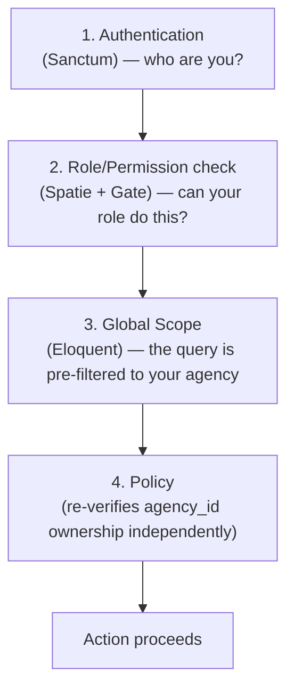
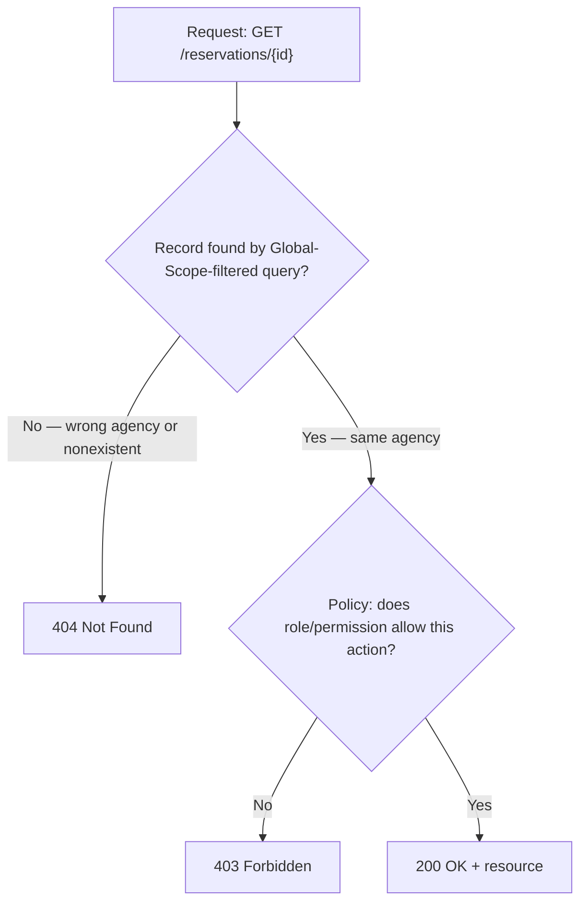
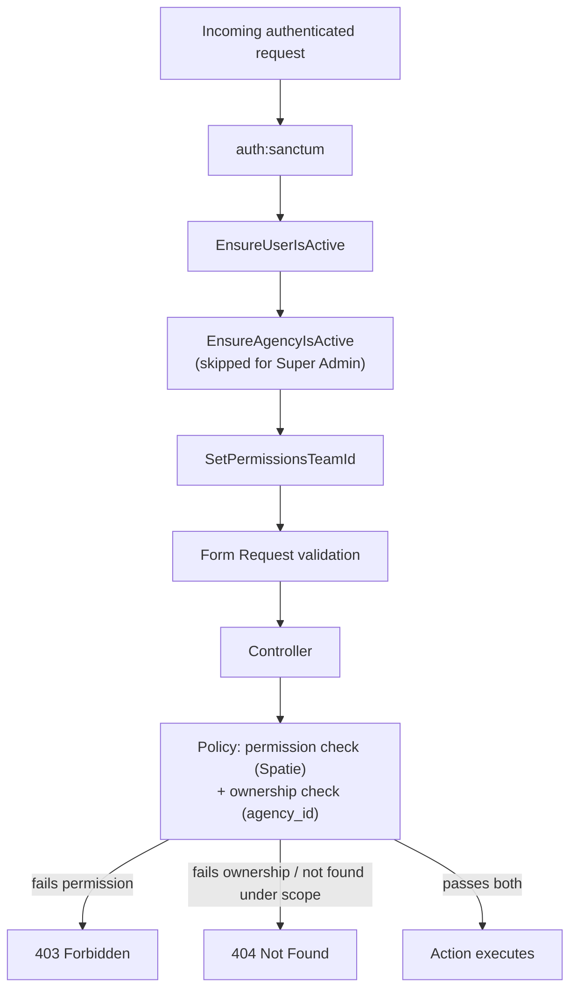
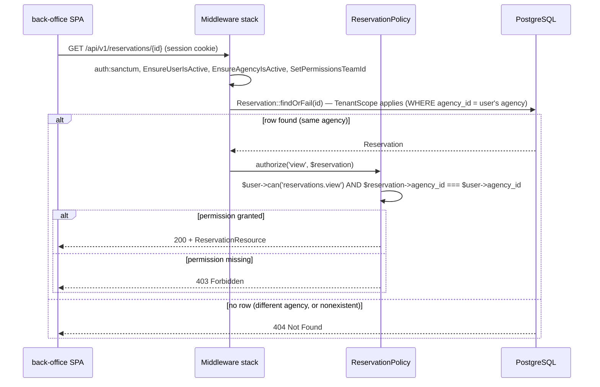
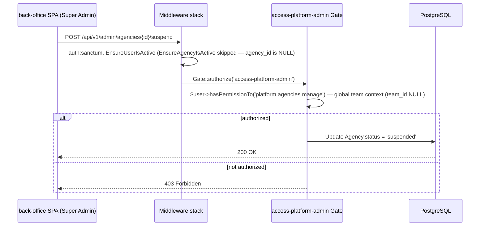
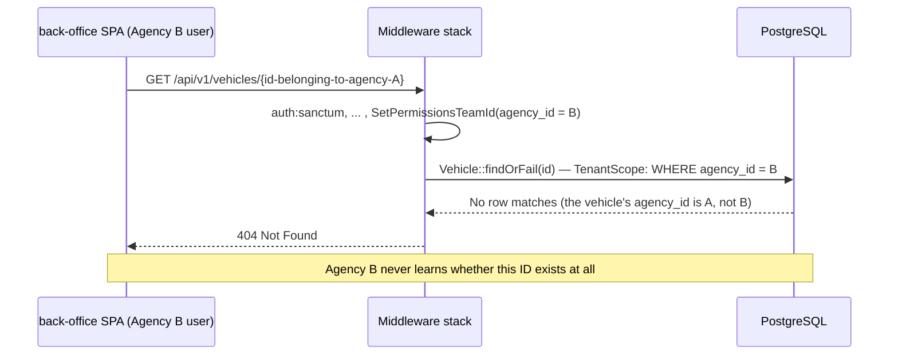
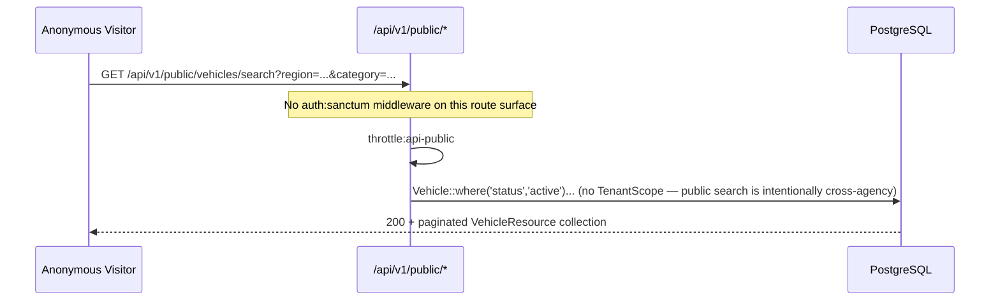

# 03 — Authorization & Roles
## Locarion — Multi-Tenant SaaS Car Rental Platform

> **Document status:** Version 1.0 (Frozen)
> **Source of truth (frozen, do not reinterpret):** `PROJECT-BLUEPRINT.md`, `01-system-architecture.md` (Version 1.0), `02-database-design.md` (Version 1.0)
> **Purpose of this document:** define the complete authentication, authorization, permission model, tenant-isolation behavior, and security rules of the platform — detailed enough that Policies, Middleware, Gates, Spatie roles, and permission seeders can be implemented directly from it.
> **Scope discipline:** this document extends the existing design; it introduces no new business features and redesigns no previous decision. Where a previous document is silent, an explicit assumption is stated inline as **`> Assumption:`**.
> **Companion documents:** `04-api-design.md`, `05-cicd-and-deployment.md`, `06-testing-strategy.md`.

---

## Table of Contents

1. [Purpose](#1-purpose)
2. [Authentication Architecture](#2-authentication-architecture)
3. [User Types](#3-user-types)
4. [Roles](#4-roles)
5. [Permission Model](#5-permission-model)
6. [Permission Matrix](#6-permission-matrix)
7. [Tenant Isolation](#7-tenant-isolation)
8. [Laravel Authorization](#8-laravel-authorization)
9. [Authentication Flow](#9-authentication-flow)
10. [Security Considerations](#10-security-considerations)
11. [Future Evolution](#11-future-evolution)
12. [Authorization ADRs](#12-authorization-adrs)

---

## 1. Purpose

### 1.1 Authentication Goals

Establish, with certainty, *who* is making a request — a real, active, non-deactivated `User` row (Super Admin, Agency Admin, or Employee, per `02-database-design.md` §4.4) or nobody at all (an Anonymous Visitor on the public site). Authentication answers exactly one question — identity — and nothing more; it is deliberately kept separate from authorization (§1.2), which answers a different question.

### 1.2 Authorization Goals

Once identity is established, determine precisely *what that identity is allowed to do*, at two independent levels that must both agree before any tenant-scoped action proceeds:

1. **Role/permission level** — does this user's role and assigned permissions include the capability the request needs (e.g., `reservations.create`)?
2. **Ownership level** — does the specific record this request touches actually belong to this user's agency?

A request that passes level 1 but fails level 2 must still be rejected — this is the entire reason §7 (Tenant Isolation) exists as a first-class section of this document rather than a footnote to §8.

### 1.3 Tenant Isolation Goals

Restated from Blueprint §2 and §10, and already fixed as non-negotiable by `01-system-architecture.md` ADR-05 and `02-database-design.md` §8: **no agency may ever see or affect another agency's data, even in the presence of an application bug.** This document's job is to specify the authorization mechanics precisely enough that this guarantee holds for every endpoint, not just the ones a developer remembered to think carefully about.

### 1.4 Principle of Least Privilege

Every identity — human or otherwise — starts with the minimum capability needed and gains more only through an explicit, auditable grant:

- A newly created **Employee** starts with **zero permissions** (§4.2) — an Agency Admin must deliberately grant each capability, rather than an Employee starting broad and being restricted down. This is the safer default direction: a missed grant merely means "ask again," while a missed *restriction* on an over-privileged-by-default account is a silent security gap.
- **Super Admin** — despite platform-wide authority over *platform* concerns — has **no default access path to any agency's operational data** (§7.4). Even the most powerful identity on the platform does not get broad access "because it's convenient"; accessing agency data requires an explicit, logged action (impersonation).

### 1.5 Defense in Depth

No single layer is trusted to be the *only* thing preventing a security failure. This document specifies four independent layers that must all agree for an authenticated, tenant-scoped action to succeed:



This is the same philosophy already established by `01-system-architecture.md` §3.6 and `02-database-design.md` §8 — this document is where it is made complete and implementation-ready.

---

## 2. Authentication Architecture

### 2.1 Laravel Sanctum — Chosen Mode

Per Blueprint §8 and Architecture ADR-08, **Laravel Sanctum in SPA cookie-session mode** is the authentication mechanism for the `back-office` SPA — the only first-party application that authenticates in v1 (`public-web` never authenticates, per Architecture §4.5; Anonymous Visitors have no identity to establish).

**Why cookie-session mode, not token mode, for the back office:** a session cookie can be marked `httpOnly`, making it inaccessible to JavaScript and therefore immune to token theft via XSS — a meaningfully stronger posture than storing a bearer token in `localStorage`/`sessionStorage`, which any injected script could read. Since `back-office` is a first-party SPA served from Locarion's own domain (not a third-party integration), there is no reason to accept the weaker token-in-storage model just to get token auth's flexibility — that flexibility is reserved for the cases that actually need it (§2.8, §11).

### 2.2 SPA Cookie Authentication — Mechanics

1. Before any state-changing request, the `back-office` client requests `GET /sanctum/csrf-cookie`, which sets an unencrypted, non-`httpOnly` `XSRF-TOKEN` cookie.
2. The client's HTTP layer (the shared API client in `packages/ui`, per Architecture §4.5) reads that cookie and echoes its value back as an `X-XSRF-TOKEN` header on every subsequent state-changing request — this is the CSRF handshake (§2.4).
3. `POST /login` submits credentials. On success, Laravel's session is established and a `httpOnly`, `Secure` (production), `SameSite=Lax` session cookie is set.
4. Every subsequent request from `back-office` includes that session cookie automatically (`credentials: 'include'` / `withCredentials: true`); Sanctum's `EnsureFrontendRequestsAreStateful` middleware recognizes requests from the configured stateful domain(s) and authenticates them via the session, rather than requiring a bearer token.

> **Assumption:** Sanctum's stateful-domain mechanism requires the SPA and the API to share the same top-level domain (e.g., `app.locarion.com` calling `api.locarion.com`, or both served from `locarion.com`). This document assumes that deployment shape, consistent with Architecture §9.2's single-Nginx-entry-point design — no cross-top-level-domain SPA/API split is planned, so `SameSite=Lax` is sufficient and `SameSite=None` (which would additionally require `Secure` on every environment, including local HTTP dev) is not needed.

### 2.3 Session Lifecycle

- **Session driver:** `database` (Architecture §9.4), meaning sessions live in a `sessions` table.
- **Idle timeout:** the session expires after a period of inactivity.
  > **Assumption:** neither the Blueprint nor prior documents specify an exact session lifetime. This document assumes Laravel's conventional default — **120 minutes of inactivity** — as a reasonable, unremarkable starting point for a back-office application handling financial data, revisitable without any structural change (`SESSION_LIFETIME` is a single config value).
- **Session ID regeneration:** on every successful login, the session ID is regenerated (Laravel's `Auth::login()` does this by default) — this prevents session-fixation attacks, where an attacker who fixed a victim's pre-login session ID could otherwise hijack the post-login authenticated session.
- **Sliding vs. absolute expiration:** the idle timeout above is sliding (any request resets the clock). No separate absolute maximum session lifetime is enforced in the MVP; this is a candidate hardening item (§10) if the platform later handles higher-sensitivity data.

### 2.4 CSRF Protection

Restated and made concrete from Architecture §10.5: every state-changing request (`POST`/`PUT`/`PATCH`/`DELETE`) to an authenticated route must carry a valid `X-XSRF-TOKEN` header matching the session's CSRF token (§2.2, step 2). `GET`/`HEAD`/`OPTIONS` requests are exempt, as they are not expected to mutate state. This protects against cross-site request forgery — a malicious third-party site cannot silently trigger a state-changing action using the victim's authenticated session cookie, because it cannot read the `XSRF-TOKEN` cookie value to construct a matching header (same-origin policy blocks that read).

### 2.5 "Remember Me"

`02-database-design.md` §4.4 includes a `remember_token` column on `users` (a standard field of Laravel's `Authenticatable` contract). This document specifies its use: **optional, user-initiated, longer-lived authentication** beyond the normal session idle timeout (§2.3), activated by passing `remember = true` to `Auth::login()` at login time. When active, Laravel issues an additional, longer-lived `remember_web_...` cookie that can re-establish a session after the normal session cookie has expired, without re-prompting for a password.

> **Assumption:** the Blueprint does not mention a "remember me" requirement; this document treats the `remember_token` column as inherited standard Laravel `Authenticatable` scaffolding (present because Sanctum/Laravel auth expects it) and specifies conventional, opt-in usage rather than inventing a bespoke session-persistence feature. Exposing a "Keep me signed in" checkbox on the login form is a frontend/UX decision, not an architectural one, and is left to `04-api-design.md`/frontend implementation to surface or omit.

### 2.6 Password Hashing

Laravel's default hashing driver (`bcrypt`) is used, unmodified — consistent with the "boring technology where it doesn't matter" principle (Architecture §1.2). Passwords are never logged, never returned in any API Resource, and never stored or transmitted in plaintext at any layer.

### 2.7 Login / Logout Flow

- **Login (`POST /api/v1/login`):** validates credentials via `Auth::attempt()`; rejects if the matching `User` row is soft-deleted (Eloquent's default query behavior already excludes `deleted_at IS NOT NULL` rows, so a soft-deleted user simply doesn't match — no extra code needed) or if `is_active = false` (an explicit check, since `is_active` is a business flag, not something Eloquent's default scoping handles). On success: regenerate session ID (§2.3), return the authenticated user's profile plus their resolved roles/permissions (so the SPA can render role-appropriate UI immediately, per Architecture §4.2's route-guard design).
- **Logout (`POST /api/v1/logout`):** invalidates the current session, regenerates the CSRF token, and clears the session cookie.
- **`GET /api/v1/me`:** returns the current authenticated user plus resolved roles/permissions — this is the endpoint Architecture §4.2 already references as the source for `back-office`'s route guards.

### 2.8 Password Reset

> **Assumption:** the Blueprint's Identity & Access module description ("Users, roles, permissions, **auth tokens**," §5) implies standard account-management hygiene without listing "forgot password" as a named feature. This document assumes Laravel's standard, built-in password-reset flow is included as baseline account functionality (a signed, time-limited email link, backed by Laravel's default `password_reset_tokens` table), since omitting it would leave locked-out staff with no self-service recovery path and no alternative is specified anywhere in the Blueprint. This requires a mail driver/transport, which is not otherwise specified in prior documents and is deferred to `05-cicd-and-deployment.md` as an infrastructure/environment concern, not an authorization one.

### 2.9 Supporting Infrastructure Tables (Note on Consistency with `02-database-design.md`)

> **Note:** this document relies on three standard Laravel/Sanctum tables — `sessions`, `password_reset_tokens`, and `personal_access_tokens` — none of which appear in `02-database-design.md`'s Entity Overview (§3). This is not an inconsistency: that document's scope was explicitly the platform's **business/domain entities** (§1 of that document), and it already excluded another package's infrastructure tables on the same basis (Spatie `laravel-permission`'s own tables, `02-database-design.md` §4.4). These three tables are framework/package infrastructure, created by Laravel's and Sanctum's own default migrations, not hand-designed business schema — consistent with that same precedent, they are not redefined here, only referenced by the behavior that depends on them.

### 2.10 Future Mobile Token Authentication

Sanctum's **token mode** (API tokens via `personal_access_tokens`) is already available in the same package, alongside cookie mode — no separate library or redesign is needed to light it up later for a mobile client or partner integration (Architecture ADR-08, §11 of this document). Token-mode requests would authenticate via `Authorization: Bearer {token}` instead of a session cookie, be exempt from the CSRF requirement (§2.4, which only applies to cookie-authenticated requests), and could optionally be scoped with **abilities** (Sanctum's token-scoping feature) — e.g., a read-only reporting integration token. This is a configuration and route-guard addition, not a change to any Policy, Action, or the permission model in §5–§6, which operate identically regardless of how the request authenticated.

---

## 3. User Types

Restated from Blueprint §6 and made authorization-precise. This document does not add, remove, or redefine any user type.

### 3.1 Super Admin

| Aspect | Detail |
|---|---|
| **Responsibilities** | Platform lifecycle: create/suspend/delete agencies; manage Regions and Vehicle Categories; manage global platform settings; view platform-wide statistics (Blueprint §6) |
| **Authentication** | `User` row with `agency_id = NULL` (`02-database-design.md` §4.4); Sanctum SPA cookie session, same mechanism as any other staff user (§2) |
| **Permissions** | All `platform.*` permissions (§5, §6); **no** agency-operational permissions by default |
| **Restrictions** | Cannot view or modify any agency's operational data (Vehicles, Customers, Reservations, Contracts, Invoices, Payments) except through explicit, logged impersonation (§7.4) |

### 3.2 Agency Admin

| Aspect | Detail |
|---|---|
| **Responsibilities** | Full operational control of exactly one agency: employees, fleet, customers, reservations, billing, reports, company settings (Blueprint §6) |
| **Authentication** | `User` row with `agency_id` set to their agency; Sanctum SPA cookie session |
| **Permissions** | All agency-operational permissions (§5, §6) within their own agency, granted by default at account creation — not individually assigned |
| **Restrictions** | Cannot access any other agency's data (§7); cannot access any `platform.*` capability |

### 3.3 Employee

| Aspect | Detail |
|---|---|
| **Responsibilities** | A subset of Agency Admin's operational capability, scoped to whatever permissions their Agency Admin has explicitly granted (Blueprint §6) |
| **Authentication** | `User` row with `agency_id` set to their agency; Sanctum SPA cookie session — identical authentication mechanism to Agency Admin, differing only in authorization (§1.2) |
| **Permissions** | **None by default** (§1.4); individually granted per-permission by an Agency Admin (or by another Employee holding `employees.permissions.manage`, §5) |
| **Restrictions** | Cannot access any other agency's data (§7); cannot access any `platform.*` capability; cannot grant themselves permissions they don't already hold |

### 3.4 Customer

| Aspect | Detail |
|---|---|
| **Responsibilities** | Referenced by Reservations and Contracts; identified by phone/email/document at booking time (Blueprint §6) |
| **Authentication** | **None in v1.** `Customer` (`02-database-design.md` §4.7) is a data record, not a login-capable identity — it does not implement Laravel's `Authenticatable` contract |
| **Permissions** | Not applicable — a Customer never makes an authenticated request |
| **Restrictions** | No portal, no login, no self-service access of any kind in v1 (Blueprint §6's explicit decision); see §11 for how this extends later without redesign |

### 3.5 Anonymous Visitor

| Aspect | Detail |
|---|---|
| **Responsibilities** | Search, view vehicle/agency details, submit a Booking Request (Blueprint §6) |
| **Authentication** | None — every request originates from the unauthenticated `/api/v1/public/*` route surface (Architecture §2.1, §6) |
| **Permissions** | Not applicable — public routes carry no permission checks (§7.1); they are rate-limited and validated, not authorized against a role |
| **Restrictions** | No access whatsoever to any `/api/v1/*` (authenticated) route |

---

## 4. Roles

### 4.1 Role Set

Exactly **three** authenticatable Spatie roles exist, matching Blueprint §6's staff-facing roles one-to-one. No additional formal roles are introduced.

| Role (Spatie name) | Purpose | Scope | Limitations |
|---|---|---|---|
| `super-admin` | Platform operation and lifecycle management | Global (`team_id = NULL`, §4.4 of `02-database-design.md`) | No agency-operational access by default (§7.4) |
| `agency-admin` | Full operational authority over one agency | Team-scoped (`team_id = agency_id`) | Cannot act outside their own agency; cannot access platform-level capability |
| `employee` | Delegated, permission-scoped operational capability within one agency | Team-scoped (`team_id = agency_id`) | Starts with zero permissions (§1.4); can only ever hold permissions its Agency Admin has granted |

### 4.2 No Role Inheritance

Spatie `laravel-permission` does not natively support role hierarchies, and this document does not simulate one. `agency-admin`'s broad capability is **not** the result of inheriting from `employee` — it is the direct consequence of the `agency-admin` role being seeded with every agency-operational permission at agency-creation time (§10 of `02-database-design.md`'s seeding discussion; permission seeding detail in §6 of this document). `employee` is a genuinely separate, independently-scoped role that happens to draw from the same permission catalogue (§5) as a *subset*.

> **Note:** the Blueprint's illustrative Employee sub-types — "front desk," "fleet manager," "accountant" (§6) — are **not** modeled as additional Spatie roles. They are treated as **named permission presets**: convenience groupings an Agency Admin can apply when creating/editing an Employee (e.g., a "Fleet Manager" preset button that checks the `fleet.*` and `reservations.view` permission boxes at once), implemented entirely in the `back-office` UI and/or as a seeded convenience list, not as data the authorization system itself is aware of. This keeps the Spatie role set at exactly three, matching Blueprint §6's role table precisely, while still satisfying the Blueprint's description of common employee capability bundles.
>
> **Assumption:** the Blueprint does not specify whether these labels are formal roles or informal groupings. This document chooses informal groupings specifically because introducing additional formal roles would fragment the "Employee, permission-scoped" model Blueprint §6 explicitly describes into something closer to a second tier of fixed roles — a design the Blueprint does not ask for.

### 4.3 Team Scoping Mechanism

Spatie's **teams** feature (already fixed by `02-database-design.md` ADR-DB-08) is the mechanism that makes `agency-admin`/`employee` role and permission assignments agency-specific: every row in `model_has_roles`/`model_has_permissions` carries a `team_id` column, populated with the assigning agency's `agency_id`. A middleware early in the authenticated request pipeline (§8.3) calls Spatie's `setPermissionsTeamId()` using the current user's own `agency_id`, so every `$user->hasPermissionTo(...)`/`$user->can(...)` check for the remainder of the request is automatically scoped to that team — no permission check anywhere in the codebase needs to manually pass an agency ID.

---

## 5. Permission Model

Every permission follows the naming convention `{module}.{action}` (dot-namespaced, lowercase, kebab-case module names where multi-word — §8.5 formalizes this convention). Each entry below states its description and who receives it **by default at seed/creation time** — §6 restates the same information as a matrix for quick lookup, and §4.2 clarifies that Employee grants are always individual, never bundled by the authorization system itself.

### 5.1 Fleet

| Permission | Description | Who receives it |
|---|---|---|
| `fleet.view` | View the agency's vehicles | Agency Admin (default); Employee (assignable) |
| `fleet.create` | Add a new vehicle | Agency Admin (default); Employee (assignable) |
| `fleet.update` | Edit vehicle details, pricing, or status | Agency Admin (default); Employee (assignable) |
| `fleet.delete` | Remove (soft-delete) a vehicle | Agency Admin (default); Employee (assignable) |
| `fleet.images.manage` | Upload, reorder, or remove vehicle images | Agency Admin (default); Employee (assignable) |

### 5.2 Reservations

| Permission | Description | Who receives it |
|---|---|---|
| `reservations.view` | View the agency's reservations | Agency Admin (default); Employee (assignable) |
| `reservations.create` | Create a new reservation | Agency Admin (default); Employee (assignable) |
| `reservations.update` | Edit reservation details (dates, locations, notes) | Agency Admin (default); Employee (assignable) |
| `reservations.status.update` | Transition a reservation's status (confirm / activate / complete / cancel) | Agency Admin (default); Employee (assignable) |

### 5.3 Customers

| Permission | Description | Who receives it |
|---|---|---|
| `customers.view` | View the agency's customer records | Agency Admin (default); Employee (assignable) |
| `customers.create` | Create a customer record | Agency Admin (default); Employee (assignable) |
| `customers.update` | Edit a customer record, including document verification | Agency Admin (default); Employee (assignable) |
| `customers.delete` | Remove (soft-delete) a customer record | Agency Admin (default); Employee (assignable) |

### 5.4 Contracts

| Permission | Description | Who receives it |
|---|---|---|
| `contracts.view` | View/download a generated contract | Agency Admin (default); Employee (assignable) |
| `contracts.generate` | Trigger contract generation or regeneration for a reservation | Agency Admin (default); Employee (assignable) |

### 5.5 Billing

| Permission | Description | Who receives it |
|---|---|---|
| `billing.invoices.view` | View invoices | Agency Admin (default); Employee (assignable) |
| `billing.invoices.manage` | Create, update, or void invoices | Agency Admin (default); Employee (assignable) |
| `billing.payments.record` | Record a payment against an invoice | Agency Admin (default); Employee (assignable) |

### 5.6 Reports

| Permission | Description | Who receives it |
|---|---|---|
| `reports.view` | View agency reports and analytics (revenue, utilization) | Agency Admin (default); Employee (assignable) |

### 5.7 Agency Settings

| Permission | Description | Who receives it |
|---|---|---|
| `agency.settings.view` | View company profile, branding, and settings | Agency Admin (default); Employee (assignable) |
| `agency.settings.update` | Edit company profile, branding, and settings | Agency Admin (default); Employee (assignable, off by default — see note) |

> **Assumption:** Blueprint §6 states an Employee "cannot change company settings by default," which this document reads as "assignable, but not granted automatically" (consistent with Employee being described throughout as *permission-scoped*), rather than an absolute, un-grantable restriction. If the intent was instead an absolute restriction that no Agency Admin can override, `agency.settings.update` should be redefined as Agency-Admin-only (❌ for Employee in §6) — a one-line change to this document with no structural impact elsewhere.

### 5.8 Platform Administration (Super Admin only)

| Permission | Description | Who receives it |
|---|---|---|
| `platform.agencies.manage` | Create, suspend, or delete agencies | Super Admin only |
| `platform.agencies.impersonate` | Enter a logged, temporary support session scoped to a specific agency (§7.4) | Super Admin only |
| `platform.regions.manage` | Create, update, or deactivate Regions | Super Admin only |
| `platform.categories.manage` | Create, update, or deactivate Vehicle Categories | Super Admin only |
| `platform.settings.manage` | Manage global platform settings | Super Admin only |
| `platform.stats.view` | View platform-wide statistics | Super Admin only |

### 5.9 Employee Management

| Permission | Description | Who receives it |
|---|---|---|
| `employees.view` | View the agency's employee list | Agency Admin (default); Employee (assignable) |
| `employees.create` | Create a new employee account | Agency Admin (default); Employee (assignable) |
| `employees.update` | Edit an employee's profile | Agency Admin (default); Employee (assignable) |
| `employees.permissions.manage` | Assign or revoke permissions for an employee | Agency Admin (default); Employee (assignable, off by default) |
| `employees.deactivate` | Deactivate or reactivate an employee account | Agency Admin (default); Employee (assignable) |

### 5.10 Booking Requests

| Permission | Description | Who receives it |
|---|---|---|
| `booking-requests.view` | View incoming public booking requests | Agency Admin (default); Employee (assignable) |
| `booking-requests.approve` | Approve a request and convert it into a Reservation | Agency Admin (default); Employee (assignable) |
| `booking-requests.reject` | Reject a request | Agency Admin (default); Employee (assignable) |

---

## 6. Permission Matrix

**Legend:** ✅ Granted automatically at role assignment · ⚙️ Assignable — an Agency Admin (or an Employee holding `employees.permissions.manage`) may grant this individually · 🔒 Not available by default; accessible only via logged Super Admin impersonation (§7.4) · ❌ Never available to this role, cannot be granted

| Permission | Super Admin | Agency Admin | Employee |
|---|---|---|---|
| `fleet.view` | 🔒 | ✅ | ⚙️ |
| `fleet.create` | 🔒 | ✅ | ⚙️ |
| `fleet.update` | 🔒 | ✅ | ⚙️ |
| `fleet.delete` | 🔒 | ✅ | ⚙️ |
| `fleet.images.manage` | 🔒 | ✅ | ⚙️ |
| `reservations.view` | 🔒 | ✅ | ⚙️ |
| `reservations.create` | 🔒 | ✅ | ⚙️ |
| `reservations.update` | 🔒 | ✅ | ⚙️ |
| `reservations.status.update` | 🔒 | ✅ | ⚙️ |
| `customers.view` | 🔒 | ✅ | ⚙️ |
| `customers.create` | 🔒 | ✅ | ⚙️ |
| `customers.update` | 🔒 | ✅ | ⚙️ |
| `customers.delete` | 🔒 | ✅ | ⚙️ |
| `contracts.view` | 🔒 | ✅ | ⚙️ |
| `contracts.generate` | 🔒 | ✅ | ⚙️ |
| `billing.invoices.view` | 🔒 | ✅ | ⚙️ |
| `billing.invoices.manage` | 🔒 | ✅ | ⚙️ |
| `billing.payments.record` | 🔒 | ✅ | ⚙️ |
| `reports.view` | 🔒 | ✅ | ⚙️ |
| `agency.settings.view` | 🔒 | ✅ | ⚙️ |
| `agency.settings.update` | 🔒 | ✅ | ⚙️ (see §5.7 assumption) |
| `platform.agencies.manage` | ✅ | ❌ | ❌ |
| `platform.agencies.impersonate` | ✅ | ❌ | ❌ |
| `platform.regions.manage` | ✅ | ❌ | ❌ |
| `platform.categories.manage` | ✅ | ❌ | ❌ |
| `platform.settings.manage` | ✅ | ❌ | ❌ |
| `platform.stats.view` | ✅ | ❌ | ❌ |
| `employees.view` | 🔒 | ✅ | ⚙️ |
| `employees.create` | 🔒 | ✅ | ⚙️ |
| `employees.update` | 🔒 | ✅ | ⚙️ |
| `employees.permissions.manage` | 🔒 | ✅ | ⚙️ (off by default) |
| `employees.deactivate` | 🔒 | ✅ | ⚙️ |
| `booking-requests.view` | 🔒 | ✅ | ⚙️ |
| `booking-requests.approve` | 🔒 | ✅ | ⚙️ |
| `booking-requests.reject` | 🔒 | ✅ | ⚙️ |

---

## 7. Tenant Isolation

This section makes `02-database-design.md` §8 and `01-system-architecture.md` §3.6 implementation-complete from the authorization side.

### 7.1 `agency_id` Ownership as the Root of Trust

Every tenant-scoped model (`Vehicle`, `VehicleImage`, `Customer`, `Reservation`, `Contract`, `Invoice`, `Payment`, `BookingRequest`) carries the `agency_id` column fixed by `02-database-design.md` §4 — `NOT NULL`, foreign-keyed, indexed. Authorization at every layer described below ultimately reduces to one comparison: **does this record's `agency_id` equal the authenticated user's `agency_id`?** Every mechanism in this section exists to make that comparison happen reliably, more than once, in more than one place.

### 7.2 Global Scopes

A `TenantScope` global scope (Architecture §3.6) is registered on every tenant-scoped Eloquent model. It automatically injects `WHERE agency_id = :current_user_agency_id` into every query issued against that model — `SELECT`, `UPDATE`, and `DELETE` alike — including through Eloquent relationships (`$vehicle->reservations` on a Vehicle already scoped to the current agency cannot leak another agency's reservations, because the relationship query itself passes back through the same scope). **This is the first line of defense, and by volume it is the one that prevents the overwhelming majority of would-be cross-tenant queries from ever reaching the database unscoped.**

### 7.3 Policies — Independent Re-Verification

Every controller action touching a tenant-scoped model calls a Laravel **Policy** (`VehiclePolicy`, `ReservationPolicy`, `CustomerPolicy`, `ContractPolicy`, `InvoicePolicy`, `PaymentPolicy`, `BookingRequestPolicy`) that re-checks `$model->agency_id === $user->agency_id` **independently of whether the Global Scope already filtered the query**. This is deliberate redundancy, not an oversight: a Global Scope can be accidentally bypassed by a specific query builder call (e.g., a forgotten `withoutGlobalScope()`, or a raw query written during a rushed fix) — the Policy is the second, structurally independent check that a single such mistake cannot silently defeat. Every Policy method additionally consults the permission model (§5, §6) via Spatie — a Policy's `view`/`create`/`update`/`delete` methods check both "does this user's role/permission set allow this action" **and** "does this specific record belong to this user's agency," and both must pass.

### 7.4 Super Admin — No Default Bypass, Only Logged Impersonation

Super Admin's `agency_id` is `NULL` (§3.1, `02-database-design.md` §4.4). This is **not** treated as "no tenant, therefore see everything" — it is treated as "no tenant, therefore the Global Scope and Policies for agency-operational models simply never match, and no route exists that would let a Super Admin's default session reach that data at all" (the `/api/v1/admin/*` route surface, Architecture §11, exposes only platform-level resources — Agencies' lifecycle/status, Regions, Categories, platform stats — never `Vehicle`/`Reservation`/`Customer`/etc. directly).

Blueprint §6 explicitly allows one exception: Super Admin **may** view agency operational data "for support, which is logged." This document specifies that mechanism as **impersonation**:

1. Super Admin, holding `platform.agencies.impersonate`, calls an admin-only endpoint to begin impersonating a specific `Agency`.
2. The action is recorded in `ActivityLog` (`02-database-design.md` §4.13) with `action = 'agency.impersonation_started'`, `agency_id` = the target agency, `user_id` = the Super Admin.
3. For the duration of the impersonation session, the Super Admin's effective tenant context is set to the target agency's `agency_id` — the Global Scope and Policies now evaluate exactly as they would for that agency's own Agency Admin, and Spatie's team context (§4.3) is temporarily set to the impersonated agency.
4. Every subsequent write performed while impersonating is itself logged to `ActivityLog`, tagged so it is auditable as "performed by Super Admin while impersonating," not conflated with the agency's own staff activity.
5. Ending impersonation is itself a logged event (`agency.impersonation_ended`), and the Super Admin's session reverts to its normal, agency-data-free state.

> **Assumption:** Blueprint §6 states impersonation is "logged" without specifying its exact mechanics. The five-step design above is this document's concrete proposal, consistent with that requirement — it is an addition to the authorization model (a temporary, explicit, audited context switch), not a redesign of anything already fixed. Exact endpoint shape is deferred to `04-api-design.md`.

### 7.5 404 vs. 403 — Why the "Wrong" Status Code Is the Right One

Restated and generalized from `01-system-architecture.md` §3.6 and `02-database-design.md` §6 (Rule set): when a request references a record ID that exists but belongs to a **different** agency, the API returns **404 Not Found**, never 403 Forbidden. This applies uniformly across every tenant-scoped resource, not only the `Vehicle` example already worked through in Architecture §3.6.

**Why:** 403 confirms existence ("this resource exists, you're just not allowed to see it") — which, in a *single-tenant* system, is harmless information. In a *multi-tenant* system, confirming existence to a user outside the owning tenant is itself a leak: it tells Agency B that a given UUID corresponds to a real record somewhere, which is exactly the enumeration/existence-confirmation risk UUID keys were chosen to avoid in the first place (`02-database-design.md` §2.2). 404 is indistinguishable, from the outside, between "this ID was never valid" and "this ID belongs to someone else" — which is the point.

**When 403 *is* still correct:** when the record **does** belong to the requester's own agency, but their role/permission set doesn't allow the specific action (e.g., an Employee without `billing.invoices.view` requesting an invoice that genuinely is in their own agency). This is the case Architecture §8.3 already establishes; this document confirms it applies identically for every module in §5.



### 7.6 Mass-Assignment Protection

Restated from Architecture §10.5 and grounded here: `agency_id` is **never** present in any tenant-scoped model's `$fillable` array and is **never** accepted from request input, on any endpoint. It is always set server-side, in the relevant Action, from `$user->agency_id` (or, during impersonation, the impersonated agency's ID, §7.4) — never trusted from the request body. This closes the single most direct theoretical bypass: a malicious or buggy client simply sending a different `agency_id` in a `POST`/`PATCH` payload.

### 7.7 Tenant-Aware Route-Model Binding

Every route parameter that resolves to a tenant-scoped model (`{vehicle}`, `{reservation}`, `{customer}`, ...) resolves through the same Global-Scope-filtered query as any other lookup (§7.2) — Laravel's implicit route-model binding calls the model's default query, which already carries the `TenantScope`. A binding for a record in a different agency therefore fails to resolve at all, producing the `ModelNotFoundException` → 404 path (§7.5) automatically, with no extra code required per-route.

---

## 8. Laravel Authorization

### 8.1 Policies

One Policy class per tenant-scoped model, co-located under its owning domain per `01-system-architecture.md` §3.1 (`Domain/{Context}/Policies/`): `VehiclePolicy`, `CustomerPolicy`, `ReservationPolicy`, `ContractPolicy`, `InvoicePolicy`, `PaymentPolicy`, `BookingRequestPolicy` — plus `UserPolicy` (Employee Management, §5.9) and `AgencyPolicy` (Agency Settings, §5.7) for the two agency-scoped-but-not-listed-above concerns. Each Policy method (`viewAny`, `view`, `create`, `update`, `delete`, plus domain-specific methods like `ReservationPolicy::updateStatus`) performs exactly the two checks described in §7.3: permission-via-Spatie, then ownership-via-`agency_id`.

### 8.2 Gates

Gates (closures, not tied to a specific Eloquent model instance) are used only for authorization checks that don't correspond to a CRUD action on a single record:

| Gate | Purpose |
|---|---|
| `access-platform-admin` | Guards the entire `/api/v1/admin/*` route surface — checks the user holds *any* `platform.*` permission |
| `begin-impersonation` | Guards the impersonation-start endpoint (§7.4) — checks `platform.agencies.impersonate` specifically |
| `view-agency-reports` | Guards `/reports/*` — thin wrapper over `reports.view`, kept as a Gate rather than a Policy since Reports has no single owning Eloquent model (`02-database-design.md` §3's note that Reporting has no dedicated table) |

### 8.3 Middleware

| Middleware | Purpose |
|---|---|
| `auth:sanctum` | Establishes authentication (§2) on every route under `/api/v1/*` (not `/api/v1/public/*`) |
| `EnsureAgencyIsActive` *(custom)* | Rejects requests from a user whose `Agency.status = 'suspended'` (`02-database-design.md` §4.3) with 403 — an agency-level circuit breaker, independent of any individual permission |
| `EnsureUserIsActive` *(custom)* | Rejects requests from a user whose `is_active = false` — belt-and-suspenders alongside the login-time check (§2.7), covering the case where a user is deactivated mid-session |
| `SetPermissionsTeamId` *(custom)* | Calls Spatie's `setPermissionsTeamId($user->agency_id)` early in the pipeline (§4.3), so every downstream permission check is automatically team-scoped |
| `throttle:api-public` / `throttle:api-auth` | Rate limiting (§10.2), more permissive for authenticated routes than for `/api/v1/public/*`, per Architecture §9.2's stated policy |

### 8.4 Spatie Permission Integration

The `User` model uses Spatie's `HasRoles` trait, giving access to `$user->hasRole()`, `$user->hasPermissionTo()`, and `$user->can()` (the last of which integrates with Laravel's native `Gate`/`Policy` system automatically — a Policy method can call `$user->can('fleet.update')` exactly as it would check any other permission string). Role and permission assignment always goes through the **teams**-aware methods (`assignRole()`, `givePermissionTo()`) after `setPermissionsTeamId()` (§4.3, §8.3) has been called for the current request, so every assignment is correctly scoped without any call site needing to pass `agency_id` explicitly.

### 8.5 Permission Naming Conventions

Fixed by §5: `{module}.{action}`, all lowercase, multi-word modules hyphenated (`booking-requests`), multi-word actions dot-nested where there's a clear sub-resource (`billing.invoices.manage`, `employees.permissions.manage`). This mirrors the route surface's own structure (Architecture §8.1) closely enough that a developer can usually guess a permission's name from its endpoint, and vice versa — a small but real reduction in the chance of a typo'd permission string silently failing open or closed.

### 8.6 Authorization Flow (Composite)



---

## 9. Authentication Flow

### 9.1 Login

```mermaid
sequenceDiagram
    participant SPA as back-office SPA
    participant API as Laravel API
    participant DB as PostgreSQL

    SPA->>API: GET /sanctum/csrf-cookie
    API-->>SPA: Set-Cookie: XSRF-TOKEN
    SPA->>API: POST /api/v1/login (email, password) + X-XSRF-TOKEN header
    API->>DB: Look up User by email (excludes soft-deleted by default)
    DB-->>API: User row
    API->>API: Verify password hash
    alt credentials valid AND is_active = true
        API->>API: Regenerate session ID
        API-->>SPA: 200 + user profile + roles/permissions; Set-Cookie: session
    else invalid credentials OR is_active = false
        API-->>SPA: 401 Unauthorized
    end
```

### 9.2 Authenticated Request with Permission + Tenant Check (Employee Example)



### 9.3 Super Admin Request (Platform-Level)



### 9.4 Cross-Tenant (Unauthorized) Request



### 9.5 Public (Unauthenticated) Request



---

## 10. Security Considerations

### 10.1 Password Policies

> **Assumption:** no password policy is specified in prior documents. This document assumes Laravel's `Password::defaults()` rule set as the starting baseline: minimum 8 characters, with the framework's built-in "not a commonly compromised password" check (via the `uncompromised()` rule, checked against the Have I Been Pwned range API) enabled. This is a config-level decision (`app/Providers/...` password rule definition), not a schema or architecture change, and can be tightened later without any structural impact.

### 10.2 Rate Limiting & Brute-Force Protection

Two independent throttle policies, per Architecture §9.2:

| Surface | Policy | Purpose |
|---|---|---|
| `/api/v1/public/*` | Aggressive (e.g., a low per-IP request ceiling per minute) | Anonymous, higher abuse surface (scraping, booking-request spam) |
| `/api/v1/login` specifically | A **stricter**, separate throttle keyed on `email + IP` (e.g., 5 attempts per minute), using Laravel's `RateLimiter` facade | Brute-force login protection — this is intentionally its own, tighter policy distinct from the general authenticated-route throttle, since credential-guessing is a qualitatively different risk than normal authenticated traffic volume |
| `/api/v1/*` (authenticated, non-login) | Standard authenticated-route throttle | Baseline abuse protection for logged-in traffic |

### 10.3 Session Expiration

Covered in §2.3 — 120-minute sliding idle timeout (assumption), session ID regenerated on login.

### 10.4 Cookie Security

Every authentication-related cookie (`session`, `XSRF-TOKEN`, `remember_web_...`) is `Secure` in every environment except local development (Architecture §9.3's TLS table), and the session cookie specifically is `httpOnly` (§2.1) — `XSRF-TOKEN` is deliberately **not** `httpOnly`, since the frontend must be able to read it to echo it back as a header (§2.2); this is the standard, safe Sanctum CSRF pattern, not an oversight. `SameSite=Lax` per the same-top-level-domain assumption in §2.2.

### 10.5 HTTPS

Enforced in every environment except local development (Architecture §9.2, §9.3) — TLS termination happens at Nginx; the application itself always assumes it is being reached over HTTPS in production (`APP_URL`/`FORCE_HTTPS`-equivalent configuration) so that redirect and cookie-security logic behaves correctly behind the reverse proxy.

### 10.6 CSRF

Covered fully in §2.4.

### 10.7 XSS

Two independent mitigations: React's default output escaping (Architecture §4, general SPA behavior — neither app uses `dangerouslySetInnerHTML` on user-supplied content) and, more importantly for authentication specifically, the `httpOnly` session cookie (§2.1, §10.4) means that even a successful XSS injection cannot read or exfiltrate the authentication credential itself — the worst a same-origin script injection could do is act *as* the logged-in user's browser session for its duration, not steal a portable token usable from elsewhere. A Content-Security-Policy header is a reasonable additional hardening step, noted here as a candidate for `05-cicd-and-deployment.md`'s Nginx configuration rather than specified in detail in this document.

### 10.8 SQL Injection

Eloquent's query builder parameterizes all bound values by default; no raw, string-concatenated SQL is used anywhere in the Actions/Policies/Controllers described in this or prior documents. This is inherited, not a new decision — worth stating explicitly here only because authorization logic (permission checks, tenant filters) is exactly the kind of code where a shortcut into raw SQL would be most dangerous if it ever happened.

### 10.9 Mass Assignment

Covered fully in §7.6 (tenant-isolation-specific) and restated generally from Architecture §10.5: every model declares an explicit `$fillable` list; nothing is ever accepted from a request body that the relevant Form Request (Architecture §3.7) didn't explicitly validate and the Action didn't explicitly choose to write.

### 10.10 Sensitive Logging

Restated from Architecture §10.1 and made concrete for `ActivityLog` (`02-database-design.md` §4.13): log `action`, `subject_type`, `subject_id`, and a small structured `metadata` payload (e.g., old/new `status` value) — **never** passwords, full document numbers, full payment references, or raw request bodies. This applies identically to Laravel's own application logs (Monolog) as it does to `ActivityLog` rows.

### 10.11 Account Deactivation

`User.is_active = false` (`02-database-design.md` §4.4) blocks new logins immediately (§2.7) and, via `EnsureUserIsActive` middleware (§8.3), also terminates the *usefulness* of any session that was already active at the moment of deactivation — every subsequent request from that session is rejected, even though the session cookie itself remains technically valid until it expires. This is a deliberate two-point enforcement (login-time and every-request-time), not redundant: without the middleware check, a staff member deactivated mid-shift could continue acting on an already-established session until it naturally expired.

### 10.12 Soft-Deleted Users

A soft-deleted `User` (`deleted_at IS NOT NULL`) is automatically excluded from Eloquent's default queries — including the login lookup (§2.7) — with no additional code required; Eloquent's `SoftDeletes` trait applies this exclusion globally by default. A soft-deleted user therefore cannot authenticate at all, and any *already-active* session belonging to that user is handled the same way as deactivation (§10.11) — a soft-deleted user is treated as `is_active = false` for the purposes of `EnsureUserIsActive`, so an in-progress session is cut off on the next request rather than remaining valid until natural expiration.

---

## 11. Future Evolution

Restated in the same spirit as `01-system-architecture.md` §12 — each item below is additive to the design in this document, not a redesign of it.

| Future item | Why this design accommodates it without redesign |
|---|---|
| **Customer accounts** (Blueprint §19) | `Customer` (`02-database-design.md` §4.7) would gain an `Authenticatable` implementation (password/email-verification columns) and a **new, separate Sanctum guard** — it would never share the `users` table, roles, or permission catalogue described in this document, since a Customer's capability model (view own reservations/history) is entirely disjoint from staff RBAC. Zero change to §4–§8. |
| **Native mobile app** | Sanctum token mode is already available alongside cookie mode (§2.10) — a mobile client authenticates via bearer token against the exact same Policies, Gates, and permission model; nothing in §5–§8 is aware of *how* a request authenticated, only *who* it authenticated as. |
| **OAuth (social login for Customers, once accounts exist)** | Laravel Socialite integrates at the authentication layer only (§2) — it produces a `User`/`Customer` identity the same way password login does; §5–§8's authorization model is entirely unaffected. |
| **SSO (enterprise agency requirement, Blueprint §19's schema-per-tenant trigger)** | A SAML/OIDC provider integration would replace *how* a specific agency's staff authenticate (§2), federating into the same `User`/role/permission model — the agency's staff still end up as `agency-admin`/`employee`-role `User` rows with the same team-scoped permissions described in §4–§6. |
| **API keys for partner integrations** | Sanctum's token **abilities** feature (§2.10) already supports scoped, non-interactive tokens (e.g., a read-only reporting integration) without any new authentication mechanism — just a new token-issuance endpoint and an abilities list drawn from the existing permission catalogue (§5). |
| **2FA** | Laravel Fortify's two-factor module (or an equivalent) adds a second verification step *inside* the existing login flow (§2.7, between "credentials valid" and "session established") — it does not change what a session *is* or how Policies/Gates evaluate it afterward. |
| **Enterprise authentication generally** | Every item above shares the same shape: a new way to *establish* a `User` identity, sitting entirely upstream of §4–§8's role/permission/tenant-isolation model, which is deliberately independent of authentication mechanism (§1.1's separation of concerns is what makes this list possible). |

---

## 12. Authorization ADRs

Prefixed `ADR-AUTH` to distinguish from `01-system-architecture.md`'s `ADR-01..16` and `02-database-design.md`'s `ADR-DB-01..12`.

| # | Decision | Rationale | Source |
|---|---|---|---|
| ADR-AUTH-01 | Sanctum **cookie-session** mode (not token mode) for the `back-office` SPA | `httpOnly` session cookie is immune to XSS-based token theft, unlike a bearer token stored in browser storage; appropriate since `back-office` is first-party, same-origin | Architecture ADR-08; this document §2.1 |
| ADR-AUTH-02 | Exactly three Spatie roles (`super-admin`, `agency-admin`, `employee`), no role hierarchy, no additional formal roles for Employee sub-types | Matches Blueprint §6's role table precisely; "front desk/fleet manager/accountant" modeled as UI-level permission presets, not authorization-system roles, avoiding role-set fragmentation | Blueprint §6; this document §4 |
| ADR-AUTH-03 | Spatie **teams** feature used for per-agency role/permission scoping (`team_id` = `agency_id`) | The package's own supported mechanism for exactly this need — no custom-built per-tenant RBAC scoping required | `02-database-design.md` ADR-DB-08; this document §4.3 |
| ADR-AUTH-04 | Policy-based authorization as the primary enforcement mechanism; Gates reserved for non-model-instance checks | Keeps the common case (CRUD on a tenant-scoped record) using Laravel's most idiomatic, testable authorization primitive; Gates only where no natural model instance exists | This document §8.1, §8.2 |
| ADR-AUTH-05 | Defense-in-depth tenant isolation: Global Scope + independent Policy re-check + tenant-aware route-model binding, all required to agree | A single missed scope, forgotten check, or bypass must never be the only thing separating two tenants' data | Blueprint §10; Architecture ADR-05; this document §7 |
| ADR-AUTH-06 | Super Admin has **no default access path** to agency-operational data; access requires explicit, logged impersonation | "Powerful" and "broadly privileged by default" are treated as different things; least-privilege applies even to the platform's most trusted identity | Blueprint §6; this document §1.4, §7.4 |
| ADR-AUTH-07 | `404`, not `403`, for any request referencing a record that exists but belongs to a different agency | Confirming existence to a non-owning tenant is itself an information leak, undermining the enumeration protection UUID keys were chosen for | Blueprint §10; `02-database-design.md` §2.2, Rule set §6; this document §7.5 |
| ADR-AUTH-08 | Permissions named `{module}.{action}`, dot-namespaced, mirroring the API's own route structure | Reduces the chance of a typo'd permission string; a developer can usually guess a permission's name from its endpoint and vice versa | This document §5, §8.5 |
| ADR-AUTH-09 | Employees start with **zero permissions**; every capability is an explicit, individually auditable grant | The safer default direction — a missed grant is a support ticket, a missed restriction is a silent security gap | Blueprint §6; this document §1.4 |
| ADR-AUTH-10 | Password reset uses Laravel's standard, built-in mechanism; no custom account-recovery flow | Consistent with "boring technology where it doesn't matter" (Architecture §1.2); avoids inventing bespoke, harder-to-audit recovery logic | This document §2.8 |
| ADR-AUTH-11 | No absolute session lifetime ceiling in the MVP — only sliding idle-timeout expiration | Matches Laravel's conventional default and the MVP's current risk profile; documented as a candidate hardening item, not a gap that was overlooked | This document §2.3, §10.3 |
| ADR-AUTH-12 | Login-specific rate limiting (`email + IP`) kept separate and stricter than the general authenticated-route throttle | Credential-guessing is a qualitatively different risk than ordinary authenticated traffic and deserves its own, tighter policy | This document §10.2 |

---

*This document expands `01-system-architecture.md` and `02-database-design.md` and introduces no roles, permissions, or mechanisms those documents do not already imply, except where explicitly marked `> Assumption:`. Those assumptions are proposals, not settled fact, and should be confirmed or corrected before the next document (`04-api-design.md`) is written, since the route surface and endpoint-level authorization will build directly on §5–§8 of this document.*

**Awaiting confirmation before proceeding to `04-api-design.md`.**
