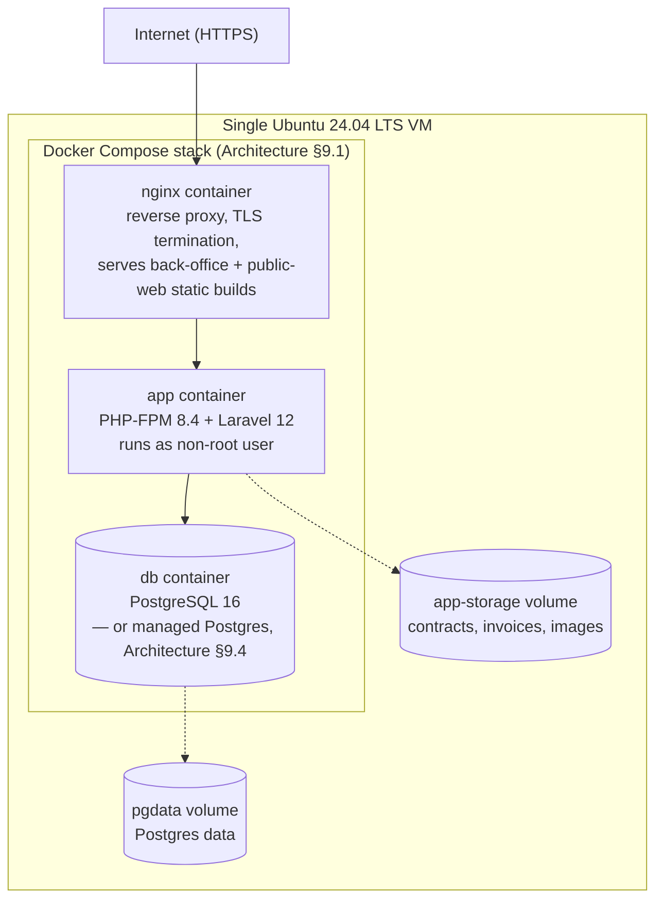
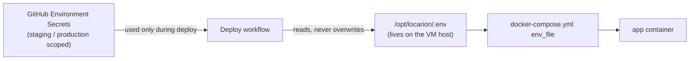
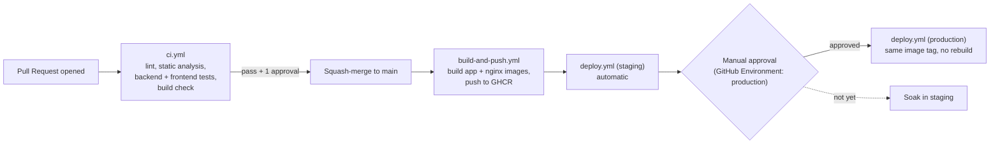
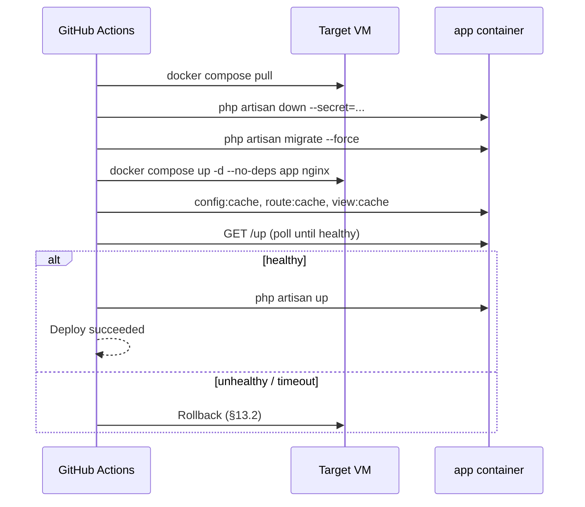

# 05 — CI/CD & Deployment
## Locarion — Multi-Tenant SaaS Car Rental Platform

> **Document status:** Version 1.0 (Frozen)
> **Source of truth (frozen, do not reinterpret):** `PROJECT-BLUEPRINT.md`, `01-system-architecture.md` (v1.0), `02-database-design.md` (v1.0), `03-authorization-and-roles.md` (v1.0), `04-api-design.md` (v1.0)
> **Purpose of this document:** define the complete CI/CD pipeline, deployment workflow, infrastructure configuration, environment management, monitoring, backup strategy, and operational runbooks — implementation-ready enough that a DevOps engineer can deploy the platform without making further architectural decisions.
> **Scope discipline:** this document does not repeat architecture, database, or authorization explanations already covered — it references them by section number and focuses exclusively on deployment, operations, automation, environments, and release management. Where a previous document is silent on an operational detail, an explicit assumption is stated inline as **`> Assumption:`**.

---

## Table of Contents

1. [Purpose](#1-purpose)
2. [Deployment Architecture](#2-deployment-architecture)
3. [Environment Strategy](#3-environment-strategy)
4. [Git Workflow](#4-git-workflow)
5. [GitHub Actions Pipeline](#5-github-actions-pipeline)
6. [Build Process](#6-build-process)
7. [Deployment Process](#7-deployment-process)
8. [Database Deployment](#8-database-deployment)
9. [Server Configuration](#9-server-configuration)
10. [Monitoring & Logging](#10-monitoring--logging)
11. [Backup & Disaster Recovery](#11-backup--disaster-recovery)
12. [Security During Deployment](#12-security-during-deployment)
13. [Operational Runbooks](#13-operational-runbooks)
14. [Future Evolution](#14-future-evolution)
15. [CI/CD ADRs](#15-cicd-adrs)

---

## 1. Purpose

### 1.1 Deployment Philosophy

Deployment is treated as a solved, boring problem, deliberately — the same "boring technology where it doesn't matter" principle that governs the application layer (Architecture §1.2) applies here with even less room for exception, because a deployment mistake in a **shared-schema, multi-tenant** platform (Database Design §2.1, ADR-DB-01) affects *every* agency simultaneously. There is no "canary tenant" isolation the way schema-per-tenant might offer — this is the direct operational consequence of that already-frozen trade-off, and it is the reason this document treats predictability as a first-class requirement rather than a nice-to-have.

### 1.2 CI/CD Goals

Restated from Blueprint §14's seven-phase DevOps Roadmap, which this document exists to make concrete and executable:

| Goal | Why it matters here specifically |
|---|---|
| Catch regressions before merge | A bug that reaches `main` reaches every agency on the next deploy — there is no per-tenant blast-radius containment |
| Fast, safe, reversible releases | The single-VM MVP topology (§2) means "redeploy the previous image" must be a fast, well-rehearsed operation, not an improvised one |
| Gated, deliberate production promotion | Irreversible or hard-to-reverse actions (schema migrations against live tenant data) must never happen by accident |
| Observable failures | Blueprint §14 Phase 5's "know when something breaks before a user reports it" is materially harder in a shared-schema system, where a broken query can silently degrade every tenant's experience at once |

### 1.3 Why Deployments Must Be Predictable

The application layer already commits to one specific mechanism for this: the same Docker image, built once, is promoted unmodified from CI through staging to production (Architecture ADR-13). This document's entire purpose is to specify the pipeline, environment configuration, and operational procedure that make that guarantee actually true in practice — not just an aspiration in `01-system-architecture.md`.

---

## 2. Deployment Architecture

### 2.1 Clarifying Note on Technology Placement

> **Note (not a new decision):** Blueprint §8 and `01-system-architecture.md` §9 already fix **Docker + Docker Compose** as the containerization strategy for every environment, and Architecture ADR-13 fixes "same image, dev → staging → prod" as non-negotiable. This document does not revisit that. Where this document refers to "Ubuntu," "Nginx," and "PHP-FPM," it means: **Ubuntu is the host operating system the Docker Engine runs on**, and **Nginx/PHP-FPM are the software running inside the containers** already specified in Architecture §9.1 (the three-service MVP stack: `nginx`, `app`, `db`) — not a bare-metal, non-containerized deployment. This is stated explicitly here to remove any ambiguity before the rest of this document builds on it.

### 2.2 Environments

| Environment | Topology | Purpose |
|---|---|---|
| **Local** | `docker-compose.yml` on a developer's machine (Architecture §9.1) | Day-to-day development; Vite dev server with HMR for both SPAs, proxied to the local API |
| **Staging** | A single Ubuntu VM running the same three-service Docker Compose stack, at smaller resource scale | Mirrors production topology exactly; the last stop before manual promotion (Blueprint §17) |
| **Production** | A single Ubuntu VM running the same three-service Docker Compose stack (Blueprint §8: "Linux VM (single host, MVP)") | Serves real traffic; only ever receives an image already validated in Staging |

> **Assumption:** Blueprint §17's deployment diagram shows a distinct "Staging host" and "Production host." This document assumes these are **two separate VMs**, not one VM running two Compose "projects" side by side — simpler to reason about, and avoids any resource contention between a staging deploy and live production traffic.

### 2.3 Server Layout (Per Environment)



**Why named Docker volumes, not container-local storage:** the `app` and `nginx` containers are **replaced**, not updated in place, on every deploy (§7) — anything written to a container's own writable layer is lost the moment that container is recreated. Postgres data and the application's file storage (Architecture §7.1) are mounted from named volumes that outlive any individual container's lifecycle, so a routine deploy never touches persisted data.

### 2.4 Storage

- `pgdata` — the Postgres data directory, mounted into the `db` container.
- `app-storage` — mounted into the `app` container at the application's storage path (`storage/app`, Architecture §7.1), holding generated contract/invoice PDFs and uploaded vehicle images. This is the exact directory the future S3-compatible migration (Architecture ADR-15) would redirect via a config-only driver swap — this document's job is only to ensure it persists correctly under the *current*, local-disk driver.

---

## 3. Environment Strategy

### 3.1 Where Configuration Lives

Per Architecture §9.3, no environment-specific value is ever baked into the Docker image. Concretely, in this deployment model:

- A `.env` file lives **on each VM's host filesystem** at a fixed path (e.g., `/opt/locarion/.env`), **outside** the git-checked-out application code and outside the Docker image entirely.
- `docker-compose.yml`'s `env_file` directive points the `app` container at that host-resident file.
- A deploy (§7) replaces the `app`/`nginx` **images**; it never touches this file. Provisioning or updating an environment variable is a deliberate, separate operational action (§13), never a side effect of a code deploy.
- Local development uses a `.env.example` (committed, no secrets) copied to `.env` per developer machine — standard Laravel convention, unchanged here.

### 3.2 Secrets

GitHub Actions **Encrypted Secrets**, scoped to a GitHub **Environment** (`staging`, `production`) hold: the SSH deploy key (§12.2), container registry credentials, and the values needed to *provision* each VM's `.env` file the first time (or update it deliberately). Production-scoped secrets are only readable by a workflow run that has passed the Environment's required-reviewer gate (§5.4, §12.1) — the same gate that protects the production deploy itself.

### 3.3 Configuration Reference Table

| Variable | Local | Staging | Production | Notes |
|---|---|---|---|---|
| `APP_ENV` | `local` | `staging` | `production` | Drives Laravel's own environment-conditional behavior |
| `APP_DEBUG` | `true` | `false` | `false` | Never `true` outside local (Architecture §9.3) — a leaked stack trace is itself a tenant-isolation risk |
| `APP_KEY` | generated locally, per developer | generated once at provisioning, stored as a durable secret | generated once at provisioning, stored as a durable secret | **Never regenerated on deploy** — rotating it invalidates all encrypted session/cookie data currently in flight |
| `APP_TIMEZONE` | `UTC` | `UTC` | `UTC` | Matches the `timestamptz` storage convention (Architecture §10.7) exactly, so `Carbon::now()` and stored values never disagree |
| `APP_LOCALE` / `APP_FALLBACK_LOCALE` | `en` | `en` | `en` | Only `en` is populated in v1 (Architecture §10.6); the variable exists so adding `ar`/`fr` later is additive |
| `QUEUE_CONNECTION` | `sync` | `sync` | `sync` | Matches the MVP's inline job execution (Architecture §9.1) — deliberately identical across environments to avoid a "works differently in prod" surprise; see §14 for the future Redis/worker migration |
| `CACHE_STORE` | `array` | `database` | `database` | Per Architecture §9.4 |
| `SESSION_DRIVER` | `database` | `database` | `database` | Kept identical across environments for consistency, even though Architecture §9.4 allowed `file` locally |
| `FILESYSTEM_DISK` | `local` | `local` | `local` | Points at the `app-storage` volume (§2.4); config-only swap to `s3` later (Architecture ADR-15) |
| `MAIL_MAILER` / `MAIL_HOST` etc. | test inbox (see §3.4) | test inbox | real SMTP transport | See §3.4 |
| `DB_CONNECTION` | `pgsql` | `pgsql` | `pgsql` | |
| `LOG_CHANNEL` | `stack` (human-readable, verbose) | `stack` (JSON to stdout) | `stack` (JSON to stdout) | Per Architecture §9.4/§10.1 |

### 3.4 Mail Transport

> **Assumption:** no prior document fixes a mail transport, though `03-authorization-and-roles.md` §2.8 explicitly defers this to this document as an "infrastructure/environment concern" needed for password-reset emails. This document assumes a standard **SMTP-compatible transactional email provider**, configured entirely through Laravel's standard `MAIL_*` environment variables — the specific vendor (e.g., a provider such as Postmark, Mailgun, or SES-SMTP) is left as an environment-variable-level choice, not architecturally fixed, since swapping providers is a config change only. Local and Staging point at a catch-all test inbox (e.g., Mailpit running as an additional local-only Compose service, or a shared staging test mailbox) so that no real email is ever sent outside Production.

### 3.5 Secrets and Configuration Management — Summary



---

## 4. Git Workflow

Restated briefly from Blueprint §16 and Architecture ADR-12 — not re-derived, only made operationally concrete:

- **Trunk-based development**: `main` is always deployable; every feature is a short-lived branch merged via a CI-gated Pull Request.
- **Merge strategy**: squash-merge into `main`, so each PR becomes exactly one Conventional Commit on `main`'s history — keeping the changelog-generation input (§4.3) clean and matching Blueprint §16's Conventional Commits convention from commit #1.
- **Code review**: at least one approving review required before merge (branch protection rule on `main`), in addition to the CI gate (§5.1) — both are required, neither substitutes for the other.

### 4.1 Release Tagging & Version Numbering

- Semantic Versioning (`vMAJOR.MINOR.PATCH`), starting at `v0.1.0` pre-launch and moving to `v1.0.0` at public launch (Blueprint §18, Milestones M5/M6).
- A tag is cut from `main` **after** a build has soaked successfully in Staging (§5.4) — the tag identifies the exact commit (and therefore the exact image, §6.4) that is about to be promoted to Production, not merely "the current tip of `main`."

> **Assumption:** neither prior document specifies whether tagging/changelog generation is automated. This document assumes **manual, deliberate tagging** for the MVP (a maintainer runs `git tag vX.Y.Z && git push --tags` immediately before triggering a production deploy) rather than adopting an automated semantic-release tool now — consistent with keeping tooling simple during the MVP (Architecture §1.4's Development Principles). Automating this is a low-risk future addition, not a structural change.

### 4.2 Rollback Philosophy at the Git Level

Rollback is **never** a `git revert` followed by a rebuild-and-redeploy under time pressure. Rollback means redeploying the **previous known-good, already-built image tag** (§7.6, §13.2) — a fast, pre-validated operation independent of whether a clean git operation can be performed calmly in the moment. Git history is corrected afterward, at leisure, once service is stable again.

---

## 5. GitHub Actions Pipeline

### 5.1 Overview



### 5.2 `ci.yml` — Runs on Every Pull Request

| Step | Purpose |
|---|---|
| Checkout | Standard `actions/checkout` |
| Set up PHP 8.4 | `shivammathur/setup-php`, with the extensions listed in §9.3 pre-enabled |
| `composer install` (with dependency cache) | Installs backend dependencies, including dev tools (Pint, PHPStan, Pest) |
| Set up Node + pnpm | `pnpm install --frozen-lockfile` at the workspace root (Architecture §4.1's pnpm Workspaces) |
| **Lint** — `./vendor/bin/pint --test` | Enforces consistent PHP formatting; fails the build on drift rather than silently reformatting in CI |
| **Static analysis** — `./vendor/bin/phpstan analyse` | Catches a class of bugs (type errors, undefined methods) before they reach a human reviewer — an explicit Blueprint §14 Phase 2 deliverable |
| **Backend tests** — `./vendor/bin/pest` against a throwaway `postgres:16` service container | Exercises Actions, Policies, and tenant-scoping behavior (full test strategy in the later `06-testing-strategy.md`) |
| **Frontend tests** — `pnpm -r test` (Vitest) + `pnpm -r typecheck` (`tsc --noEmit`) | Both `back-office` and `public-web`, plus `packages/ui` |
| **Build check** — `pnpm -r build` (Vite) **and** `docker build` for the `app`/`nginx` images (not pushed) | Catches a broken production build or a broken Dockerfile before merge, without publishing anything |

**Illustrative workflow (abbreviated):**

```yaml
name: CI
on:
  pull_request:
    branches: [main]

jobs:
  backend:
    runs-on: ubuntu-latest
    services:
      postgres:
        image: postgres:16
        env:
          POSTGRES_PASSWORD: secret
          POSTGRES_DB: locarion_test
        ports: ["5432:5432"]
        options: >-
          --health-cmd pg_isready --health-interval 10s --health-retries 5
    steps:
      - uses: actions/checkout@v4
      - uses: shivammathur/setup-php@v2
        with:
          php-version: "8.4"
          extensions: pdo_pgsql, mbstring, bcmath, gd, zip, intl
      - run: composer install --prefer-dist --no-progress
      - run: ./vendor/bin/pint --test
      - run: ./vendor/bin/phpstan analyse
      - run: ./vendor/bin/pest
        env:
          DB_CONNECTION: pgsql
          DB_HOST: localhost
          DB_DATABASE: locarion_test

  frontend:
    runs-on: ubuntu-latest
    steps:
      - uses: actions/checkout@v4
      - uses: pnpm/action-setup@v3
      - uses: actions/setup-node@v4
        with: { node-version: "22", cache: "pnpm" }
      - run: pnpm install --frozen-lockfile
      - run: pnpm -r typecheck
      - run: pnpm -r test
      - run: pnpm -r build

  docker-build-check:
    runs-on: ubuntu-latest
    needs: [backend, frontend]
    steps:
      - uses: actions/checkout@v4
      - run: docker build -t locarion-app:ci -f docker/app/Dockerfile .
      - run: docker build -t locarion-nginx:ci -f docker/nginx/Dockerfile .
```

### 5.3 `build-and-push.yml` — Runs on Merge to `main`

| Step | Purpose |
|---|---|
| Checkout | |
| Build `app` image (multi-stage: `composer install --no-dev --optimize-autoloader`, copy application code) | Production-optimized, dev-dependency-free image |
| Build `nginx` image (multi-stage: `pnpm build` for both `back-office` and `public-web`, copy resulting `dist/` folders + `nginx.conf` into the final stage) | The static-asset-serving image (§6.4) |
| Tag both images with the git SHA **and** `latest` | The SHA tag is the durable, promotable reference (§4.2); `latest` is a convenience pointer only |
| Push both to **GitHub Container Registry** (`ghcr.io`) | Per Blueprint §17's explicit choice of registry |

```yaml
name: Build and Push
on:
  push:
    branches: [main]

jobs:
  build-and-push:
    runs-on: ubuntu-latest
    permissions:
      contents: read
      packages: write
    steps:
      - uses: actions/checkout@v4
      - uses: docker/login-action@v3
        with:
          registry: ghcr.io
          username: ${{ github.actor }}
          password: ${{ secrets.GITHUB_TOKEN }}
      - run: |
          docker build -t ghcr.io/locarion/app:${{ github.sha }} -t ghcr.io/locarion/app:latest -f docker/app/Dockerfile .
          docker build -t ghcr.io/locarion/nginx:${{ github.sha }} -t ghcr.io/locarion/nginx:latest -f docker/nginx/Dockerfile .
          docker push ghcr.io/locarion/app --all-tags
          docker push ghcr.io/locarion/nginx --all-tags
```

### 5.4 `deploy.yml` — Staging (Automatic) and Production (Gated)

| Aspect | Staging | Production |
|---|---|---|
| Trigger | Automatic, immediately after `build-and-push.yml` succeeds | Manual `workflow_dispatch`, requiring the image SHA that already soaked in staging |
| GitHub Environment | `staging` (no required reviewers) | `production` (required reviewers configured in repo settings — Blueprint §17's "Manual approval") |
| Image source | The SHA tag just built | **The same SHA tag already running in staging** — never a fresh build (§7.6, ADR-13) |
| Steps | Pull → migrate → recreate containers → health check → (rollback on failure) | Identical steps, same script, different target host/secrets |

Full step-by-step deploy procedure: §7. Full rollback procedure: §13.2.

### 5.5 Pipeline Failure Notifications

A failed `ci.yml`, `build-and-push.yml`, or `deploy.yml` run notifies the team (GitHub's own PR/commit-status UI at minimum; optionally a webhook to a team chat channel) — this is the first, cheapest layer of the alerting strategy in §10.5.

---

## 6. Build Process

### 6.1 Composer (Backend)

Production image build stage runs `composer install --no-dev --optimize-autoloader --classmap-authoritative` — excludes Pint/PHPStan/Pest and other dev-only tooling from the shipped image, and pre-resolves the autoloader for a small but real startup-time improvement (no meaningful cost, standard Laravel production practice).

### 6.2 pnpm / Vite (Frontend)

`pnpm install --frozen-lockfile` at the workspace root, then `pnpm --filter back-office build` and `pnpm --filter public-web build` (Architecture §4.1's pnpm Workspaces filter syntax) — each producing a `dist/` folder of static, production-optimized assets.

### 6.3 Asset Versioning & Cache Busting

Vite's built-in content-hashed output filenames (e.g., `index.a1b2c3.js`) handle cache-busting with no additional tooling: Nginx serves hashed assets with a long `Cache-Control: max-age` (they never change contents under the same filename), while `index.html` itself is served `no-cache`, so a browser always fetches the current reference to whichever hashed assets are current.

### 6.4 Production Optimization — Timing Matters

Laravel's `config:cache`, `route:cache`, `view:cache`, and `event:cache` **must run at container-start/deploy time, not at Docker-image-build time.** This is a deliberate, easy-to-get-wrong detail worth stating explicitly: these caches bake in the *current* environment variable values, and environment variables are only available once the container is actually running with its `.env` mounted (§3.1) — caching them at image-build time would freeze in whatever values happened to be present in the CI build environment, directly contradicting the "same image, different env vars per environment" principle (Architecture ADR-13). These commands run as the first step after the new `app` container starts (§7, step 6), not inside the Dockerfile.

### 6.5 Artifacts

Exactly two versioned artifacts come out of the build process, both tagged by git SHA (§5.3):

- **`app` image** — PHP-FPM 8.4 + Laravel 12 application code + production Composer dependencies.
- **`nginx` image** — Nginx + the built `back-office`/`public-web` static assets baked in at build time (Architecture §9.1: "Frontend apps are not run as long-lived containers... built to static assets... served directly by Nginx").

These two images are always promoted **as a pair**, sharing the same SHA tag — never deployed independently of each other (§7, §15 ADR-OPS-08).

---

## 7. Deployment Process

Identical script, different target (staging vs. production, §5.4). Each numbered step exists for a specific reason, stated alongside it.

| # | Step | Why |
|---|---|---|
| 1 | Pull new image tags (`docker compose pull`) | Fetches both the `app` and `nginx` images (§6.5) for the SHA being deployed, without touching running containers yet |
| 2 | (Conditional) Enter maintenance mode — `docker compose exec app php artisan down --secret=<token>` | Prevents a user request from hitting a transiently inconsistent state mid-migration; Locarion's migrations are expected to be predominantly additive (Database Design §9.4's expand/contract convention), so this window is typically seconds — the step exists as a safety net for the exceptional migration, not because every deploy needs a long outage |
| 3 | Run database migrations — `docker compose exec app php artisan migrate --force` | Runs **before** the code swap (step 4), so the schema becomes a superset compatible with both the outgoing and incoming code for the brief overlap window — the practical expression of the expand/contract principle already fixed in Database Design §9.4 |
| 4 | Recreate `app` and `nginx` containers with the new images — `docker compose up -d --no-deps app nginx` | `--no-deps` avoids unnecessarily recreating the `db` container |
| 5 | Rebuild Laravel caches inside the freshly started container (§6.4) | Must happen after the container is running with the correct `.env`, never baked into the image |
| 6 | Health check (§10.4) — poll `/up` until healthy, with a bounded timeout | Confirms the new containers are actually serving correctly before declaring the deploy successful |
| 7 | Exit maintenance mode — `php artisan up` | Restores normal traffic |
| 8 | Lightweight post-deploy smoke check (e.g., hit one authenticated and one public endpoint) | Cheap, fast confirmation beyond "the health endpoint responds" |
| 9 | On any failure in steps 1–8 | Trigger rollback (§13.2) automatically rather than leaving the environment in a partially-deployed state |



---

## 8. Database Deployment

- **Migration execution:** `php artisan migrate --force` — the `--force` flag is Laravel's own built-in guard against accidentally running migrations against a non-`local` `APP_ENV`; it is never omitted or scripted around.
- **Migration ordering:** exactly the dependency-ordered sequence already fixed in `02-database-design.md` §9.1 — this document does not restate that table, only executes it.
- **Transaction safety:** Postgres DDL is transactional, and Laravel wraps each migration file's `up()` method in a transaction by default. The one class of exception worth flagging operationally: statements Postgres cannot run inside a transaction (e.g., `CREATE INDEX CONCURRENTLY`, relevant only if the deferred partial-exclusion-constraint hardening from Database Design §6/ADR-DB-09 is ever adopted) require a dedicated, non-transactional migration — not a concern for any migration currently specified.
- **Backup before migration:** the deploy pipeline's step 3 (§7) is preceded by an automated pre-migration snapshot (§11.1) — mandatory, not optional, and is the concrete pipeline-level implementation of the principle already stated in Database Design §9.3/§12.
- **Rollback limitations:** restated and made operational — production migrations are **never** rolled back via `migrate:rollback`. A migration mistake is corrected by a new, forward-only migration (Database Design §9.3); genuine rollback means restoring the pre-migration backup (§11, §13.3), which is exactly why that backup is mandatory rather than best-effort.
- **Zero-data-loss principle:** restated from Database Design §9.4 — no single migration both adds and destructively removes for a tenant-scoped table with live data; this document's CI (§5.2) does not currently enforce this automatically (no automated schema-diff-linting tool is adopted for the MVP), so it remains a **code-review-time discipline**, consistent with Architecture §1.4's principle of maintaining boundaries "through clear module organization, engineering documentation, code reviews, and future automated tests" rather than heavier tooling before it's justified.
- **Seeders:** `php artisan db:seed --force` runs only the production-safe seeders defined in Database Design §10 (`RoleAndPermissionSeeder`, `RegionSeeder`, `VehicleCategorySeeder`, `SuperAdminUserSeeder`) — `DemoAgencySeeder` is excluded from the production seeder list entirely (not merely skipped by an environment `if`), so there is no code path in which demo data can reach production.
- **Production restrictions:** interactive `php artisan tinker` sessions against production are not part of normal operations; any exceptional need goes through the break-glass procedure in §12.3/§13.9. Migrations and seeders run only through the pipeline (§5.4, §7) — never manually typed against a live production shell outside an emergency.

---

## 9. Server Configuration

### 9.1 Host Operating System

> **Assumption:** no prior document fixes an exact Ubuntu release. This document assumes **Ubuntu 24.04 LTS** — the current long-term-support release at time of writing, minimizing OS-level maintenance churn for a single, long-lived VM per environment.

The host itself needs only the Docker Engine and the Docker Compose plugin installed — per §2.1's clarifying note, Nginx, PHP-FPM, and Postgres all run **inside** containers, not as host-level packages. This keeps the host's own package surface (and therefore its own patching burden) deliberately minimal.

### 9.2 PHP Extensions

Baked into the `app` image's Dockerfile (not installed on the host): `pdo_pgsql` (database driver), `mbstring`, `bcmath` (precise decimal arithmetic for the `numeric(10,2)` monetary columns, Database Design §2.8), `gd` or `imagick` (vehicle image handling, Database Design §4.6), `zip`, `intl` (supports the translation-helper hook, Architecture §10.6), `exif`.

### 9.3 Supervisor

> **Note:** not needed in the MVP. There is no dedicated queue-worker process (Architecture §9.1's deferral, restated in §14 of this document) — PHP-FPM is the only long-running process inside the `app` container, and its lifecycle is managed by Docker itself (restart policies), not Supervisor. Supervisor becomes relevant the moment a dedicated `worker` container is introduced (§14) to keep `queue:work` alive and auto-restarting.

### 9.4 Permissions & Storage Directories

- The `app` container's PHP-FPM process runs as a **non-root** user (e.g., `www-data`), consistent with the container-level least-privilege posture restated in §12.2.
- `pgdata` and `app-storage` (§2.4) are named Docker volumes, owned by the relevant container's non-root user with `775` permissions — accessible to the container process and to host-level backup tooling (§11) without requiring root.

### 9.5 Logs

Application and web-server logs go to **container stdout/stderr**, captured by Docker's own logging driver — the direct operational expression of Architecture §10.1's "structured (JSON) output to stdout" convention. Docker's `json-file` driver is configured with `max-size`/`max-file` rotation so logs cannot grow unbounded on host disk (§10.6's disk-usage concern).

### 9.6 TLS / SSL

Let's Encrypt certificates via Certbot, renewed by a host-level cron job running **twice daily** (Let's Encrypt's own recommended cadence), reloading the `nginx` container's configuration on successful renewal (§13.4's runbook covers the manual fallback).

### 9.7 Cron

Even with `QUEUE_CONNECTION=sync` (no dedicated worker, §3.3), Laravel's **scheduler** still needs a periodic trigger for any time-based task (e.g., a future `BookingRequest` expiry sweep). A host-level cron entry runs `docker compose exec -T app php artisan schedule:run` every minute — the one recurring process the MVP genuinely needs regardless of queue driver.

### 9.8 Timezone

Host OS and every container are set to **UTC**, matching the `timestamptz` storage convention exactly (Architecture §10.7) — eliminating any possible host-vs-container-vs-database clock disagreement.

---

## 10. Monitoring & Logging

### 10.1 Laravel & PHP Logs

Captured via stdout/JSON (§9.5); no separate log files to rotate manually inside the container.

### 10.2 Nginx Logs

Access and error logs, also routed to stdout (captured the same way) — kept in the same place as application logs deliberately, so a single `docker compose logs` invocation during an incident shows the full request lifecycle without switching tools.

### 10.3 Failed Jobs

Because the MVP's `QUEUE_CONNECTION` is `sync` (§3.3), there is no `failed_jobs` backlog to monitor in the traditional sense — a job failure surfaces immediately as a failed HTTP request (a 500 response), which is caught by the error-rate monitoring described in §10.5. This becomes a distinct, additional monitoring concern the moment the deferred worker/queue migration (§14) lands, at which point `failed_jobs` table monitoring and alerting are added as part of that same change.

### 10.4 Health Endpoint

`GET /up` — Laravel's own built-in health-check route, checking at minimum that the application can connect to the database. Used by the deploy pipeline (§7, step 6) and can additionally be polled by an external uptime monitor (§10.5).

> **Assumption:** the exact health-check endpoint path/response shape is normally the kind of detail `04-api-design.md` would fix. This document assumes Laravel's standard built-in `/up` route is used as-is, satisfying Blueprint §3's uptime success metric without inventing a bespoke endpoint.

### 10.5 Alerting Strategy

Kept deliberately minimal for the MVP, per Blueprint §14 Phase 5's goal ("know when something breaks before a user reports it") without over-building ahead of real traffic:

1. **External uptime monitor** polling `/up` on a short interval, alerting on sustained failure.
2. **Disk-usage threshold alert** (§10.6) — a real, concrete risk given Postgres data and file storage both live on a single VM's local disk (§2.3).
3. **CI/CD pipeline failure notifications** (§5.5) — the cheapest and fastest-to-implement signal, since a broken pipeline is itself an operational event.

### 10.6 Disk Usage

A simple threshold check (cron script or the hosting provider's own basic monitoring) alerts before the single VM's disk fills — a genuine, near-term risk in this topology (unlike a managed, auto-scaling storage backend), not a generic future concern.

### 10.7 Database Monitoring

Postgres's `pg_stat_activity` (connection count, long-running queries) and the `pg_stat_statements` extension (enabled from day one — a cheap, low-effort addition consistent with Architecture §1.4's Development Principles) provide baseline query-performance visibility without adopting a dedicated APM product yet.

### 10.8 Performance Monitoring (APM) & Future Tools

> **Assumption:** no APM/error-tracking tool is fixed by prior documents. This document recommends adopting a dedicated tool (an APM/error-tracking service, and eventually a metrics/dashboarding stack) **once real production traffic exists**, not as day-one MVP tooling — consistent with the "avoid premature optimization" principle already applied elsewhere (Architecture §1.2, §11 of Database Design).

---

## 11. Backup & Disaster Recovery

### 11.1 Database Backups

`02-database-design.md` §12 explicitly deferred the exact backup tooling to this document. **Decision:** a scheduled job (host cron, or a small dedicated backup container) runs `pg_dump` nightly, compresses the output, and uploads it to an **off-host** location.

> **Assumption:** application file storage remains on local disk in the MVP (Architecture §7.1, ADR-15 defers cloud object storage). This document treats **backup artifacts specifically** as a narrower, separate concern: even before application storage moves to the cloud, backups should never live solely on the same disk as the data they protect. A low-cost, off-host target (the hosting provider's own snapshot/object-storage feature, used *only* for backup artifacts) is recommended — this does not contradict or accelerate Architecture ADR-15's broader application-storage decision, which is about serving files to users, not protecting backups.

### 11.2 Storage Backups

The `app-storage` volume (§2.4) is included in the same nightly, off-host backup routine as the database.

### 11.3 Retention

> **Assumption:** no retention policy is fixed elsewhere. This document proposes **7 daily + 4 weekly + 3 monthly** rolling backups as a reasonable, low-cost MVP default — a single script parameter, adjustable without any architectural impact.

### 11.4 Restore Process & Recovery Testing

Full step-by-step restore procedure lives in the runbook (§13.3). Per Blueprint §18's Milestone M5 exit criterion — "backups verified restorable" — a **quarterly restore drill** against a disposable, throwaway environment (never production) confirms backups are genuinely usable, not merely present.

### 11.5 Disaster Scenarios

| Scenario | Response |
|---|---|
| VM loss (hardware/provider failure) | Provision a new VM (§9), deploy the last known-good image tag (§7), restore the latest database + storage backup (§13.3) |
| Database corruption | Restore from the latest good backup to the existing (or a fresh) `db` container |
| Accidental data deletion | Restore the relevant backup to a **scratch** database, extract only the affected rows, and reintroduce them — avoiding a full-platform rollback for a narrow mistake |

### 11.6 Recovery Objectives

> **Assumption:** neither RPO nor RTO is fixed elsewhere. This document proposes **RPO ≈ 24 hours** (matching the nightly backup cadence, §11.1) and **RTO ≈ a few hours** (manual VM rebuild + restore) — both consistent with Blueprint §3's 99.5% single-region, no-HA-yet uptime target, and both explicit, revisitable numbers rather than vague aspirations.

---

## 12. Security During Deployment

### 12.1 Secrets

Covered fully in §3.2 — GitHub Environment-scoped Encrypted Secrets, gated behind required reviewers for `production`.

### 12.2 SSH & Least Privilege

- Deploy workflows authenticate via a **dedicated, deploy-only SSH key** — never a personal engineer's key.
- The remote `deploy` user is a **non-root** system account, a member of the `docker` group only (sufficient to run `docker compose` commands), with **no sudo access**.
- Inside containers, application processes also run as non-root (§9.4) — least privilege is applied at both the host-account level and the container-process level, independently.

### 12.3 Production Access

Direct interactive SSH access to production is the **exception**, not routine operation — normal deploys, migrations, and rollbacks all go through the pipeline (§5, §7, §13). Any manual access follows the emergency runbook (§13.9) and is treated as a logged, exceptional event.

### 12.4 TLS

Restated from §9.6.

### 12.5 File Permissions

Restated from §9.4.

### 12.6 Dependency Verification

`composer.lock` and `pnpm-lock.yaml` are committed and installed with lockfile-exact commands (`composer install`, `pnpm install --frozen-lockfile`) in every environment — no lockfile drift between local, CI, and production. `composer audit` and `pnpm audit` run as part of CI (or a separate scheduled weekly job) to surface known-vulnerable dependencies before they ship.

### 12.7 Server Hardening

Baseline, deliberately unremarkable hardening appropriate to a single-VM MVP: `unattended-upgrades` for automatic OS security patches, a firewall (UFW) permitting only ports 22/80/443, and `fail2ban` on SSH.

---

## 13. Operational Runbooks

### 13.1 Standard Deployment

1. Confirm CI is green on `main` and the image has been built/pushed (§5.3).
2. Confirm the image has already been running successfully in **staging** for a reasonable soak period.
3. Tag the release (§4.1).
4. Trigger the `production` `deploy.yml` workflow (`workflow_dispatch`), specifying the already-staged SHA.
5. Approve the required-reviewer gate (§5.4).
6. Monitor the deploy's health-check step (§7, step 6) to completion.
7. Perform the post-deploy smoke check (§7, step 8) manually if not already automated.

### 13.2 Rollback

1. Identify the last known-good image SHA (the one running immediately prior to the failed deploy).
2. Trigger `deploy.yml` again, pointing explicitly at that prior SHA — **not** a rebuild.
3. If the failed deploy included a migration that is not backward-compatible with the prior code version, do **not** roll back code alone — first assess whether a forward-fix migration (§8) is required instead, since the prior code may not tolerate the new schema shape.
4. Confirm health checks pass on the rolled-back version before standing down.

### 13.3 Database Restore

1. Identify the target restore point (§11.3's retention window).
2. Provision or use an existing scratch database instance — **never restore directly over a live production database** without first confirming this is the intended, deliberate recovery action (not a drill).
3. Restore the `pg_dump` archive.
4. Verify row counts / spot-check key tables against expectations.
5. If restoring to recover from a real incident, follow the disaster-scenario procedure appropriate to the situation (§11.5) before cutting traffic over.

### 13.4 Certificate Renewal (Manual Fallback)

1. Confirm automatic Certbot renewal (§9.6) has genuinely failed (check the renewal cron's own log first).
2. Run Certbot manually on the host.
3. Reload (not restart) the `nginx` container's configuration.
4. Verify the new certificate via an external TLS check.

### 13.5 Server Restart

1. Announce the restart window if it's expected to be user-visible.
2. `docker compose down` gracefully (allows in-flight requests to finish where possible).
3. Restart the host if needed (OS-level maintenance); otherwise `docker compose up -d`.
4. Confirm health check (§10.4) before considering the restart complete.

### 13.6 Disk Full

1. Identify what's consuming space — Docker image/layer bloat, log growth, or genuine data growth (§10.6).
2. Prune unused Docker images/layers (`docker system prune`, scoped carefully to avoid removing the currently-running image).
3. If logs are the culprit, confirm the rotation policy (§9.5) is actually active and adjust `max-size`/`max-file` if needed.
4. If genuine data growth, this is the trigger to reassess the "future partitioning" note in Database Design §11 — not an MVP-day concern, but the disk-full event is exactly the signal that would justify revisiting it.

### 13.7 Failed Deployment

1. The pipeline's own automatic rollback (§7, step 9) should already have reverted to the prior image — confirm this happened.
2. If automatic rollback itself failed, follow the manual rollback runbook (§13.2) immediately.
3. Investigate the failure (usually visible directly in the failed step's CI logs) before re-attempting.

### 13.8 Migration Failure

1. **Do not** attempt `migrate:rollback` against production (§8).
2. Assess whether the failure was caught **before** the code-swap step (§7, step 4) — if so, the deploy's automatic rollback (§7, step 9) should mean production is still running the prior code against the prior (unmigrated) schema, and no user-facing impact occurred.
3. If the failure was caught **after** the code swap, restore from the pre-migration backup (§8, §13.3) rather than attempting to reverse the migration in place.
4. Write a forward-only corrective migration once the root cause is understood, and re-run the full pipeline from CI (§5.2) — never hand-apply a fix directly against production.

### 13.9 Emergency Maintenance / Break-Glass Access

1. Direct production access outside the pipeline is exceptional (§12.3) — confirm no pipeline-driven alternative exists first.
2. Announce the access (even informally, to the team) before connecting.
3. Perform the minimum necessary action.
4. Document what was done and why, immediately afterward — an ad-hoc production change that isn't captured anywhere is exactly the kind of drift Architecture ADR-13's "same image, dev to prod" principle exists to prevent.

---

## 14. Future Evolution

Restated in the same spirit as `01-system-architecture.md` §12 and `03-authorization-and-roles.md` §11 — each item below extends this document's design additively.

| Future item | Why this deployment design accommodates it without redesign |
|---|---|
| **Kubernetes** | The existing `app`/`nginx` images (§6.5) are already the exact unit Kubernetes would schedule — adopting it changes *orchestration*, not the images themselves or the CI steps that produce them |
| **Redis** | A config/driver swap (`QUEUE_CONNECTION`, `CACHE_STORE`) plus a new `redis` service added to `docker-compose.yml` (Architecture ADR-14) |
| **Dedicated queue worker container** | Introduced alongside Redis (Architecture §9.1's deferred item) — a new `worker` service running `queue:work` under a restart policy (or Supervisor, §9.3), sharing the same `app` image already built by this pipeline; no new image-build step required |
| **Horizontal scaling** | The application is already stateless at the container level (session/cache in the database, not in-process, per Architecture ADR-13) — scaling out means running multiple `app` container replicas behind Nginx/a load balancer, not a redesign |
| **CDN** | Fronting the Nginx-served, already content-hashed static assets (§6.3) with a CDN is a DNS/config change |
| **Cloud object storage** | The config-only `local` → `s3` filesystem swap already fixed by Architecture ADR-15; this document's backup routine (§11) would simplify further at that point, relying on the object store's own durability rather than a separate off-host backup upload |
| **Multi-region deployment** | Explicitly the farthest-out item — would require revisiting the single-shared-Postgres assumption (Database Design ADR-DB-01) directly, and is out of scope per Blueprint §2/§19, not a near-term concern this pipeline needs to anticipate today |

---

## 15. CI/CD ADRs

Prefixed `ADR-OPS` to distinguish from prior documents' `ADR-01..16`, `ADR-DB-01..12`, and `ADR-AUTH-01..12`.

| # | Decision | Rationale | Source |
|---|---|---|---|
| ADR-OPS-01 | GitHub Actions as the sole CI/CD platform | Native to GitHub hosting; no third-party CI account or credential to manage | Blueprint §8 |
| ADR-OPS-02 | Docker + Docker Compose retained as the containerization strategy across every environment (Local, Staging, Production) | Directly reaffirms Blueprint §8 and Architecture ADR-13 — "Ubuntu/Nginx/PHP-FPM" in this document refers to the host OS and in-container software respectively, not a non-containerized deployment (§2.1) | Blueprint §8; Architecture §9, ADR-13 |
| ADR-OPS-03 | Single production Ubuntu VM (not a managed container-orchestration platform) as the MVP deployment target | Cost-effective, operationally simple, and sufficient at MVP scale (Blueprint §3's uptime target); documented path to Kubernetes/multi-host later (§14) without redesign | Blueprint §8, §17 |
| ADR-OPS-04 | Manual approval gate (GitHub Environment with required reviewers) before any production deploy | Matches Blueprint §17's explicit "Manual approval" step; ensures an irreversible-or-hard-to-reverse action never happens unattended | Blueprint §17 |
| ADR-OPS-05 | GitHub Container Registry (`ghcr.io`) as the sole image registry | Native to the same platform as CI itself; no additional third-party registry account | Blueprint §17 |
| ADR-OPS-06 | No dedicated queue-worker container in the MVP; `sync` queue driver used identically across all environments | Keeps the MVP infrastructure footprint minimal (Architecture §9.1); deferred until real async-processing volume justifies it (§14) | Architecture §9.1 |
| ADR-OPS-07 | No Redis in the MVP | Consistent with Architecture ADR-14 — avoids infrastructure the current scale doesn't yet justify | Architecture ADR-14 |
| ADR-OPS-08 | `app` and `nginx` images always built, tagged, and promoted **as a pair**, sharing one git-SHA tag | Guarantees the frontend static builds and the backend code deployed together were always tested together — never an independently-drifted pairing | This document §6.5, §7 |
| ADR-OPS-09 | Forward-only migration philosophy; `migrate:rollback` is never used against production | A migration mistake is fixed by a new migration, not reversed in place — genuine rollback is a full backup restore, which is why that backup is mandatory before every production migration | Database Design §9.3; this document §8, §13.8 |
| ADR-OPS-10 | Off-host nightly database + storage backups, 7-daily/4-weekly/3-monthly retention | A low-cost, explicit default rather than an unspecified aspiration; backups never rely solely on the same disk as the data they protect | This document §11 |
| ADR-OPS-11 | Dedicated, non-root, `docker`-group-only SSH deploy user; no routine direct production shell access | Least privilege applied independently at the host-account level and the container-process level; production access is the deliberate exception, not the norm | This document §12.2, §12.3 |
| ADR-OPS-12 | Production optimization caches (`config:cache`, etc.) generated at container-start/deploy time, never baked into the Docker image | Environment variables are only available once the container is running with its mounted `.env` — caching at build time would freeze in the wrong values and contradict "same image, different env per environment" | Architecture ADR-13; this document §6.4 |

---

*This document extends `01-system-architecture.md`, `02-database-design.md`, `03-authorization-and-roles.md`, and `04-api-design.md`, and introduces no infrastructure, tooling, or operational mechanism those documents do not already imply, except where explicitly marked `> Assumption:`. Those assumptions are proposals, not settled fact, and should be confirmed or corrected before the next document (`06-testing-strategy.md`) is written.*

**Awaiting confirmation before proceeding to `06-testing-strategy.md`.**
