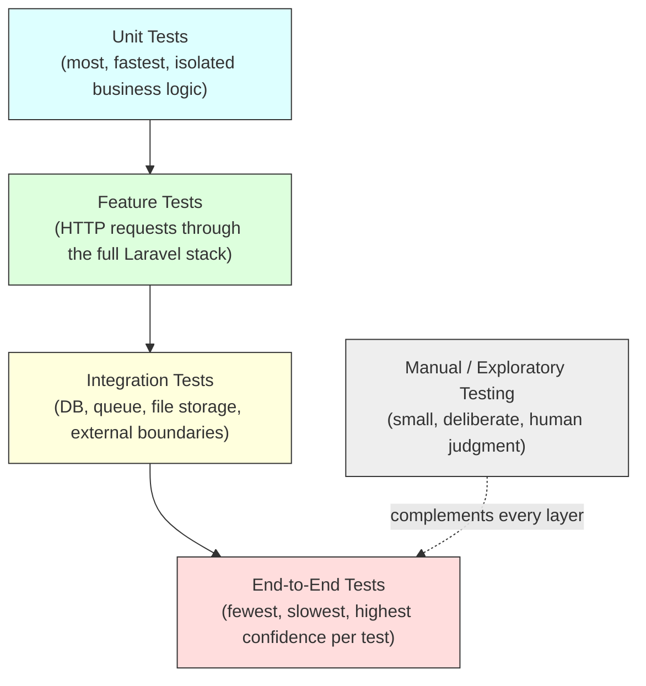
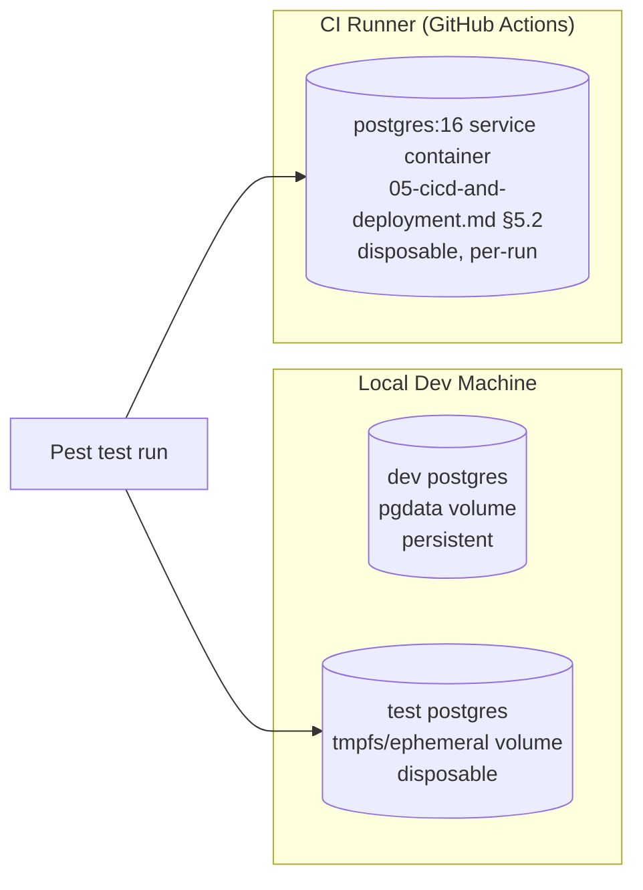
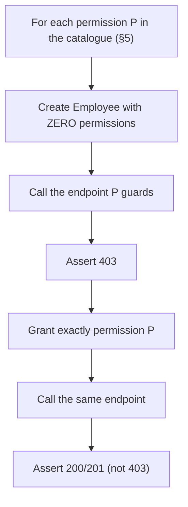
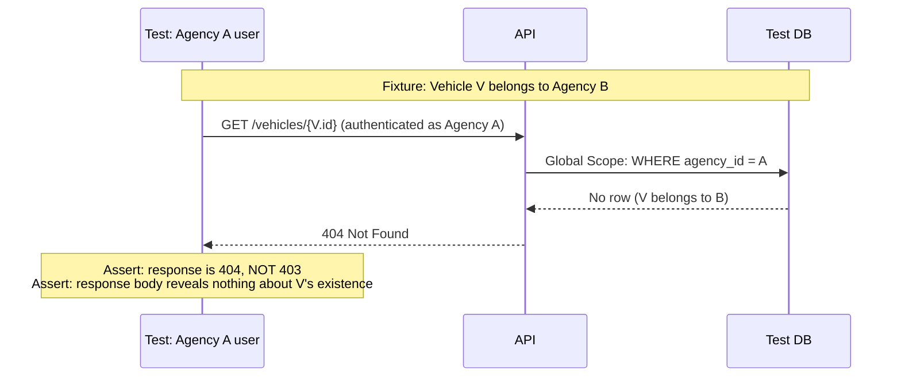

# 06 — Testing Strategy
## Locarion — Multi-Tenant SaaS Car Rental Platform

> **Document status:** Version 1.0 (Frozen)
> **Source of truth (frozen, do not reinterpret):** `PROJECT-BLUEPRINT.md`, `01-system-architecture.md` (v1.0), `02-database-design.md` (v1.0), `03-authorization-and-roles.md` (v1.0), `04-api-design.md` (v1.0), `05-cicd-and-deployment.md` (v1.0)
> **Purpose of this document:** define the complete, implementation-ready automated testing strategy that verifies the system as already specified — not a generic testing guide, but the **verification layer** for every architectural decision already frozen in the six documents above.
> **Scope discipline:** this document introduces no new business features, redesigns no architecture, and reinterprets no prior decision. Its only job is to specify *how the implementation is proven to match the documentation*. Where a prior document is silent on a purely testing-operational detail, an explicit assumption is stated inline as **`> Assumption:`**.
> **Companion documents:** all six frozen documents listed above, referenced throughout by section number rather than re-explained.

---

## Table of Contents

1. [Purpose](#1-purpose)
2. [Testing Pyramid](#2-testing-pyramid)
3. [Test Environment](#3-test-environment)
4. [Unit Testing](#4-unit-testing)
5. [Feature Testing](#5-feature-testing)
6. [Authorization Testing](#6-authorization-testing)
7. [API Testing](#7-api-testing)
8. [Database Testing](#8-database-testing)
9. [Frontend Testing](#9-frontend-testing)
10. [End-to-End Testing](#10-end-to-end-testing)
11. [Performance Testing](#11-performance-testing)
12. [Security Testing](#12-security-testing)
13. [CI Quality Gates](#13-ci-quality-gates)
14. [Test Data Strategy](#14-test-data-strategy)
15. [Coverage Strategy](#15-coverage-strategy)
16. [Traceability Matrix](#16-traceability-matrix)
17. [Future Evolution](#17-future-evolution)
18. [Testing ADRs](#18-testing-adrs)

---

## 1. Purpose

### 1.1 What This Document Is For

Every prior document made a claim about how the system *should* behave: agencies cannot see each other's data (Blueprint §2, §10), a wrong-tenant lookup returns 404 not 403 (`03-authorization-and-roles.md` §7.5), a reservation cannot double-book a vehicle (`02-database-design.md` §6 Rule 6), the same Docker image is promoted unmodified from CI to production (`01-system-architecture.md` ADR-13). None of these claims are self-enforcing. This document specifies the automated tests whose continued passing is the *evidence* that each claim is still true — today, and after every future change.

Put directly: **the previous six documents describe what Locarion is supposed to do. This document describes how we know it actually does it.**

### 1.2 Testing Philosophy

1. **Verification, not exploration.** This document does not invent new correctness criteria — every test category traces back to a specific section of a frozen document (see §16, the Traceability Matrix). A test that doesn't correspond to a documented decision is either testing something out of scope or a signal that a document is missing a decision, not a reason to write speculative tests.
2. **Shift-left.** A defect caught by a unit test in a developer's editor costs seconds. The same defect caught by `ci.yml` (`05-cicd-and-deployment.md` §5.2) costs minutes. Caught after merge, it costs a production incident affecting every tenant simultaneously (§1.1 of `05-cicd-and-deployment.md`: "there is no canary tenant isolation"). Every layer in the pyramid (§2) exists specifically to catch a class of defect as early and as cheaply as possible.
3. **Confidence over coverage percentage.** A percentage is a proxy, not a goal. Blueprint §3 sets an indicative coverage target (>70% on reservations/invoicing/tenancy-scoping domain logic) as a floor, not a target to game — 100% line coverage on a getter/setter proves nothing, while 100% *scenario* coverage on "can Agency B ever see Agency A's reservation" is the actual point of this whole document. §15 makes this explicit.
4. **Multi-tenancy is the platform's one truly non-negotiable guarantee** (Blueprint §2: "Agency data isolation is non-negotiable... enforced at multiple layers, not just the UI"). Because isolation is enforced by *multiple independent layers* (Global Scope, Policy, tenant-aware route binding, DB constraints — `03-authorization-and-roles.md` §1.5), the test suite is the only thing that can prove all layers are simultaneously intact; a human code reviewer cannot inspect four independent layers on every PR the way a CI-gated cross-tenant test suite can.
5. **Every test failure must be traceable to a specific frozen decision** — a test that fails should point a developer at "which section of which document did this violate," not merely "something broke." This is why §16 exists as a first-class section, not an appendix.

### 1.3 Why Automated Testing Is Non-Negotiable for This Architecture Specifically

`02-database-design.md` ADR-DB-01 chose **shared-schema, shared-database** multi-tenancy over schema-per-tenant or database-per-tenant specifically because it is operationally simpler at MVP scale. That decision has a direct testing consequence: because there is no physical database boundary between Agency A and Agency B, **the application layer is the only thing preventing cross-tenant data leakage**, and the application layer is exactly the thing unit/feature tests exercise. A schema-per-tenant architecture would get some isolation "for free" from Postgres itself; this architecture gets none of that for free — it must be continuously, automatically proven. This is the single biggest reason this document exists and the single biggest reason tenant-isolation tests (§6) are treated as the highest-priority test category in the entire suite.

---

## 2. Testing Pyramid

### 2.1 The Five Layers

### 2.2 Why Each Layer Exists

| Layer | What it proves | Why this layer specifically | Relative volume |
|---|---|---|---|
| **Unit** | A single Action, value object, or calculation is correct in isolation, given any input | Business rules (pricing, availability, status transitions — Architecture §3.4) must be provably correct **independent of HTTP, the database, or authentication**, per Architecture §3.4's explicit requirement that Actions be "callable and fully testable without an HTTP request, a database transaction commit, or a queued job actually running" | Highest — cheapest, fastest feedback |
| **Feature** | A full HTTP request, through routing → middleware → Form Request → Policy → Action → Resource, behaves as `04-api-design.md` specifies | This is where authorization (§6), tenant isolation, validation, and the API contract itself are actually exercised together — a unit test cannot prove a route is wired to the correct Policy | High — the bulk of business-logic proof |
| **Integration** | Laravel's boundary with real infrastructure (PostgreSQL constraints, file storage, Sanctum's actual cookie/session mechanics) behaves as documented | Some guarantees (a `CHECK` constraint firing, a `UNIQUE` violation, a foreign key `RESTRICT`) can only be proven against a real Postgres instance, not a mock | Moderate |
| **End-to-End** | A realistic, multi-step business workflow (Blueprint §18's Milestones) works from the outside in, the way a real agency or visitor would experience it | Feature tests prove each endpoint works; E2E tests prove the *sequence* of endpoints a real user actually calls produces the outcome the Blueprint promises (e.g., "an agency can list a car and a visitor can find it via search," Blueprint §18 M2) | Low — few, high-value, slow |
| **Manual / Exploratory** | Anything a human notices that an automated assertion wasn't written to check — visual polish, UX friction, a genuinely novel edge case | Automated tests only check what someone thought to assert; a human tester exploring the `back-office` UI before a milestone sign-off (Blueprint §18) is still valuable and is not replaced by automation | Lowest — deliberate, milestone-gated |

### 2.3 Pyramid Discipline

> **Assumption:** no prior document specifies a target test-count ratio between layers. This document assumes the conventional pyramid shape (many unit tests, fewer feature tests, still fewer integration tests, very few E2E tests) as the default engineering discipline, consistent with Architecture §1.4's "avoid premature optimization" and "prefer simplicity" principles — an inverted pyramid (many slow E2E tests, few fast unit tests) would make the CI pipeline duration target (Blueprint §3: <8 minutes) unachievable.

A rule of thumb enforced in code review, not tooling: **if a behavior can be proven with a unit test, it should be — a feature test should only additionally exist to prove the wiring (routing, middleware, authorization) around that behavior, not to re-verify the business rule's correctness a second time.**

---

## 3. Test Environment

### 3.1 Docker Compose for Testing

Per `05-cicd-and-deployment.md` §2.1, Docker Compose is already fixed as the containerization strategy for every environment. Testing adds one more: a `test` service profile (or a dedicated `docker-compose.test.yml` override) that mirrors the `db` service (Postgres 16, matching `05-cicd-and-deployment.md` §2.3) but with a disposable, ephemeral volume — never the `pgdata` named volume used by local development (§2.4 of that document) — so running the test suite can never corrupt a developer's local working data.

### 3.2 Test Database

- A dedicated database (e.g., `locarion_test`), never the same database as local development or any deployed environment (§3.3 of `05-cicd-and-deployment.md` fixes `pgsql` as the driver everywhere — this document only adds a distinct *database name/instance* for tests, not a different driver).
- Migrations run fresh against this database for every test run (`RefreshDatabase` trait, §3.4) — never assumed to already reflect the latest schema.

### 3.3 Database Refresh Strategy

> **Assumption:** neither prior document fixes a Pest/Laravel database-reset strategy. This document specifies Laravel's `RefreshDatabase` trait (migrate once per test run into an in-memory-tracked schema, wrap each test in a transaction that rolls back) as the default for Feature and Integration tests — the conventional, fastest-correct option, consistent with "boring technology where it doesn't matter" (Architecture §1.2). `DatabaseTransactions` alone (without a full migration refresh) is insufficient here specifically because schema-correctness itself (constraints, `CHECK`s, indexes — `02-database-design.md` §4–§7) is part of what this suite verifies; a stale schema would silently stop testing what the current migrations actually produce.

| Test type | Reset strategy | Why |
|---|---|---|
| Unit | No database at all, wherever possible | Actions/value-objects under test should not need a database (Architecture §3.4) |
| Feature | `RefreshDatabase` (migrate once, transaction-wrapped per test) | Fast, correct, exercises real constraints |
| Integration (DB-boundary-specific) | `RefreshDatabase`, occasionally without the transaction wrapper when testing genuine commit/rollback behavior (e.g., an `EXCLUDE`-constraint concurrency test, `02-database-design.md` §6 Rule 6 note) | Some constraint/concurrency behavior only manifests across committed transactions |
| E2E | Full fresh migrate + targeted seed per run | Simulates a genuinely fresh environment, per Blueprint §18 M0's "docker compose up gives a working empty app" exit criterion |

### 3.4 Parallel Testing

> **Assumption:** Pest's built-in parallel runner (`pest --parallel`, backed by Paratest) is adopted to keep the CI pipeline within Blueprint §3's <8-minute target as the test suite grows. Each parallel process gets its own isolated test database (Laravel's parallel-testing support creates one database per process automatically, e.g., `locarion_test_1`, `locarion_test_2`, ...) so parallel workers never contend for the same rows — this is the direct testing-layer analog of the "many small tenants, not one giant tenant" scale assumption already made in `02-database-design.md` §11.

### 3.5 Seeders in the Test Environment

The **production-safe seeders** (`RoleAndPermissionSeeder`, `RegionSeeder`, `VehicleCategorySeeder` — `02-database-design.md` §10) are run once per test-database refresh, since role/permission scaffolding is a precondition for almost every feature test (§6). `SuperAdminUserSeeder` and `DemoAgencySeeder` are **not** used directly in automated tests — tests construct their own Super Admin/Agency/User rows via Factories (§3.6) with deliberately controlled, test-specific attributes, rather than depending on seeded demo data whose contents could drift.

### 3.6 Factories

Every tenant-scoped Eloquent model (`02-database-design.md` §3) has a corresponding Laravel Factory. Factories are the **primary** mechanism for constructing test data — never hand-written `INSERT`-equivalent Eloquent calls scattered across test files. Factory conventions:

| Convention | Rule |
|---|---|
| Default state | A Factory's default state produces a **valid, fully-constraint-satisfying** row (a vehicle with a valid `vehicle_category_id`, a reservation with `end_date > start_date`, etc.) — invalid states are explicit, named factory states (`Vehicle::factory()->maintenance()`), never the default |
| Tenant association | A Factory for a tenant-scoped model **requires** an `Agency` (either passed explicitly or created via `Agency::factory()`) — there is no factory default that produces a `NULL`/orphaned `agency_id`, mirroring the schema's own `NOT NULL` rule (`02-database-design.md` §8.1) |
| Cross-agency test data | A dedicated factory helper/trait (`TestTenancy::twoAgencies()` or similar) creates **two** distinct agencies with parallel data (a Vehicle in Agency A, a Vehicle in Agency B) — used specifically by tenant-isolation tests (§6) so every such test starts from an unambiguous, symmetric two-tenant fixture rather than each test hand-rolling its own |
| Money fields | Factory-generated `daily_rate`/`amount`/etc. are always realistic `numeric(10,2)`-safe values, never floats that could hide a rounding bug (`02-database-design.md` §2.8, principle 4) |

### 3.7 Environment Isolation

- Test runs never share state with the `staging` or `production` databases described in `05-cicd-and-deployment.md` §2.2 — there is no code path, credential, or CI job that points a test run at anything but the disposable test database (§3.1–§3.2).
- `APP_ENV=testing` is set for every test run; `.env.testing` (committed, no secrets — mirroring `.env.example`'s role per `05-cicd-and-deployment.md` §3.1) fixes `QUEUE_CONNECTION=sync`, `MAIL_MAILER=array` (captured in-memory, never actually sent), and `FILESYSTEM_DISK` pointed at a temporary local-disk fake (Laravel's `Storage::fake()`), so no test run ever writes to the real `app-storage` volume (`05-cicd-and-deployment.md` §2.4).

### 3.8 CI Environment

Directly implements `05-cicd-and-deployment.md` §5.2's `ci.yml`: a `postgres:16` GitHub Actions service container, matched to the same major version used in Staging/Production (`05-cicd-and-deployment.md` §2.3), so a constraint or index behavior proven in CI is proven against the same database engine version production runs — never a lighter substitute (e.g., SQLite) that would risk silently diverging from Postgres-specific behavior (`CHECK` constraints, `numeric` precision, `timestamptz` handling — `02-database-design.md` §2.3, §2.7).

> **Assumption:** SQLite is explicitly **not** used for any test tier, including unit tests that happen to touch Eloquent models, specifically because this schema relies on Postgres-specific guarantees (`CHECK`-constraint enums, `timestamptz`, `numeric(10,2)` precision) that SQLite does not enforce identically — a passing SQLite-backed test could mask a genuine Postgres-only failure. This is worth stating explicitly since SQLite-backed testing is a common Laravel default elsewhere and is a deliberate rejection here, not an oversight.

---

## 4. Unit Testing

### 4.1 What Belongs at This Layer

Per Architecture §3.4, every **Action** is designed to be callable and testable without HTTP, without a committed transaction, and without a queue actually running. Unit tests are where that design pays off directly.

| Category | Example | What the test proves |
|---|---|---|
| **Pricing / Money calculations** | `CalculateReservationPriceAction` | `total_price = daily_rate_snapshot × number_of_days`, rounds correctly to `numeric(10,2)` (`02-database-design.md` §2.8 principle 4), never produces a float-rounding artifact |
| **Availability calculations** | The `Vehicle::availableFor($dateRange)` scope / query object (Architecture §3.5) | Correctly identifies date-range overlap against existing `confirmed`/`active` reservations (`02-database-design.md` §6 Rule 6) — inclusive/exclusive boundary correctness (a reservation ending the same day another starts) is exhaustively tested here, not left to a single feature test |
| **Status transition rules** | `TransitionReservationStatusAction` | Every allowed transition (`pending → confirmed → active → completed`, `cancelled` reachable from `pending`/`confirmed`/`active` — `04-api-design.md` §5.8) succeeds; every disallowed transition throws the documented domain exception |
| **Invoice numbering** | The agency-scoped sequential invoice-number generator (`04-api-design.md` §5.10) | Produces a correctly formatted, per-agency-unique number, and correctly handles the first invoice for a brand-new agency (no prior sequence) |
| **Payment-sum validation** | The balance check inside `RecordPaymentAction` (`02-database-design.md` §6 Rule 14) | A payment that would push the running sum over `Invoice.amount` is rejected; a payment landing exactly on the balance transitions the invoice to `paid` (`04-api-design.md` §5.11) |
| **Date calculations** | `duration_days` computed field (`04-api-design.md` §6.2), reservation date validation | Off-by-one-day correctness — the exact class of bug Architecture §10.7's UTC-storage decision exists to prevent; unit tests here are the concrete proof that decision actually works |
| **UUID generation** | Every model using `HasUuids` (`02-database-design.md` §2.2) | A newly instantiated (not-yet-saved) model already has a non-null, valid-format UUID `id` — proving the "reference an ID before persisting" benefit `02-database-design.md` §2.2 explicitly claims |
| **Validation helper / Rule classes** | `EndDateAfterStartDate`, `UniquePerAgency` (`04-api-design.md` §9.3) | The custom Rule class passes/fails exactly the cases its name implies, independent of any specific Form Request that uses it |
| **Value objects** | Money formatting (fixed-2-decimal string serialization, `04-api-design.md` §12) | A `Money`-style value object (or equivalent formatting helper) never emits a float, never loses precision on serialization |

### 4.2 What Should NOT Be Unit Tested

- **Anything requiring HTTP routing, middleware, or authentication** — that's Feature testing (§5). A unit test that boots the Kernel to test an Action defeats the entire purpose of the Actions pattern (Architecture §3.4).
- **Global Scopes and Policies in isolation from a real query** — a Global Scope's entire job is to modify a query; testing it meaningfully requires an actual Eloquent query against a real (test) database, which makes it a Feature/Integration concern (§6), not a Unit one.
- **Framework behavior already covered by Laravel's own test suite** — e.g., "does `$model->save()` persist a row." Locarion's test suite verifies Locarion's decisions, not Laravel's.
- **Getters/setters, simple Eloquent casts, or trivial API Resource field mapping** with no logic — these are implicitly covered by Feature tests asserting the full response shape (§7); a dedicated unit test adds cost without adding confidence (§1.2, principle 3).
- **Third-party package internals** (Spatie `laravel-permission`'s own team-scoping logic, Sanctum's own cookie mechanics) — Locarion's tests verify *Locarion's use of* these packages (§6), never the packages' own already-tested internals.

---

## 5. Feature Testing

### 5.1 Structure and Convention

Every Feature test issues a real HTTP request (`$this->postJson(...)`, `getJson(...)`, etc.) through Laravel's full stack and asserts on the actual HTTP response — status code, JSON shape (§7), and any resulting database state. Feature tests are organized to mirror `04-api-design.md` §4's module breakdown exactly, one test class family per module, so a developer reading `04-api-design.md` §5.x can find the corresponding test file by name convention alone (e.g., `tests/Feature/Reservations/CreateReservationTest.php` ↔ `04-api-design.md` §5.8).

### 5.2 Per-Module Feature Test Definition

For every module below: **Purpose**, **Expected (happy-path) scenarios**, **Failure scenarios**, **Edge cases** — each traceable to the cited section of a frozen document.

#### 5.2.1 Authentication

| Aspect | Detail |
|---|---|
| Purpose | Prove login/logout/`/me`/password-reset behave exactly per `03-authorization-and-roles.md` §2, §9.1 |
| Expected | Valid credentials + active user → `200`, session established, session ID regenerated (§2.3); `GET /me` returns resolved roles/permissions (§2.7) |
| Failure | Wrong password → `401`; `is_active = false` → `401` (§2.7); soft-deleted user → `401` (§10.12, since Eloquent excludes it from the lookup entirely) |
| Edge cases | Login attempt against an email that doesn't exist at all (must not leak "email not found" vs. "wrong password" — same generic `401`); "remember me" issuing the correct additional cookie (§2.5); CSRF cookie missing on a state-changing request → `419`/`403` depending on Sanctum's own default (verify against `03-authorization-and-roles.md` §2.4) |

#### 5.2.2 Authorization

Covered as its own first-class section — see §6.

#### 5.2.3 Vehicles (Fleet)

| Aspect | Detail |
|---|---|
| Purpose | CRUD + Policy + tenant scoping for `/api/v1/vehicles` (`04-api-design.md` §5.5) |
| Expected | Agency Admin/permitted Employee can list/create/view/update/soft-delete a vehicle within their own agency; response matches `VehicleResource` (§6.1 of `04-api-design.md`) exactly |
| Failure | Missing `fleet.*` permission → `403`; invalid `vehicle_category_id` → `422`; duplicate `plate_number` within the same agency → `422` (`02-database-design.md` §4.5 Rule 15) |
| Edge cases | Duplicate `plate_number` **across two different agencies** must succeed (Rule 15 is per-agency, not global — this is a deliberate positive test, not just a negative one); soft-deleted vehicle excluded from default `GET /vehicles` list but still resolvable by a `Reservation`'s eager-loaded relation (proving soft-delete preserves referential integrity, `02-database-design.md` §2.4) |

#### 5.2.4 Vehicle Images

| Aspect | Detail |
|---|---|
| Purpose | Upload/reorder/remove per `04-api-design.md` §5.6, §11.1 |
| Expected | Valid image upload → `201`, correct tenant-namespaced storage path (Architecture §7.1) |
| Failure | Oversized file (>5MB) or disallowed MIME type → `422`; authorization piggybacks on `VehiclePolicy` (§5.6 assumption) — an Employee without `fleet.images.manage` but with `fleet.view` → `403` |
| Edge cases | Deleting a Vehicle cascades to its images (`ON DELETE CASCADE`, `02-database-design.md` §2.5) — proven at the Feature layer by deleting a vehicle and asserting its images are truly gone, and again at the Database layer (§8) as a direct constraint test |

#### 5.2.5 Reservations

| Aspect | Detail |
|---|---|
| Purpose | Full booking lifecycle per `04-api-design.md` §5.8 |
| Expected | Create → `201` with server-computed `daily_rate_snapshot`/`total_price`; valid status transition → `200` |
| Failure | Overlapping `confirmed`/`active` reservation for the same vehicle → `409 overlapping_reservation` (not `422` — `04-api-design.md` ADR-API-14); invalid status transition (e.g. `completed → pending`) → `409 invalid_status_transition`; `vehicle_id`/`customer_id` belonging to a different agency → the Global Scope means these simply don't `exists:` validate → `422`, not a leak |
| Edge cases | Reservation dates that exactly abut an existing reservation (one ends the day the next starts) — must **not** count as overlapping, a precise boundary test mirroring the unit-level availability test (§4.1) but exercised through the real HTTP+DB path; attempting to `POST .../status` twice with the same target status is idempotently rejected, not double-applied (`04-api-design.md` §12 "Idempotency") |

#### 5.2.6 Customers

| Aspect | Detail |
|---|---|
| Purpose | CRUD per `04-api-design.md` §5.7 |
| Expected | Create/update/verify-document flow sets `document_verified_at` correctly (`04-api-design.md` §5.7's `document_verified` field) |
| Failure | Duplicate (`agency_id`, `document_type`, `document_number`) → `422` (`02-database-design.md` §4.7 Rule 16) |
| Edge cases | The same real-world document number registered independently by **two different agencies** must both succeed — proving Rule 16's per-agency scope, and directly proving Blueprint §6's "no cross-agency customer identity" decision |

#### 5.2.7 Invoices

| Aspect | Detail |
|---|---|
| Purpose | Draft → issue → void/paid lifecycle per `04-api-design.md` §5.10 |
| Expected | Create draft → `201`; issue → `status = issued`, `issued_at` set; void a non-paid invoice → `status = void` |
| Failure | `PATCH` an already-`issued` invoice → `403` (a permission-level rejection per policy state, not `422` — `04-api-design.md` §5.10); duplicate `invoice_number` within an agency is structurally impossible since it's server-generated, but the uniqueness constraint is still asserted directly (§8) |
| Edge cases | Server-generated `invoice_number` format and per-agency uniqueness under concurrent creation (two invoices created back-to-back for the same agency never collide) |

#### 5.2.8 Payments

| Aspect | Detail |
|---|---|
| Purpose | Recording payments per `04-api-design.md` §5.11 |
| Expected | Payment recorded → `201`; sum reaching `Invoice.amount` exactly → invoice auto-transitions to `paid` (`02-database-design.md` §6 Rule 14) |
| Failure | Payment that would exceed the invoice's remaining balance → `409 payment_exceeds_balance` |
| Edge cases | Two payments recorded in rapid succession that together exactly total the balance — the *second* one specifically must trigger the `paid` transition, not the first; a payment of `0.00` or negative amount rejected at validation (`min:0.01`) before ever reaching the Action |

#### 5.2.9 Contracts

| Aspect | Detail |
|---|---|
| Purpose | Generation/regeneration/download per `04-api-design.md` §5.9 |
| Expected | `POST .../contract` → `201` with the full `ContractResource` in the same response (synchronous, `sync` queue driver — `04-api-design.md` §5.9 note); regeneration updates the existing row rather than creating a second one (`02-database-design.md` §4.9's "at most one" via unique constraint) |
| Failure | `GET .../download` for a contract belonging to a different agency → `404`, never a leaked file stream |
| Edge cases | Attempting to generate a contract for a Reservation that doesn't yet exist in a confirmable state — verify the Action's own precondition, not just a generic validation error |

#### 5.2.10 Booking Requests

| Aspect | Detail |
|---|---|
| Purpose | Public submission (§5.3 of `04-api-design.md`) + back-office review (§5.12) |
| Expected | Public `POST` → `201`, `agency_id` correctly derived server-side from `vehicle_id` (never accepted from the body, `04-api-design.md` §12.9); `approve` converts into exactly one `Reservation`, creating a `Customer` if none matches (`04-api-design.md` §5.12 assumption) |
| Failure | Approving an already-converted request → `409 already_converted` (`02-database-design.md` §6 Rule 11) |
| Edge cases | A public visitor submitting a request for a `vehicle_id` that exists but is `retired`/`maintenance` → `422` (fails the `exists: ... active vehicle` rule, `04-api-design.md` §5.3); the created-`Customer`-on-approval path specifically verified to attach the new Customer to the **correct** agency (the vehicle's/request's agency, never the reviewing Super Admin's — which is `NULL` anyway) |

#### 5.2.11 Employees

| Aspect | Detail |
|---|---|
| Purpose | Employee lifecycle + permission management per `04-api-design.md` §5.13 |
| Expected | Agency Admin creates an Employee → starts with **zero** permissions (`03-authorization-and-roles.md` §1.4, ADR-AUTH-09) — this is asserted as an explicit, named test, not an incidental default; `PATCH .../permissions` performs a full, idempotent replace |
| Failure | An Employee (even one holding `employees.permissions.manage`) attempting to grant a permission they don't themselves hold — verify this is actually blocked (or, if not structurally prevented by Policy, flagged as a gap against `03-authorization-and-roles.md` §3.3's restriction) |
| Edge cases | Deactivating an Employee mid-session terminates their *existing* session's usefulness on the next request, not merely blocking future logins (`03-authorization-and-roles.md` §10.11) — this specific test requires establishing a session, deactivating from a second "actor," then replaying a request on the first session |

#### 5.2.12 Reports

| Aspect | Detail |
|---|---|
| Purpose | Aggregated read-models per `04-api-design.md` §5.14 |
| Expected | `revenue`/`utilization` reports return figures that match hand-computed expectations from seeded Invoice/Payment/Reservation fixtures for the given `from`/`to` range |
| Failure | Missing `from`/`to` → `422` (never silently "all time," per `04-api-design.md` §8.5) |
| Edge cases | A report window that includes invoices from **two different agencies** in the fixture set — the requesting Agency Admin's report must reflect **only their own agency's** figures, making this simultaneously a Reports test and a tenant-isolation test (§6) |

#### 5.2.13 Settings (Agency)

| Aspect | Detail |
|---|---|
| Purpose | `GET`/`PATCH /api/v1/agency` per `04-api-design.md` §5.4 |
| Expected | Permitted fields update; `region_id`/`status`/`slug` are silently ignored if included in the request body, not validated or written (`04-api-design.md` §5.4) |
| Failure | Missing `agency.settings.update` → `403` |
| Edge cases | Explicitly asserting that a `PATCH` body containing `{"status": "suspended"}` has **zero effect** on the agency's actual `status` column — this is a security-relevant negative assertion, not just a validation nicety |

#### 5.2.14 Platform Administration

| Aspect | Detail |
|---|---|
| Purpose | `/api/v1/admin/*` per `04-api-design.md` §5.15 |
| Expected | Super Admin creates an agency + its first Agency Admin atomically (`CreateAgencyAction`, single transaction) — a test that forces a failure partway through (e.g., duplicate `admin_email`) asserts **neither** the Agency **nor** a partial User row persists |
| Failure | Non-Super-Admin hitting any `/admin/*` route → `403` via the `access-platform-admin` Gate (`03-authorization-and-roles.md` §8.2) |
| Edge cases | Suspending an agency and then verifying its staff's *next* request is rejected by `EnsureAgencyIsActive` (`03-authorization-and-roles.md` §8.3) — this is both a Platform Admin test and an Authorization test (§6) |

---

## 6. Authorization Testing

This section is the direct verification layer for `03-authorization-and-roles.md` in its entirety — the single most important test category in the suite per §1.3 of this document.

### 6.1 Roles

| Test | Verifies |
|---|---|
| Exactly three Spatie roles exist post-seed (`super-admin`, `agency-admin`, `employee`) | `03-authorization-and-roles.md` §4.1, ADR-AUTH-02 — a test that fails if a fourth role is ever accidentally introduced |
| `agency-admin` is seeded with every agency-operational permission at agency-creation time | §4.2 — asserted directly against the permission catalogue (§5 of that document), not just "some permissions exist" |
| `employee` starts with zero permissions on creation | §1.4, ADR-AUTH-09 |
| No role inheritance exists (revoking a permission from `agency-admin`'s seed set does not cascade any inherited grant to `employee`) | §4.2 |

### 6.2 Permissions

For every permission in `03-authorization-and-roles.md` §5's tables (46 permissions across 10 modules), a **parameterized** Pest test (`it()->with([...])` / a dataset) asserts: an Employee **without** the permission is rejected (`403`) on the corresponding endpoint, and an Employee **granted** that specific permission (and no others) succeeds. This is deliberately implemented as one dataset-driven test per module rather than 46 hand-written near-duplicate tests, so adding a permission to §5 later is a one-line dataset addition, not a new test file.

### 6.3 Policies

| Test | Verifies |
|---|---|
| Every tenant-scoped model has a corresponding Policy registered (`VehiclePolicy`, `ReservationPolicy`, ... — `03-authorization-and-roles.md` §8.1) | A static/reflection-based test enumerating `02-database-design.md` §3's tenant-scoped entities against Laravel's registered Policy map — fails loudly if a new domain model is ever added without a matching Policy |
| Policy re-checks ownership **independent of** the Global Scope | Constructed by directly calling `$policy->view($user, $modelFromDifferentAgency)` bypassing the scope (e.g., via `withoutGlobalScope()`) and asserting the Policy **still** denies — this is the literal test of the "defense in depth" claim in §7.3 of that document; without this specific test, a broken Global Scope could silently pass every other test |
| Every Policy method checks both permission **and** agency ownership | Four-way dataset: (permission: yes/no) × (ownership: same/different agency) → only (yes, same) should authorize |

### 6.4 Tenant Isolation

The highest-priority test family in the entire suite (§1.3). Structure: every tenant-scoped resource gets an identical-shaped test using the two-agency fixture (§3.6):

| Test | Verifies |
|---|---|
| Cross-agency `GET` by ID → `404` | `03-authorization-and-roles.md` §7.5, for **every** tenant-scoped resource type (parameterized across Vehicle, Reservation, Customer, Contract, Invoice, Payment, BookingRequest) |
| Cross-agency `PATCH`/`DELETE` by ID → `404` (never a silent no-op success) | Same, write-path variant |
| Cross-agency list endpoints never include the other agency's rows, even when both agencies have qualifying data | `03-authorization-and-roles.md` §7.2 — the Global Scope test at collection-scale, not just single-record |
| Relationship traversal never leaks (`$vehicle->reservations` scoped to Agency A cannot return an Agency B reservation even if IDs were somehow forced) | Architecture §3.6's explicit relationship-leak concern |
| Mass-assignment of `agency_id` from the request body has zero effect | `03-authorization-and-roles.md` §7.6 — `POST`/`PATCH` a payload that includes a foreign `agency_id` and assert the persisted row's `agency_id` is still the acting user's own agency |
| `agency_id NOT NULL` + `FOREIGN KEY` cannot be bypassed even via direct Eloquent calls that skip the Action layer | A defense-in-depth database-layer test, cross-referenced with §8 |

### 6.5 Super Admin Behavior

| Test | Verifies |
|---|---|
| Super Admin (`agency_id = NULL`) gets `404`, not privileged access, when hitting any agency-scoped endpoint directly | `03-authorization-and-roles.md` §7.4 — proves "no default bypass" is real, not just documented |
| `/api/v1/admin/*` routes reject a non-Super-Admin | §8.2 Gate test |
| `EnsureAgencyIsActive` middleware is correctly **skipped** for Super Admin (whose `agency_id` is `NULL`, so the check is meaningless) without throwing | §8.3, §9.3 sequence diagram |

### 6.6 Impersonation

| Test | Verifies |
|---|---|
| Beginning impersonation logs `agency.impersonation_started` to `ActivityLog` with the correct `agency_id`/`user_id` | `03-authorization-and-roles.md` §7.4 step 2 |
| During impersonation, Policies/Global Scopes evaluate as if the Super Admin were that agency's own Agency Admin | Step 3 — the actual authorization-behavior proof, not just the logging side-effect |
| Every write during impersonation is separately tagged/logged | Step 4 |
| Ending impersonation reverts the session to agency-data-free, and is itself logged (`agency.impersonation_ended`) | Step 5 |
| A Super Admin **without** `platform.agencies.impersonate` cannot begin impersonation at all | §5.8 permission table |

### 6.7 Unauthorized Access & 404 vs. 403

| Test | Verifies |
|---|---|
| Unauthenticated request to any `/api/v1/*` (non-public) route → `401`, not `403`/`404` | `03-authorization-and-roles.md` §2, general Sanctum behavior |
| Same-agency record, missing permission → `403` | §7.5's "when 403 is still correct" case — the complementary positive test to §6.4's 404 tests, ensuring the suite doesn't accidentally turn *every* denial into a blanket 404 |
| Different-agency record, regardless of permission level → `404`, even if the user holds the relevant permission in their own agency | The precise disambiguation the whole 404-vs-403 design (§7.5) hinges on — a permission holder in Agency A must still get 404, not 403, for an Agency B record |

### 6.8 Session Behavior

| Test | Verifies |
|---|---|
| Session ID regenerates on login | `03-authorization-and-roles.md` §2.3 — session-fixation protection |
| Idle session past `SESSION_LIFETIME` is rejected on the next request | §2.3 |
| CSRF-missing state-changing request → rejected | §2.4 |
| Deactivated/soft-deleted user's active session is cut off on the very next request | §10.11, §10.12 |
| `remember_token`-backed session correctly re-establishes after normal session expiry | §2.5 |

---

## 7. API Testing

Direct verification of `04-api-design.md` in full.

### 7.1 Endpoints

Every endpoint row in `04-api-design.md` §5 has at least one corresponding Feature test asserting: correct HTTP method accepted (and disallowed methods rejected with `405`), correct URL resolves, correct Policy/Gate/permission enforced (cross-referenced to §6 rather than re-asserted independently).

> **Assumption:** a lightweight, generated **route-coverage checklist** (a script that diffs Laravel's `route:list` output against the endpoint table in `04-api-design.md` §5) is run as a CI step to catch an endpoint added to the codebase with no corresponding row in that document, or vice versa — this is not a correctness test in the Pest sense but a **documentation-drift** test, directly serving this document's stated goal (§1.1) of proving implementation matches documentation.

### 7.2 Validation

Every Form Request's rule table (`04-api-design.md` §5.x) is exercised with both a valid payload (asserted to pass) and, for every individual field, an invalid variant (asserted to produce exactly that field's key in the `422` `errors` object, per §9.2's format). Custom Rule classes (`EndDateAfterStartDate`, `UniquePerAgency` — §9.3) are additionally unit-tested (§4) so their correctness isn't proven only indirectly through a specific endpoint.

### 7.3 Filtering, Sorting, Searching

| Test | Verifies |
|---|---|
| Public search (`04-api-design.md` §8.2) filters correctly combine (`region` + `category` + `price_max` together return the intersection, not the union) | Multi-parameter correctness, not just single-parameter |
| `start_date`/`end_date` availability filter correctly excludes overlapping-reservation vehicles | Direct link to `02-database-design.md` §6 Rule 6, exercised through the actual public endpoint this time (complementing the unit-level availability test, §4.1) |
| An unrecognized `sort_by` value falls back to default rather than erroring | §7.3's explicit "ignored, not 422" rule |
| Back-office `status` filters (`04-api-design.md` §8.4) only ever return the **acting agency's** matching rows, tying this directly back to §6.4 | Combined filtering + tenant-isolation test |

### 7.4 Pagination

| Test | Verifies |
|---|---|
| Default `per_page` (15) and max clamp (100) | `04-api-design.md` §7.2 — a request for `per_page=500` returns at most 100, not an error |
| `meta`/`links` shape matches §7.1 exactly | Full envelope assertion, not just `data` |
| Public search default order is `daily_rate asc`; back-office lists default to `created_at desc` | §7.4 |

### 7.5 Error Responses & Status Codes

A single, shared assertion helper (`assertErrorEnvelope($response, $code, $errorCode)`) is used across every negative-path Feature test, checking the full `{"message": ..., "error_code": ..., "errors": ...}` shape from `04-api-design.md` §10.1 — including that `errors` is present **only** on `422` and absent on every other error code, and that `error_code` is present on every non-2xx response without exception (§10.2's full table is walked as a dataset).

### 7.6 JSON Structure

Every API Resource (`04-api-design.md` §6) has a **snapshot-style** structural assertion (`assertJsonStructure`) verifying exactly the documented field set — including that "hidden" fields (e.g., `Contract.file_path`, `User.password`) are **provably absent**, not merely unasserted. Money fields are asserted to be **strings** with exactly two decimals (`04-api-design.md` §12, ADR-API-12) — a dataset test across every monetary field in every Resource, since a silent regression to a JSON number is exactly the kind of defect a human reviewer easily misses.

### 7.7 Authentication (API Surface)

Covered jointly with §6.8; API-specific addition: verifying that `/api/v1/public/*` endpoints **never** require (or even accept meaningfully) a session cookie — a request with a *valid* session cookie for one agency hitting a public endpoint still returns the same, agency-agnostic public data (proving public routes are truly stateless per Architecture §2.1).

### 7.8 Rate Limiting

| Test | Verifies |
|---|---|
| `/api/v1/login` rejects the 6th attempt within a minute for the same `email + IP` with `429` | `04-api-design.md` §13, `03-authorization-and-roles.md` §10.2 |
| `/api/v1/public/*` general throttle (60/min) and the stricter `booking-requests` `POST` throttle (10/hour) both fire at their documented thresholds | §13 |
| Authenticated general throttle (120/min) is measurably more permissive than the public one, proven as a comparative test, not just two isolated assertions | Architecture §9.2's "more permissive for authenticated routes" |

> **Assumption:** rate-limit tests use Laravel's testing-friendly rate limiter facade (freezing/advancing the limiter's internal clock rather than issuing 61 real HTTP requests in a tight loop) to keep this test fast and deterministic, consistent with the CI-duration goal (Blueprint §3).

### 7.9 File Uploads

| Test | Verifies |
|---|---|
| Valid image (JPEG/PNG/WebP, ≤5MB) → `201`, stored at the exact tenant-namespaced path convention (`04-api-design.md` §11.1, Architecture §7.1) | Uses Laravel's `UploadedFile::fake()` against a `Storage::fake()` disk (§3.7) — never a real file write |
| Oversized file / disallowed MIME → `422` | §11.1 |
| Contract PDFs are never accepted as client uploads on any route | §11.2 — a negative test confirming no such endpoint exists (route-coverage check, §7.1) |
| Downloading a contract streams `Content-Type: application/pdf`, `Content-Disposition: attachment`, and is Policy-gated (cross-tenant download → `404`) | §11.2, tied to §6.4 |

---

## 8. Database Testing

Direct verification of `02-database-design.md`.

### 8.1 Constraints & Foreign Keys

| Test | Verifies |
|---|---|
| Every documented `FOREIGN KEY` actually exists at the schema level (introspection-based test against `information_schema`, not just "the app behaves as if it exists") | §2.5, §4 (per-table FK columns) |
| Attempting to hard-delete a `Region`/`VehicleCategory` referenced by an `Agency`/`Vehicle` throws (DB-level `RESTRICT`) | §2.5, §6 Rule 9 |
| `vehicle_images.vehicle_id` is the **one** documented `CASCADE` — deleting a Vehicle row that has no other references removes its images automatically | §2.5's explicit exception |
| `agency_id NOT NULL` on every tenant-scoped table (attempting a raw insert with `agency_id = NULL` fails at the DB level, bypassing the application entirely) | §8.1 — this is deliberately tested via a raw DB insert, not through Eloquent, to prove the **database's own** guarantee independent of any application code path |

### 8.2 Unique Constraints

Parameterized dataset covering every unique constraint in §4/§7: `(agency_id, plate_number)`, `(agency_id, document_type, document_number)`, `(agency_id, invoice_number)`, `contracts.reservation_id`, `regions.code`, `vehicle_categories.slug`, `agencies.slug`, `users.email` (global). Each test proves both **that the constraint fires within the intended scope** and **that it does not fire across agencies** where the design says it shouldn't (e.g., §8.2's plate-number dataset asserts the *same* plate number in two different agencies is allowed).

### 8.3 Soft Deletes

| Test | Verifies |
|---|---|
| `Agency`, `Vehicle`, `VehicleImage`(hard, not soft), `Customer`, `Contract`, `User` correctly implement `SoftDeletes` | §2.4's table, walked as a dataset — including the deliberate *negative* case that `Reservation`, `Invoice`, `Payment`, `BookingRequest`, `Region`, `VehicleCategory`, `ActivityLog` do **not** have a `deleted_at` column at all |
| A soft-deleted row is excluded from default queries but still resolvable via `withTrashed()` for FK-integrity purposes | §2.4 |
| Soft-deleting a Vehicle/Customer that has Reservation history does not orphan or cascade-delete that history | §2.4's core rationale, directly tested |

### 8.4 Cascade Behavior

Covered jointly with §8.1's `CASCADE` exception test — this subsection additionally verifies the **absence** of unintended cascades (deleting a `VehicleCategory` must fail, not silently cascade-null every `Vehicle.vehicle_category_id`, since that FK is `NOT NULL`).

### 8.5 Indexes

| Test | Verifies |
|---|---|
| Every index listed in `02-database-design.md` §7 exists (schema introspection) | Direct, literal verification of that table |
| A representative query pattern (e.g., `WHERE agency_id = ? AND status = ?` on `reservations`) uses the expected index, not a sequential scan | `EXPLAIN`-based assertion — see also §11 (Performance Testing) for the broader N+1/query-count concern; this test is narrowly about index *usage*, not overall response time |

### 8.6 Transactions

| Test | Verifies |
|---|---|
| `CreateAgencyAction` (Agency + first Agency Admin) is atomic — forcing a failure after the Agency insert but before the User insert leaves **zero** rows from either table | `04-api-design.md` §5.15 |
| `CreateReservationAction`'s overlap check + insert happens within a single transaction, so a concurrent double-booking attempt cannot both succeed (a genuine two-connection concurrency test, not just two sequential requests) | `02-database-design.md` §6 Rule 6's documented application-layer enforcement — this is the single most important concurrency test in the suite, since it's the one place the schema deliberately does **not** provide a DB-level backstop (ADR-DB-09) |

> **Assumption:** the concurrency test for reservation overlap uses two genuinely parallel database connections (e.g., Pest's ability to open a second raw PDO connection mid-test, or a dedicated Postgres advisory-lock-aware helper) rather than two sequential HTTP calls, since a purely sequential test cannot actually exercise the race condition ADR-DB-09 accepted the risk of. This is flagged as a **higher-effort, high-value** test explicitly worth the extra setup complexity, given it verifies a documented, deliberate risk trade-off rather than an incidental behavior.

### 8.7 Migration Correctness

| Test | Verifies |
|---|---|
| `php artisan migrate:fresh` succeeds cleanly, in the exact dependency order fixed by §9.1 | Run as a dedicated CI step (also feeding `05-cicd-and-deployment.md` §5.2's build-check job) |
| Every migration has a working `down()` (`migrate:fresh` then `migrate:rollback` then `migrate` again, in local/CI only — never asserted against staging/production, per §9.3's explicit "never rolled back in production" rule) | §9.3 |
| Column types match §4's specification exactly (`numeric(10,2)` not `float`, `timestamptz` not naive timestamp, `uuid` not auto-increment) | Schema introspection dataset, directly enforcing §2.2–§2.8's typing principles |

### 8.8 Seeders

| Test | Verifies |
|---|---|
| `RoleAndPermissionSeeder`, `RegionSeeder`, `VehicleCategorySeeder`, `SuperAdminUserSeeder` run cleanly and idempotently (re-running does not duplicate rows) | §10 |
| `DemoAgencySeeder` is provably excluded from any production-targeted seeding path | Direct test of `05-cicd-and-deployment.md` §8's "excluded from the production seeder list entirely" claim — this is as much a deployment-pipeline test as a database test, and is cross-listed in §16 |

### 8.9 Data Integrity

| Test | Verifies |
|---|---|
| `CHECK (end_date > start_date)` on `reservations`, and the equivalent on `booking_requests` | §6 Rules 4–5, exercised via a raw insert bypassing Eloquent entirely, to prove the DB-level backstop independent of Form Request validation (`02-database-design.md` §2.8 principle 2) |
| Enumerated columns (`status`, `transmission`, `fuel_type`, etc.) reject an out-of-list value at the DB level | §2.7's `CHECK`-constraint implementation, tested with a raw insert of an invalid string |

### 8.10 UUIDs & Money Precision

| Test | Verifies |
|---|---|
| Every table's `id` column is `uuid` type (never `bigint`/`serial`) | §2.2, schema introspection |
| IDs are generated application-side, not via a DB default (`information_schema` shows no `DEFAULT gen_random_uuid()`) | §2.2's explicit "not a Postgres default" decision |
| Every monetary column rejects/rounds correctly at exactly `numeric(10,2)` — a value with 3 decimal places either rejects or rounds deterministically, never silently truncates unpredictably | §2.8 principle 4 |

---

## 9. Frontend Testing

### 9.1 Scope and Tooling

Per Architecture §4 and Blueprint §12, the frontend is a pnpm-workspace monorepo (`apps/back-office`, `apps/public-web`, `packages/ui`). Vitest is the test runner for all three packages (`05-cicd-and-deployment.md` §5.2's `pnpm -r test` step), with React Testing Library for component-level assertions.

### 9.2 Component Testing

| Category | What's tested | Example |
|---|---|---|
| **Presentational components** (`packages/ui`) | Render correctly given props; accessibility basics (labels, roles) | A `Button`/`Table`/form-control primitive renders and fires `onClick`/`onChange` correctly |
| **Feature components** (`apps/back-office/src/features/*`) | Correct data rendering given a mocked API response; correct empty/loading/error states | The Reservations list feature renders a status badge matching each reservation's `status` field exactly as `04-api-design.md` §6.2 defines it |
| **Route guards** | A route requiring a permission the mocked current user lacks renders the "not authorized" fallback, not the protected content or a hard crash | Architecture §4.2's route-guard design, directly tested |

### 9.3 Hooks

Custom hooks (e.g., a `useReservations()` wrapper over React Query) are tested via `renderHook` — verifying loading/success/error states transition correctly given a mocked API client response, and that cache invalidation (e.g., creating a reservation invalidates the reservations list query) behaves as the feature's data-flow design intends.

### 9.4 Forms & Validation

Every back-office form mirrors a Form Request from `04-api-design.md` §5 — a matching frontend test asserts the form surfaces the **same** field-level errors the API's `422` response would produce (using a mocked `422` response shaped exactly per §9.2/§10.1 of that document), so a developer changing a validation rule in one place has a clear signal if the other drifts.

### 9.5 Routing

`public-web`'s SEO-relevant routes (`/search`, `/vehicles/:id`, `/agencies/:id` — Architecture §4.2) are tested for correct param extraction and correct API-client calls given a route match; `back-office`'s role-aware routing is tested per §9.2's route-guard row above.

### 9.6 Authentication (Frontend)

| Test | Verifies |
|---|---|
| The CSRF handshake (`GET /sanctum/csrf-cookie` before the first state-changing request) is actually performed by the shared API client (`packages/ui`) before any `POST`/`PATCH`/`DELETE` | Architecture §4.5, `03-authorization-and-roles.md` §2.2 |
| No token is ever written to `localStorage`/`sessionStorage` anywhere in either app | Architecture §4.5's explicit XSS-mitigation rationale — a static/lint-level check (grep-style CI step) backs this up in addition to a runtime test |
| An expired-session API response (`401`) triggers a redirect to login, not a silent failure or stuck loading state | UX-correctness test tied to §6.8 |

### 9.7 API Mocking

> **Assumption:** MSW (Mock Service Worker) or an equivalent request-interception library is used to mock the typed API client's HTTP calls in every frontend test, rather than mocking the client module itself — this exercises the client's actual request-construction logic (headers, envelope parsing) while still avoiding a real backend dependency in frontend CI, consistent with keeping `ci.yml`'s frontend job (`05-cicd-and-deployment.md` §5.2) fast and hermetic.

### 9.8 `packages/ui` Testing

The shared design system and typed API client get their own focused test suite, independent of either consuming app — since Architecture §4.1/§12.2 (both frontend apps depend on it, never fork it), a regression here has the widest blast radius of any frontend change and is tested accordingly (every exported component and every API-client method has at least one direct test, not just incidental coverage through `back-office`/`public-web`'s own tests).

---

## 10. End-to-End Testing

### 10.1 Purpose and Tooling

> **Assumption:** no prior document fixes an E2E tool. This document assumes a browser-automation framework (e.g., Playwright) driving the full stack (`docker compose up`, per Blueprint §18 M0's exit criterion) against real, ephemeral containers — the closest automated approximation to a human clicking through the actual product, reserved for the small number of workflows below precisely because of the pyramid discipline in §2.3.

### 10.2 Realistic Business Workflows

Each workflow below is a single, scripted, multi-step test tracing directly to a Blueprint §18 Milestone exit criterion.

| Workflow | Steps (abbreviated) | Expected outcome | Traces to |
|---|---|---|---|
| **Agency onboarding** | Super Admin creates Agency + Agency Admin → Agency Admin logs in → adds first Vehicle | Agency Admin reaches a working dashboard with one listed vehicle | Blueprint §3's "<10 min onboarding" metric, M1/M2 |
| **Vehicle creation → public visibility** | Agency Admin creates & activates a Vehicle → Anonymous Visitor searches the public site by matching region/category | The vehicle appears in public search results | Blueprint §18 M2: "an agency can list a car and a visitor can find it via search" |
| **Reservation lifecycle** | Visitor submits a Booking Request → staff approves it → staff transitions the resulting Reservation through `confirmed → active → completed` | Each transition succeeds in order; the final state is `completed` with a correctly attributed `created_by_user_id` | Blueprint §18 M3 |
| **Invoice generation & payment** | Staff creates a draft Invoice against a completed Reservation → issues it → records a Payment covering the full amount | Invoice auto-transitions to `paid`; `balance_due` computed field reaches `0.00` | Blueprint §18 M4 |
| **Contract generation** | Staff generates a Contract for a confirmed Reservation → downloads the PDF | Response is a valid, non-empty PDF stream with correct headers | `04-api-design.md` §5.9, §11.2 |
| **Booking approval end-to-end** | Public submission → back-office approval → Reservation + (if new) Customer both correctly created and linked | `booking_requests.reservation_id` is set exactly once; the Customer belongs to the correct agency | `02-database-design.md` §6 Rule 11 |
| **Employee management** | Agency Admin creates an Employee → grants two specific permissions → Employee logs in and can perform exactly those two actions, nothing else | Matches the permission-matrix behavior end-to-end, not just at the unit/feature level | `03-authorization-and-roles.md` §5–§6 |
| **Customer journey (no login)** | Anonymous Visitor searches → views a vehicle detail page → views the agency profile → submits a Booking Request | Every step succeeds unauthenticated; no step ever prompts for or requires login | Blueprint §6's explicit no-customer-login v1 decision |
| **Platform administration** | Super Admin suspends an Agency → that agency's staff's next login attempt (or in-session request) is rejected → Super Admin reactivates → access restored | Full suspend/reactivate cycle behaves as `03-authorization-and-roles.md` §8.3's `EnsureAgencyIsActive` describes | `04-api-design.md` §5.15 |
| **Cross-tenant negative E2E** | Two full agencies are onboarded via the real UI flow; Agency B's Agency Admin attempts, through the actual `back-office` UI (not a raw API call), to navigate to a URL referencing Agency A's reservation ID | The UI shows a "not found" state, never Agency A's data | The E2E-layer restatement of §6.4 — proving isolation holds even through the UI's own routing/rendering, not only at the API layer |

### 10.3 E2E Discipline

E2E tests are **not** where business-rule edge cases belong (that's §4/§5) — they exist solely to prove the *documented milestone-level workflow* holds end-to-end. A failing E2E test should almost always point back to a specific Feature/Unit test gap that should be added, rather than being patched by adding more assertions to the E2E test itself (§2.3's pyramid discipline).

---

## 11. Performance Testing

### 11.1 Scope for the MVP

Consistent with Architecture §1.4's "avoid premature optimization" and `02-database-design.md` §11's explicit MVP-scale framing, performance testing at this stage is **regression-detection**, not load-engineering — proving the system doesn't get *slower* as it grows, not proving it survives traffic levels the Blueprint doesn't yet target.

### 11.2 Large Datasets

A dedicated, opt-in test suite (not run on every PR, to protect the <8-minute CI target — Blueprint §3) seeds a realistic-at-scale fixture (e.g., 50 agencies × 100 vehicles × 500 reservations each) and re-runs the same Feature-level assertions (§5, §7) against it, specifically checking that response shape and correctness don't change at scale — only timing does (§11.6).

### 11.3 Pagination & Search Performance

| Test | Verifies |
|---|---|
| Public search response time stays within Blueprint §3's <300ms p95 (cached) target against the large-dataset fixture | Blueprint §3's success metric, directly |
| Back-office CRUD response time stays within <200ms p95 (uncached) | Same |
| Deep-offset pagination (e.g., `page=500`) does not degrade catastrophically at the MVP's expected table sizes | `04-api-design.md` §7.5's explicit "cursor pagination solves a problem we don't have yet" claim — this test is what would eventually *disprove* that claim and trigger revisiting it |

### 11.4 Database Query Count / N+1 Detection

> **Assumption:** a query-counting assertion helper (e.g., asserting `DB::getQueryLog()` count stays at or below a fixed ceiling for a given endpoint) is added to every list-returning Feature test (`GET /vehicles`, `GET /reservations`, public search) specifically to catch N+1 query regressions — e.g., a `VehicleResource` that lazily loads `category`/`images` per-row instead of eager-loading them. This is treated as a **regression gate**, not a one-time audit: a PR that increases a previously-fixed endpoint's query count fails CI, forcing the developer to either eager-load correctly or consciously raise the ceiling with justification.

### 11.5 Load Testing

> **Assumption:** dedicated load testing (sustained concurrent virtual users, e.g., via k6 or a similar tool) is treated as a **pre-launch, milestone-gated activity** (Blueprint §18 M5's hardening phase) rather than a per-PR CI step — consistent with Architecture §1.4's "build the MVP first" principle. It is not part of the standard automated regression suite described elsewhere in this document.

### 11.6 Response Time Baselines

Baseline timings from the large-dataset suite (§11.2) are recorded and compared run-over-run (not against an absolute external SLA in CI, but against the project's *own* prior baseline) — a >20% regression on a tracked endpoint fails the opt-in performance job and requires explicit acknowledgment, without blocking the standard per-PR pipeline.

### 11.7 Future Stress Testing

Explicitly deferred, matching Blueprint §19/Architecture §12's own deferral of Redis, horizontal scaling, and managed Postgres until real load justifies them — stress-testing infrastructure that doesn't exist yet (multi-host, Redis-backed caching) is not built in the MVP test suite; see §17.

---

## 12. Security Testing

### 12.1 Authentication

Covered fully in §6.8/§7.7; this section adds the explicitly *adversarial* framing: a dedicated "security" Feature test suite attempts credential stuffing against `/api/v1/login` (verifying §7.8's rate limit actually stops it), attempts to reuse an invalidated (logged-out) session cookie, and attempts to use a "remember me" cookie after the underlying user has been deactivated.

### 12.2 Authorization

The full §6 suite **is** the authorization security suite — no separate, parallel test set is maintained; duplicating it under a "security" label would violate the "one test proves one documented decision" principle (§1.1).

### 12.3 Tenant Isolation

Restated as the platform's highest-priority security property (§1.3); §6.4's tests are the canonical implementation. This subsection adds one adversarial variant not otherwise covered: an authenticated Agency B user attempting **SQL-level tricks** in query parameters (e.g., a filter value crafted to attempt to widen a `WHERE` clause) — verifying Eloquent's parameterization (§12.7 below) prevents this from ever reaching raw SQL construction.

### 12.4 CSRF

| Test | Verifies |
|---|---|
| A state-changing request without a matching `X-XSRF-TOKEN` is rejected | `03-authorization-and-roles.md` §2.4 |
| A request with a *stale* (previous session's) CSRF token is rejected after re-login | Session-fixation-adjacent check |

### 12.5 Session Security

| Test | Verifies |
|---|---|
| Session cookie is `httpOnly` and (outside local) `Secure`, `SameSite=Lax` | `03-authorization-and-roles.md` §10.4 |
| `XSRF-TOKEN` is deliberately **not** `httpOnly` (a test that would fail if someone "hardened" it incorrectly, breaking the CSRF handshake) | §10.4's explicit note that this is intentional, not an oversight |

### 12.6 Validation

Restated from §7.2; the security framing adds boundary/adversarial inputs specifically (oversized strings, unexpected types, null-byte injection in string fields) beyond the "normal invalid input" cases already covered there.

### 12.7 SQL Injection Protection

A representative dataset of injection-style payloads (`' OR '1'='1`, etc.) submitted through every filterable/searchable query parameter (§7.3) and every Form Request string field — asserted to either validate-reject cleanly or be safely parameterized with zero behavioral difference from an equivalent benign string, per `03-authorization-and-roles.md` §10.8's "inherited, not new" guarantee.

### 12.8 XSS Protection

Frontend-side: a Vitest/RTL test rendering a feature component with a deliberately hostile string (``) in a user-controllable field (e.g., a Reservation's `notes`) asserts it renders as inert text, never executes — the concrete proof of `03-authorization-and-roles.md` §10.7's "no `dangerouslySetInnerHTML` on user-supplied content" claim.

### 12.9 File Upload Validation

Restated from §7.9's security-relevant subset: a disguised file (e.g., a `.php` file renamed with a `.jpg` extension, or a file whose declared MIME type doesn't match its actual content) is rejected, not merely "large/wrong-extension" files — proving the validation checks real content, not just the filename/`Content-Type` header the client claims.

### 12.10 Rate Limiting

Restated from §7.8 with an adversarial framing: a scripted burst against `/api/v1/public/booking-requests` specifically (the spam-prone public write endpoint, `04-api-design.md` §13) confirms the 10/hour ceiling actually stops a sustained submission attempt, not just a single over-threshold request.

### 12.11 Sensitive Data Exposure

| Test | Verifies |
|---|---|
| No API response, under any role or endpoint, ever includes `password`, `remember_token`, or a Contract's raw `file_path` | `04-api-design.md` §6's "hidden fields" columns, exhaustively asserted |
| Application logs and `ActivityLog` rows never contain a password, full document number, or full payment reference | `03-authorization-and-roles.md` §10.10, Architecture §10.1 — tested by asserting the *shape* of what gets logged during a representative set of Actions, not by scanning production logs |
| A `500` error response never leaks a stack trace or raw query text | Architecture §8.3, `03-authorization-and-roles.md` — asserted by forcing an unhandled exception in a test-only route/condition and inspecting the response body |

---

## 13. CI Quality Gates

Every gate below runs as part of `05-cicd-and-deployment.md` §5.2's `ci.yml` (or a closely adjacent workflow) and is a **required status check** on `main`'s branch protection rule (`05-cicd-and-deployment.md` §4).

| Gate | Tool | Why it exists | Blocking? |
|---|---|---|---|
| **Lint** | Pint (`--test`) | Enforces consistent formatting so code review focuses on logic, not style bikeshedding; fails on drift rather than silently reformatting (`05-cicd-and-deployment.md` §5.2) | Yes |
| **Static analysis** | PHPStan | Catches type errors and undefined-method-class bugs before a human reviewer has to; an explicit Blueprint §14 Phase 2 deliverable | Yes |
| **Unit + Feature tests** | Pest | The core correctness gate — every category in §4–§8 of this document runs here | Yes |
| **Frontend unit/component tests** | Vitest | §9's entire suite | Yes |
| **Type checking** | `tsc --noEmit` (`pnpm -r typecheck`) | Catches a class of frontend bug (wrong prop shape, API-response-type drift) before runtime, mirroring PHPStan's role on the backend | Yes |
| **Coverage reporting** | Pest's built-in coverage (Xdebug/PCOV) | Surfaces the confidence signal described in §15 — reported, not gated on an arbitrary percentage (§15.1) | No (informational) |
| **Docker build verification** | `docker build` for `app`/`nginx` (not pushed) | Catches a broken production build or Dockerfile before merge, per `05-cicd-and-deployment.md` §5.2 | Yes |
| **Route-coverage / doc-drift check** | Custom script (§7.1) | Keeps `04-api-design.md` and the actual route table from silently diverging | Yes (or a clearly visible warning, per team preference — see assumption below) |
| **Dependency audit** | `composer audit` / `pnpm audit` | Surfaces known-vulnerable dependencies before they ship (`05-cicd-and-deployment.md` §12.6) | No (alerts, doesn't block — a known CVE with no available fix shouldn't halt all development) |

> **Assumption:** the route-coverage/doc-drift check (§7.1) is treated as a **blocking** gate rather than informational, since an undocumented endpoint is precisely the kind of silent architecture drift this entire document exists to prevent (§1.1) — a team could reasonably choose to make it a warning-only check instead; this document's default is blocking, on the principle that documentation drift compounds silently if it's ever allowed to pass.

### 13.1 Merge Requirements

Restated and made concrete from `05-cicd-and-deployment.md` §4: **all** gates above (except the two explicitly marked non-blocking) must pass, **and** at least one human approving review is required — neither substitutes for the other. A PR that only touches test files still runs the full gate set; there is no "docs-only"/"tests-only" fast path that skips CI, since a broken test file can itself hide a broken assumption.

### 13.2 Deployment Prerequisites

Directly gates `05-cicd-and-deployment.md` §5.4's staging→production promotion: **no image is eligible for the production `deploy.yml` trigger unless the exact same SHA already passed the full `ci.yml` gate set and has soaked successfully in staging** — this document does not add a new deployment mechanism, it only confirms which test suite result is the precondition for that mechanism Architecture ADR-13/`05-cicd-and-deployment.md` ADR-OPS-04 already fixed.

---

## 14. Test Data Strategy

### 14.1 Factories (Primary Mechanism)

Restated and expanded from §3.6 — Factories are the **only** sanctioned way to construct a valid tenant-scoped row in a test. A code-review-time rule (not a tooling-enforced one, consistent with Architecture §1.4's "engineering discipline" pattern) flags any test that constructs a model via a raw `Model::create([...])` call with hand-filled attributes instead of a Factory, since this is exactly the kind of duplication that lets a schema-level assumption (§8) silently drift from what tests actually exercise.

### 14.2 Seeders (Baseline Only)

As established in §3.5: seeders provide the **shared platform scaffolding** (roles/permissions/regions/categories) every test needs as a precondition, never scenario-specific data. A test that needs "an agency with 3 vehicles, 2 of them retired" builds that scenario explicitly via Factories in its own arrangement step — never by depending on `DemoAgencySeeder`'s specific, driftable contents.

### 14.3 Reusable Fixtures

Common multi-step arrangements (the two-agency tenant-isolation fixture, §3.6; a "fully confirmed reservation ready for invoicing" fixture spanning Vehicle+Customer+Reservation) are extracted into named Pest **helper functions** or **traits** (`tests/Support/`), shared across test files — reducing duplication without hiding what each test actually sets up (each helper's name states its scenario plainly, e.g., `aConfirmedReservationReadyForInvoicing()`).

### 14.4 Synthetic Data

All test data is synthetic (Faker-generated names, addresses, plate numbers) — no real personal data, real documents, or production-derived data ever appears in the test suite, consistent with `03-authorization-and-roles.md` §10.10's sensitive-data discipline extending even to test fixtures.

### 14.5 Deterministic Tests

> **Assumption:** Faker's seed is fixed per test run (not per individual test) so that a failing test is reproducible from its exact seed value, while different runs still exercise varied data shapes over time — balancing determinism (a flaky test must be reproducible to be debuggable) against the value of varied synthetic input (a fixed, unchanging fixture set could hide an edge case a slightly different random value would have caught).

### 14.6 Random Data Generation — Where It's Appropriate

Property-style/randomized input (e.g., randomized valid date ranges for the availability-overlap tests, §4.1/§8.6) is used specifically where the business rule under test is a *general* mathematical property (any two overlapping ranges should be detected) rather than a single documented example — this is layered **on top of** specific, named boundary-case tests (adjacent dates, same-day start/end), never as a replacement for them.

### 14.7 Cleaning Strategy

Per §3.3's `RefreshDatabase` default, cleanup is automatic (transaction rollback per test). For the rare Integration test that deliberately commits (§3.3's concurrency-testing exception, §8.6), an explicit `tearDown()` truncates only the tables that test touched — never a blanket `migrate:fresh` per test, which would defeat the performance benefit `RefreshDatabase` exists to provide.

---

## 15. Coverage Strategy

### 15.1 Confidence Goals Over Percentages

Blueprint §3 sets an indicative floor: **>70% coverage on core domain logic** (reservations, invoicing, tenancy scoping). This document treats that number as a **floor to notice falling below**, not a target to chase — a module could sit at 95% line coverage while still missing the one adjacent-date boundary case that actually matters (§4.1), and a different module could sit at 60% while every business-critical path is genuinely proven. Coverage percentage is **reported** (§13's coverage-reporting gate) but is explicitly **non-blocking** in CI for exactly this reason: a hard percentage gate incentivizes padding line coverage with low-value tests, which directly contradicts §1.2's "confidence over coverage percentage" philosophy.

### 15.2 Critical Business Paths (Highest Confidence Bar)

| Path | Why it's critical |
|---|---|
| Tenant isolation (§6.4) | The platform's single non-negotiable guarantee (Blueprint §2, §10) |
| Reservation overlap prevention (§4.1, §8.6) | Double-booking is a direct, customer-visible business failure with no acceptable false-negative rate |
| Payment/invoice balance integrity (§5.2.8) | Financial correctness — an over-collected or silently-lost payment is a trust-destroying defect |
| Authentication/session security (§6.8, §12) | The gateway to everything else |
| 404-vs-403 tenant-boundary behavior (§6.7) | The specific, easy-to-get-subtly-wrong security property this architecture depends on |

These five areas are the ones this document expects **the highest test density and the most adversarial/edge-case coverage**, disproportionate to their raw line count — consistent with §1.2's "critical business paths" framing over blanket percentage targets.

### 15.3 High-Risk Modules

Modules where a defect has the widest blast radius or the least visible symptom: the `TenantScope` Global Scope implementation itself (a single bug here affects every tenant-scoped model simultaneously), the Spatie teams-scoping middleware (`SetPermissionsTeamId`), and the invoice-numbering/payment-sum Actions (silent financial drift is the hardest class of bug to notice in production). These get dedicated, named test files even where a more generic module-level test file would otherwise suffice.

### 15.4 Regression Prevention

Every production defect that is ever found and fixed gets a **named regression test** reproducing the exact failure, added to the suite before the fix is merged — the direct, ongoing implementation of "shift-left" (§1.2) applied retroactively: a bug that reached production once is the strongest possible evidence that a gap existed in this document's coverage, and the fix isn't considered complete until that gap is closed with a test, not just the code.

### 15.5 Mutation Testing (Future)

> **Assumption:** mutation testing (e.g., Infection PHP) is **not** adopted for the MVP — it is a legitimate future technique for measuring whether existing tests would actually *catch* a deliberately introduced bug (a stronger signal than line coverage), but it adds CI time and tooling complexity not yet justified at MVP scale (Architecture §1.4's "avoid premature optimization," applied here to the test suite itself, not just the application). Noted here as a concrete, well-understood future upgrade path (§17), not a gap being overlooked.

### 15.6 Coverage Reports

Pest's coverage report is generated per CI run and surfaced (e.g., as a PR comment or artifact) so a reviewer can see *which lines* a PR's new tests do/don't touch — used as a conversation-starter in code review ("this branch looks untested — intentional?"), never as an automated blocking threshold (§15.1).

### 15.7 What Is Intentionally Not Tested

Restated and consolidated from §4.2, §2.3, and §11.5 for clarity:

- Laravel/Sanctum/Spatie's own internal correctness (trusted, well-tested upstream dependencies).
- Trivial getters/casts/simple Resource field mappings with no logic (implicitly covered by Feature-level response-shape assertions instead).
- Infrastructure that doesn't exist yet in the MVP (Redis, a queue worker, Kubernetes — §17).
- Absolute-scale load/stress testing beyond Blueprint §3's stated MVP metrics (§11.5).
- Visual/pixel-level UI regression testing (explicitly a manual/exploratory concern, §2.2's Manual layer — not automated in the MVP).

---

## 16. Traceability Matrix

This is the audit artifact: for every architecturally significant decision in the six frozen documents, the corresponding verification strategy and the section of *this* document where it is specified. A row with no corresponding automated test is a documentation-vs-implementation gap by definition.

### 16.1 PROJECT-BLUEPRINT.md → Verification

| Blueprint decision | Section | Verified by |
|---|---|---|
| Agency data isolation is non-negotiable | §2, §10 | §6.4 Tenant Isolation, §8.1/§8.9 DB constraints, §10.2 cross-tenant negative E2E |
| No customer login in v1 | §6 | §5.2.3, §10.2 "Customer journey" E2E, route-coverage check (§7.1) confirming no customer-auth route exists |
| Success metrics (onboarding time, response times, coverage, uptime) | §3 | §11 Performance Testing, §15.1 Coverage Strategy |
| Module dependency graph | §5 | §6.3 Policy-existence test (one Policy per tenant-scoped model), route-coverage check (§7.1) |
| MVP Milestones (M0–M6) | §18 | §10.2's per-milestone E2E workflow table |

### 16.2 01-system-architecture.md → Verification

| Architecture decision | Section | Verified by |
|---|---|---|
| Modular monolith, domain-oriented folders | §3.1, §3.3 | Route-coverage/doc-drift check (§7.1, §13); no direct runtime test (a structural/organizational decision) |
| Actions/Services pattern, thin controllers | §3.4 | §4 Unit Testing (Actions tested independent of HTTP) |
| No Repository layer | §3.5 | Not directly tested (an absence-of-pattern decision); indirectly reinforced by §4's Action-centric unit tests |
| Defense-in-depth tenant isolation (Global Scope + Policy + route binding) | §3.6 | §6.3 (independent Policy re-check test), §6.4, §6.7 |
| 404 not 403 for cross-tenant records | §3.6 | §6.7, §7.5 |
| Sanctum SPA cookie auth | §6 | §6.8, §7.7, §9.6 (frontend) |
| Local disk storage behind filesystem abstraction | §7 | §7.9 File Uploads (via `Storage::fake()`, §3.7) |
| API versioning (`/api/v1/...`) | §8.2 | §7.1 route-coverage check |
| Consistent error envelope, 404/403/422/500 semantics | §8.3 | §7.5 |
| Mass-assignment protection, `agency_id` never trusted from input | §10.5 | §6.4's mass-assignment test |
| UTC timestamps | §10.7 | §4.1 date-calculation unit tests, §8.10 |
| Same Docker image dev→staging→prod | ADR-13 | §13.2 Deployment Prerequisites (cross-referenced to `05-cicd-and-deployment.md`) |

### 16.3 02-database-design.md → Verification

| Database decision | Section | Verified by |
|---|---|---|
| Shared schema, `agency_id` row-level tenancy | §2.1, ADR-DB-01 | §8.1, §6.4 |
| UUID PKs, app-generated | §2.2, ADR-DB-02 | §4.1 (unit), §8.10 |
| UTC `timestamptz` everywhere | §2.3 | §8.10, §4.1 |
| Selective soft deletes | §2.4, ADR-DB-03 | §8.3 |
| `ON DELETE RESTRICT` default, one `CASCADE` exception | §2.5, ADR-DB-05 | §8.1, §8.4 |
| Enum via `CHECK`, not native Postgres enum | §2.7, ADR-DB-04 | §8.9 |
| Money as `numeric(10,2)`, never float | §2.8 | §4.1, §8.10, §7.6 |
| Full entity/relationship/constraint set | §4–§6 | §8.1–§8.9 (constraint dataset), §5 (Feature tests per module) |
| Reservation overlap prevention (Rule 6), app-layer only | §6, ADR-DB-09 | §4.1 (unit), §7.3, §8.6 (concurrency) |
| Payment-sum vs. invoice-amount (Rule 14) | §6 | §4.1, §5.2.8 |
| Indexing strategy | §7 | §8.5 |
| No Row-Level Security in MVP | §8.4, ADR-DB-10 | Not directly tested (an absence); the application-layer isolation tests (§6.4) are what currently substitute for it |
| Migration order & seed order | §9.1, §9.2 | §8.7, §8.8 |
| Backup/restore verifiability | §12 | Cross-referenced to `05-cicd-and-deployment.md` §11.4's restore-drill runbook, not this document's automated suite directly |

### 16.4 03-authorization-and-roles.md → Verification

| Authorization decision | Section | Verified by |
|---|---|---|
| Sanctum cookie mode, ADR-AUTH-01 | §2.1 | §6.8, §7.7 |
| Exactly three roles, no hierarchy, ADR-AUTH-02 | §4 | §6.1 |
| Spatie teams scoping, ADR-AUTH-03 | §4.3 | §6.1, §6.4 (cross-tenant permission scoping) |
| Full permission catalogue & matrix | §5, §6 | §6.2 (parameterized per-permission dataset) |
| `agency_id` as root of trust | §7.1 | §6.4, §8.1 |
| Global Scopes | §7.2 | §6.3, §6.4 |
| Independent Policy re-verification, ADR-AUTH-05 | §7.3 | §6.3 (the `withoutGlobalScope` bypass test specifically) |
| Super Admin no default bypass, ADR-AUTH-06 | §7.4, §1.4 | §6.5 |
| Impersonation mechanics | §7.4 | §6.6 |
| 404 vs 403, ADR-AUTH-07 | §7.5 | §6.7, §7.5 |
| Mass-assignment protection (auth-specific restatement) | §7.6 | §6.4 |
| Tenant-aware route-model binding | §7.7 | §6.4, §6.7 |
| Policies/Gates/Middleware composition | §8 | §6.3, §6.5, §6.6, §6.8 |
| Login/logout/session flows | §9 | §5.2.1, §6.8 |
| Password policy, rate limiting, cookie security, CSRF, XSS, SQLi, mass assignment, sensitive logging | §10 | §12 (entire section, subsection-mapped 1:1) |

### 16.5 04-api-design.md → Verification

| API decision | Section | Verified by |
|---|---|---|
| Three route surfaces (public/authenticated/admin) | §2.1 | §7.7, §6.5, §7.1 |
| Every endpoint in §5 | §5.1–§5.15 | §5.2 (per-module Feature tests), §7.1 (route-coverage check) |
| API Resource shapes & hidden fields | §6 | §7.6 |
| Pagination format & limits | §7 | §7.4 |
| Filtering/search/sorting | §8 | §7.3 |
| Validation rules per endpoint | §9 | §7.2, §4.1 (custom Rule classes) |
| Error envelope, status codes, `error_code` | §10 | §7.5 |
| File upload rules | §11 | §7.9 |
| API conventions (naming, money-as-string, null handling) | §12 | §7.6 |
| Rate limiting policy | §13 | §7.8, §12.10 |
| No `DELETE` for Reservation/Invoice/Payment/BookingRequest, ADR-API-13 | §5 | Route-coverage check (§7.1) confirms absence |
| `409` vs `422` semantics, ADR-API-14 | §5.8, §5.10, §5.11 | §5.2.5, §5.2.7, §5.2.8, §7.5 |

### 16.6 05-cicd-and-deployment.md → Verification

| CI/CD decision | Section | Verified by |
|---|---|---|
| `ci.yml` gate set (Pint, PHPStan, Pest, Vitest, typecheck, build check) | §5.2 | §13 (this document's CI Quality Gates section is the direct implementation) |
| `build-and-push.yml`, image pairing, ADR-OPS-08 | §5.3, §6.5 | Not a test-suite concern directly — verified operationally, but the "app+nginx built from the same tested commit" guarantee depends on §13's gates having passed first |
| Manual production approval gate, ADR-OPS-04 | §5.4 | §13.2 |
| Migration execution order & `--force` flag | §8 | §8.7 (migration correctness), cross-referenced |
| `DemoAgencySeeder` excluded from production | §8 | §8.8 |
| Forward-only migrations, no `migrate:rollback` in prod, ADR-OPS-09 | §8, §13.8 | §8.7's local/CI-only rollback test explicitly scoped to never run against staging/production |
| Backup before every production migration | §8, §11 | Operational runbook (§13.3 of that document), not directly unit/feature-tested — a documented gap this matrix makes visible |
| Health endpoint (`/up`) | §10.4 | Implicitly exercised by the deploy pipeline itself; a Feature test asserting `/up` returns `200` when the DB is reachable is a direct, cheap addition (§7.1) |
| Non-root containers, SSH least privilege | §9.4, §12.2 | Not part of the automated application test suite — an infrastructure/config-review concern, noted here as intentionally out of this document's scope |

---

## 17. Future Evolution

Restated in the same spirit as the "Future Evolution" sections of every prior document — each item below extends this testing strategy additively, never requiring the existing suite to be redesigned.

| Future item | How the testing strategy extends without redesign |
|---|---|
| **Redis (cache/queue driver)** | The existing Action-level unit tests (§4) already treat job dispatch as an assertable side effect (`Queue::fake()`/`Bus::fake()`), independent of *which* driver actually processes it — swapping `sync` for Redis-backed queueing changes zero existing test assertions; only a new, additive integration test (confirming a job actually processes asynchronously) is needed |
| **Dedicated queue worker** | Failed-job monitoring (`05-cicd-and-deployment.md` §10.3's deferred concern) gains its own new test category (asserting a failed job lands in `failed_jobs` and is retryable) — additive, not a replacement for existing synchronous-path tests |
| **Kubernetes / horizontal scaling** | Application-level tests (§4–§9) are entirely orchestration-agnostic already, since they test the app container's behavior, not its deployment topology — no existing test needs to change; only new deployment-pipeline verification (rolling-update health-check behavior) is added |
| **Customer accounts (self-service login)** | A new, parallel Authorization test suite (§6-equivalent) is added for the new Customer guard/role, following the exact same pattern already established here — the existing staff-authorization suite is untouched, since `03-authorization-and-roles.md` §11 already specifies Customer auth as a wholly separate guard |
| **Native mobile app (Sanctum token mode)** | Every existing Feature test (§5, §7) is parameterized to run twice — once via session cookie, once via bearer token — proving the "same Policies, same routes, different auth mechanism" claim (`03-authorization-and-roles.md` §2.10) holds; no existing assertion logic changes, only the authentication setup step in each test's arrangement phase |
| **Public/partner API (Sanctum abilities)** | A new, additive test category verifying token **abilities** correctly restrict a partner token to its granted subset of existing endpoints — reuses the entire existing permission-matrix test pattern (§6.2) against abilities instead of roles |
| **GraphQL (alongside REST)** | Would sit behind the same Actions (Architecture §8.1) already unit-tested in §4 — a new, separate Feature-equivalent suite for the GraphQL resolver layer would be added, but the underlying business-logic tests require no change, since GraphQL resolvers would call the same already-tested Actions |
| **Mutation testing** | Introduced as a scheduled (not per-PR) CI job once the existing suite is judged mature enough to interpret mutation-survival results meaningfully (§15.5) — purely additive tooling on top of the existing Pest suite |
| **Automated dependency-boundary enforcement (e.g., Deptrac)** | Would formalize the currently code-review-enforced domain-dependency rules (Architecture §3.3) as an additional CI gate (§13) — additive, not a replacement for any existing test |

---

## 18. Testing ADRs

Prefixed `ADR-TEST` to distinguish from `01`'s `ADR-01..16`, `02`'s `ADR-DB-01..12`, `03`'s `ADR-AUTH-01..12`, and `05`'s `ADR-OPS-01..12`.

| # | Decision | Rationale | Source |
|---|---|---|---|
| ADR-TEST-01 | Pest over plain PHPUnit as the primary backend test runner (PHPUnit used only where Pest has no equivalent, e.g., certain low-level assertions) | Pest's expressive, dataset-friendly syntax fits this document's heavy use of parameterized cross-cutting tests (§6.2's per-permission dataset, §8.2's per-unique-constraint dataset) with less boilerplate than raw PHPUnit test classes | This document §4–§8 |
| ADR-TEST-02 | Feature-first testing emphasis for business-rule verification, with Unit tests reserved for genuinely isolated logic | Most of Locarion's risk lives in the interaction between routing, Policies, and Global Scopes (§6) — a Feature test proves that interaction; a Unit test alone cannot | This document §2.2, §5 |
| ADR-TEST-03 | Dockerized, disposable test database — never SQLite, never the developer's persistent local database | Preserves Postgres-specific guarantees (`CHECK` constraints, `numeric` precision, `timestamptz`) that a lighter substitute would silently fail to enforce | This document §3.1, §3.8 |
| ADR-TEST-04 | Confidence over coverage percentage; Blueprint §3's >70% figure is a floor to notice falling below, not a CI-blocking target | A hard percentage gate incentivizes low-value line-padding tests over genuine scenario coverage of critical paths | This document §1.2, §15.1 |
| ADR-TEST-05 | Factories as the sole sanctioned mechanism for constructing tenant-scoped test data; no hand-rolled `Model::create()` fixtures | Keeps test data construction centralized and schema-drift-resistant — a factory default that becomes invalid (e.g., after a new `NOT NULL` column) fails loudly in one place rather than in dozens of scattered ad-hoc fixtures | This document §3.6, §14.1 |
| ADR-TEST-06 | Parallel test execution (Pest/Paratest) with per-worker isolated databases | Keeps the growing suite within Blueprint §3's <8-minute CI target without sacrificing test isolation | This document §3.4 |
| ADR-TEST-07 | Route-coverage / documentation-drift check as a blocking CI gate | An undocumented endpoint or an endpoint removed from code but still documented is exactly the kind of silent drift this entire document exists to catch (§1.1) | This document §7.1, §13 |
| ADR-TEST-08 | End-to-end tests limited to Blueprint §18 Milestone-level workflows only, never used to cover business-rule edge cases | Preserves the pyramid shape (§2.3) — E2E tests are slow and expensive; edge cases belong at the Unit/Feature layer where they run in milliseconds, not seconds | This document §2.3, §10.3 |
| ADR-TEST-09 | Every production defect gets a named regression test before its fix is merged | The cheapest possible way to guarantee the same defect class never silently reappears; treats production incidents as the strongest available signal of a test-suite gap | This document §15.4 |
| ADR-TEST-10 | Mutation testing explicitly deferred, not adopted, in the MVP | Consistent with "avoid premature optimization" (Architecture §1.2) applied to the test suite itself; a well-understood, low-risk future upgrade, not an oversight | This document §15.5, §17 |
| ADR-TEST-11 | The Traceability Matrix (§16) is maintained as a living document, updated in the same PR as any change to a frozen document's decisions | Without this discipline, the matrix itself would drift from the documents it exists to audit — the one place in this whole strategy where "keep the map current" is itself a process rule, not just a testing one | This document §16 |
| ADR-TEST-12 | Concurrency-specific tests (reservation-overlap race condition, §8.6) are treated as a distinct, higher-effort test category, explicitly justified against the documented risk trade-off (`02-database-design.md` ADR-DB-09) rather than skipped for convenience | ADR-DB-09 knowingly deferred a DB-level backstop for this exact race condition — that deferral is only a safe trade-off if the application-layer protection is itself provably correct under real concurrency, not just under sequential test execution | This document §8.6 |

---

*This document expands `01-system-architecture.md`, `02-database-design.md`, `03-authorization-and-roles.md`, `04-api-design.md`, and `05-cicd-and-deployment.md` and introduces no testing requirement that is not already implied by verifying a decision those documents already made, except where explicitly marked `> Assumption:`. Those assumptions are proposals, not settled fact, and should be confirmed or corrected by the engineering team before the test suite described here is implemented.*
