# Locarion — SaaS Car Rental Platform
## Project Blueprint (Master Roadmap & Mind Map)

> **Status:** Pre-development — Blueprint phase (frozen)
> **Purpose:** A single document to *think through and see the whole system* before any detailed engineering documentation or code is written. This is intentionally high-level: wide, visual, and scannable rather than deep. Each section here becomes the seed of a full engineering document later (Vision Doc, Architecture Doc, DB Design, API Spec, etc.).
> **Not in scope here:** column-level schemas, full endpoint lists, exact folder trees, CI YAML — those come once this blueprint is approved.

We use the working name **Locarion** for readability throughout. Rename freely at `git init`.

---

## Table of Contents

1. [Executive Summary](#1-executive-summary)
2. [Product Vision](#2-product-vision)
3. [Business Goals](#3-business-goals)
4. [Feature Overview](#4-feature-overview)
5. [Module Breakdown](#5-module-breakdown)
6. [User Roles](#6-user-roles)
7. [High-Level Architecture](#7-high-level-architecture)
8. [Technology Stack](#8-technology-stack)
9. [Database Overview](#9-database-overview)
10. [Multi-Tenancy Overview](#10-multi-tenancy-overview)
11. [API Overview](#11-api-overview)
12. [Frontend Overview](#12-frontend-overview)
13. [Backend Overview](#13-backend-overview)
14. [DevOps Roadmap](#14-devops-roadmap)
15. [Development Roadmap](#15-development-roadmap)
16. [Git Strategy](#16-git-strategy)
17. [Deployment Overview](#17-deployment-overview)
18. [Project Milestones](#18-project-milestones)
19. [Future Enhancements](#19-future-enhancements)
20. [Master Mind Map (Whole System, One Diagram)](#20-master-mind-map-whole-system-one-diagram)

---

## 1. Executive Summary

Locarion is a **multi-tenant SaaS platform for car rental agencies**. A single deployment serves many independent rental agencies ("tenants"), each with its own employees, fleet, customers, and reservations — fully isolated from one another — plus a **public marketing/search website** where end-customers discover cars across all agencies and submit booking requests.

It is being built as a **portfolio-grade reference project**: it must work as a real product, but every engineering decision is also made to be defensible in a technical interview — multi-tenancy, RBAC, containerized environments, CI/CD, and a documented DevOps lifecycle are first-class citizens, not afterthoughts.

Two consumer-facing systems, one shared backend:

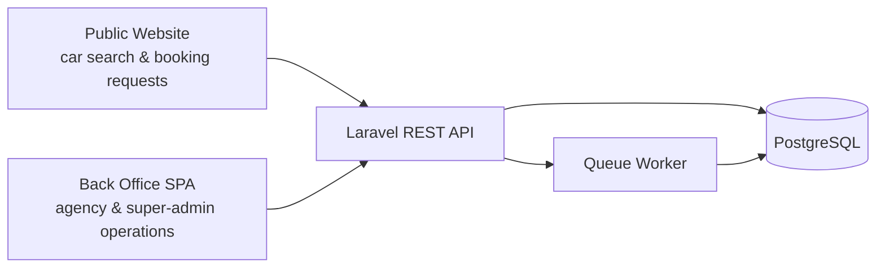

---

## 2. Product Vision

**Vision statement:** *Give any car rental agency — from a 5-car local operator to a 500-car regional fleet — a modern back office to run their business, and give renters a single place to search cars across many agencies at once.*

| Dimension | Detail |
|---|---|
| **Who it's for (agencies)** | Independent and small-to-mid-size car rental agencies who currently run on spreadsheets, WhatsApp, or legacy desktop software |
| **Who it's for (renters)** | Travelers/customers who want to compare cars across agencies by region, price, and category without visiting each agency's own site |
| **Core problem solved** | Fragmentation — agencies lack affordable software; renters lack a unified search experience |
| **Value prop for agencies** | Fast onboarding, no infra to manage, fleet/reservation/invoice management in one place |
| **Value prop for renters** | One search, many agencies, transparent availability and pricing |
| **What it is *not* (v1)** | Not a payment processor, not a fleet-telematics/IoT product, not a marketplace that takes commission (v1 is a SaaS subscription/listing model, not a transaction-fee marketplace) |

**Guiding product principles**
- **Boring technology where it doesn't matter, sharp engineering where it does.** Multi-tenancy, auth, and data integrity get the most rigor.
- **Agency data isolation is non-negotiable.** No agency should ever be able to see another agency's data, even in the event of an application bug — isolation is enforced at multiple layers, not just the UI.
- **Public site is read-heavy and cache-friendly**; back office is write-heavy and consistency-sensitive. These are architecturally different problems and are treated as such (see §7, §12).

---

## 3. Business Goals

**Product/business goals**
- Prove a viable SaaS model for car rental agencies (subscription-based access to the back office).
- Aggregate enough agencies/listings that the public site becomes a genuinely useful search surface (a two-sided marketplace dynamic, even without payments in v1).
- Keep infrastructure cost low enough that a single small VPS can host the MVP profitably.

**Portfolio/demonstration goals** (equally real — this is a dual-purpose project)
- Demonstrate **multi-tenant SaaS architecture** done correctly (a top interview topic).
- Demonstrate a **complete DevOps lifecycle**: Docker → CI → CD → monitoring → backups, not just "it runs on my machine."
- Demonstrate **production-grade Laravel + React** architecture: clean domain boundaries, typed API contracts, tested code, documented decisions.
- Produce documentation good enough to be **read on its own** as evidence of engineering maturity — this blueprint and its successors are deliverables, not scaffolding.

**Success metrics (indicative, not contractual)**

| Metric | MVP target |
|---|---|
| Agency onboarding time | < 10 minutes from signup to first car listed |
| Public search response time | < 300ms p95 (cached) |
| Back-office API response time | < 200ms p95 (uncached, typical CRUD) |
| CI pipeline duration | < 8 minutes |
| Test coverage (backend domain logic) | > 70% on core modules (reservations, invoicing, tenancy scoping) |
| Uptime (post-launch) | 99.5% (single-region MVP, no HA yet) |

---

## 4. Feature Overview

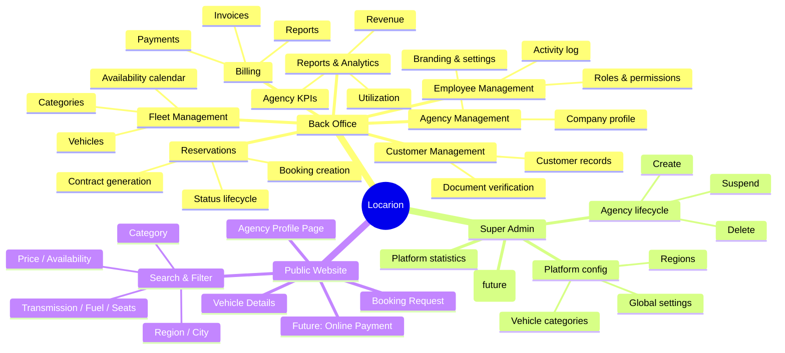

---

## 5. Module Breakdown

Modules are organized as **bounded contexts** — each maps to a Laravel domain folder and, where relevant, a React feature folder (see §12–13). This is the seed for the later "Module Breakdown" and "Folder Structure" documents.

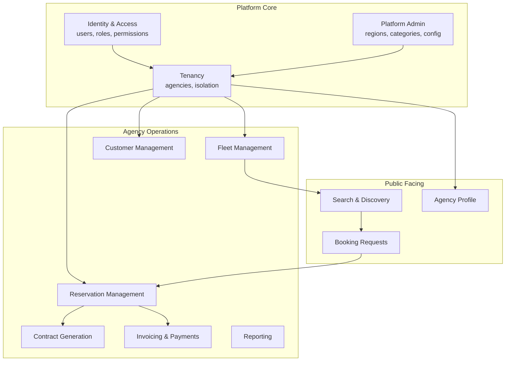

| Module | Owns | Depends on |
|---|---|---|
| Identity & Access | Users, roles, permissions, auth tokens | — |
| Tenancy | Agency entity, tenant scoping/isolation | Identity & Access |
| Platform Admin | Regions, vehicle categories, global settings, agency lifecycle | Identity & Access |
| Fleet Management | Vehicles, categories, availability | Tenancy |
| Customer Management | Customer records per agency | Tenancy |
| Reservation Management | Booking lifecycle, status transitions | Fleet, Customer |
| Contract Generation | PDF rental contracts | Reservation |
| Invoicing & Payments | Invoices, payment records | Reservation |
| Reporting | Aggregated views over the above | All agency modules |
| Search & Discovery | Public read-only search index over Fleet + Tenancy | Fleet, Tenancy |
| Agency Profile | Public-facing agency page | Tenancy |
| Booking Requests | Public → back-office handoff | Reservation |

---

## 6. User Roles

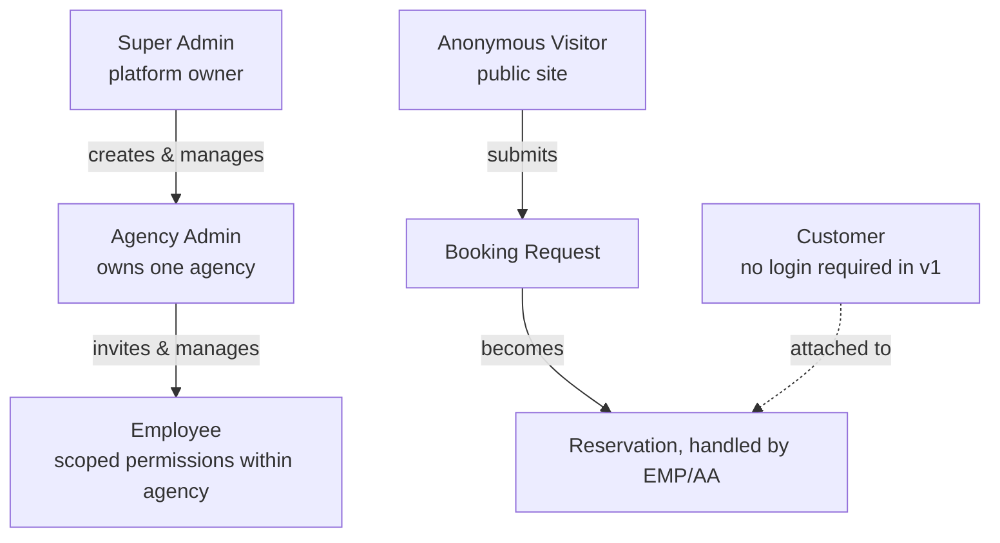

| Role | Scope | Can do (representative) | Cannot do |
|---|---|---|---|
| **Super Admin** | Platform-wide | Create/suspend/delete agencies, manage regions & categories, view platform stats, manage global settings | Cannot see agency operational data (reservations, customers) unless explicitly impersonating for support, which is logged |
| **Agency Admin** | Own agency only | Everything within their agency: employees, fleet, customers, reservations, billing, reports, company settings | Cannot access other agencies' data; cannot touch platform-level config |
| **Employee** | Own agency, permission-scoped | Subset of Agency Admin actions based on assigned permissions (e.g., "front desk" vs "fleet manager" vs "accountant") | Cannot manage other employees' roles (unless granted); cannot change company settings by default |
| **Customer** | Self only, no auth in v1 | Is referenced by reservations/contracts; identified by phone/email/document at booking time | No portal/login in v1 (future enhancement, see §19) |
| **Anonymous Visitor** | Public site only | Search, view, submit a booking request | No access to any back-office data |

> **Decision:** Customers do **not** get login accounts in v1. Reservations are entered by agency staff (or created from a public booking *request* that staff approve). This mirrors how most small rental agencies actually operate today and meaningfully shrinks v1 scope (no customer auth, password resets, customer-facing dashboards). Alternative considered: full customer accounts with self-service booking + history — deferred to v2 (see §19) once agency-side workflows are proven.

Role/permission mechanics (RBAC library choice, permission matrix, policy design) are detailed in the later **Authorization & Roles** document.

---

## 7. High-Level Architecture

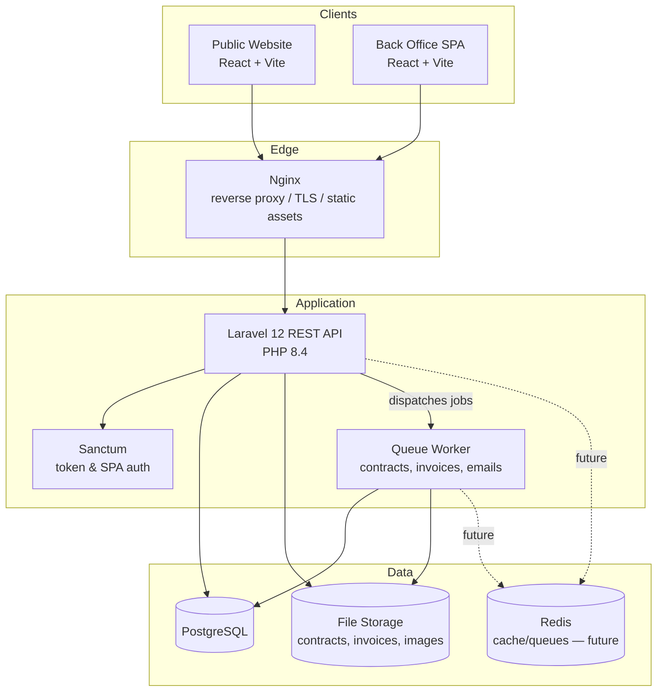

**Why a single API serving two frontends, rather than two separate backends?**

| Approach | Pros | Cons |
|---|---|---|
| **One Laravel API, two SPAs (chosen)** | Single source of truth for domain logic (pricing, availability); one deployment/CI pipeline; public search reuses the exact same fleet/pricing logic the back office uses, so no drift | Public and authenticated concerns share a codebase (mitigated by clean module boundaries and route-level separation, `/api/v1/public/*` vs `/api/v1/*`) |
| Separate "public API" microservice + "back office API" | Clean deployment isolation, independently scalable | Massive overkill at this scale; duplicated domain logic (fleet/pricing) risks drift; two CI pipelines, two deploy targets for a portfolio-scale product |

Given the scale (single deployment, one team), a modular monolith is the right call — the module boundaries in §5 are what keep it from becoming a "big ball of mud," and are exactly what would be extracted into services later if Locarion ever needed to scale that way (see §19).

**Why React SPA for the public site instead of a server-rendered/SSR approach (e.g., Next.js)?**

The spec fixes React + Vite for the frontend. The trade-off worth naming: a pure client-rendered SPA is **weaker for SEO** than SSR, which matters for a public car-search site that wants organic discovery. Mitigations planned: pre-rendered meta tags for key landing pages (regions/categories), a sitemap, and — if SEO proves to matter more than expected post-launch — an SSR migration (Next.js or Inertia+SSR) is an isolated, well-contained future change because the API layer doesn't change at all.

---

## 8. Technology Stack

| Layer | Choice | Notes |
|---|---|---|
| Backend framework | Laravel 12 (PHP 8.4) | Mature ecosystem, first-class ORM, batteries-included for a solo/small-team SaaS |
| API style | REST (JSON) | Simpler tooling and caching story than GraphQL for this domain; revisit only if client data-shaping needs explode |
| Frontend | React + TypeScript + Vite | Type safety across a large domain model (reservations, contracts, invoices) pays for itself quickly |
| Database | PostgreSQL | Strong constraints/JSONB support, best-in-class for multi-tenant row-level patterns |
| Auth | Laravel Sanctum | SPA cookie-based auth for first-party SPAs + token auth if a future mobile client appears |
| RBAC | Spatie `laravel-permission` (planned) | Battle-tested roles/permissions package, avoids reinventing ACL primitives |
| Containerization | Docker + Docker Compose | Reproducible dev environments, single artifact promoted from dev → CI → prod |
| CI/CD | GitHub Actions | Native to GitHub hosting, no third-party CI account needed |
| Web/reverse proxy | Nginx | TLS termination, static asset serving, routing to PHP-FPM |
| Deployment target | Linux VM (single host, MVP) | Cost-effective for portfolio scale; documented path to multi-host later |
| Caching/Queues (future) | Redis | Deferred until real load justifies it (see §19); Laravel's database queue driver is enough for MVP volume |

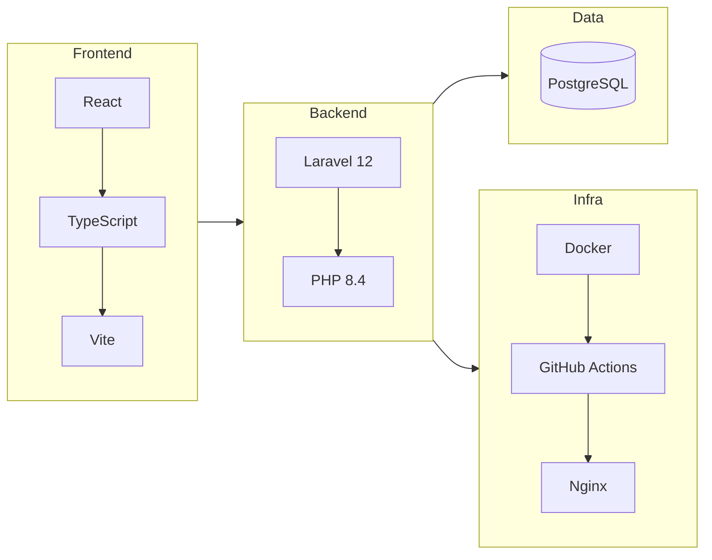

---

## 9. Database Overview

High-level entity map only — full column-level schema and normalization discussion lives in the later **Database Design & ERD** document.

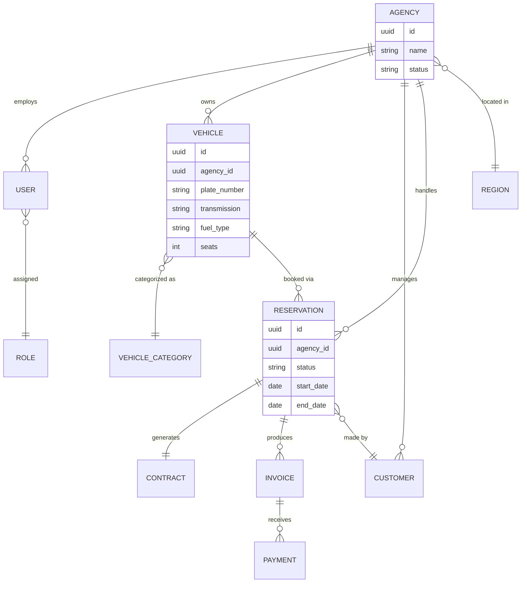

**Key modeling decisions to carry into detailed design:**
- Every tenant-scoped table carries an `agency_id` foreign key (see §10) — this is the backbone of the isolation strategy.
- Vehicles, Customers, Reservations, Contracts, Invoices, and Payments are all agency-scoped. Regions and Vehicle Categories are **platform-level** (managed by Super Admin, referenced by all agencies).
- IDs are UUIDs, not auto-increment integers, specifically because tenant-scoped resources are exposed over a REST API — sequential IDs would leak record counts/enumeration risk across a multi-tenant system.

---

## 10. Multi-Tenancy Overview

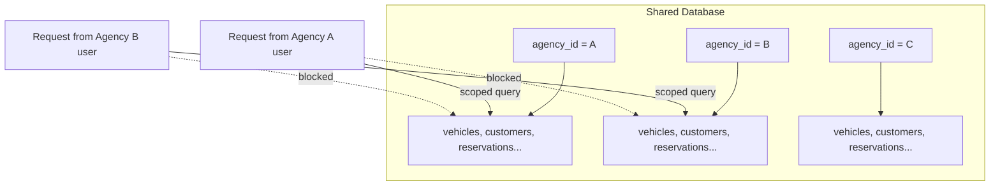

**Decision: shared database, shared schema, row-level tenant scoping (`agency_id` column + Laravel global scopes/policies).**

| Strategy | Isolation strength | Ops complexity | Cost at this scale | Chosen? |
|---|---|---|---|---|
| Shared DB, `agency_id` column, global scopes | Good (app-enforced, reinforced by DB constraints/policies) | Low — one schema, one migration path | Low | ✅ Yes, for v1 |
| Schema-per-tenant (Postgres schemas) | Stronger (DB-level boundary) | Medium — migrations must run per-schema | Medium | Reconsider if a large enterprise agency demands stronger isolation guarantees |
| Database-per-tenant | Strongest | High — connection management, per-tenant migrations/backups | High | Overkill until agency count and contractual isolation requirements justify it |

**Why row-level over schema/DB-per-tenant for v1:** at the target scale (many small-to-mid agencies), a shared schema keeps migrations, backups, and reporting trivial — one migration run updates every tenant, one backup job covers everyone, and cross-agency platform analytics (Super Admin stats) are a plain `GROUP BY agency_id` instead of a fan-out query across N databases. The isolation risk is real but well understood and mitigated in layers (see below), and the strategy is explicitly designed so a *specific* tenant could be peeled off into its own schema/database later without a full rewrite (§19).

**Defense in depth for isolation (detailed in the later Multi-tenancy document):**
1. Every Eloquent model for a tenant-scoped table uses a **global scope** that auto-injects `WHERE agency_id = :current_tenant`.
2. Every authorization **Policy** double-checks `agency_id` ownership regardless of the global scope (defense in depth — a forgotten scope should never be the only thing standing between Agency A and Agency B's data).
3. Route-model binding is tenant-aware: fetching `Vehicle` by ID for the wrong agency returns 404, not 403 (avoids confirming record existence to other tenants).
4. Database-level `NOT NULL` constraints on `agency_id` plus (later) row-level security policies as a last-resort backstop.

---

## 11. API Overview

- **Style:** REST, JSON, versioned from day one: `/api/v1/...`
- **Auth:** Sanctum SPA cookie auth for the two first-party SPAs; the API is structured so token auth (for a future mobile app or partner integration) is additive, not a redesign.
- **Two route surfaces, one API:**
  - `/api/v1/public/*` — unauthenticated, cacheable, rate-limited (search, vehicle details, agency profile, booking request submission)
  - `/api/v1/*` — authenticated, tenant-scoped (everything in the back office) + `/api/v1/admin/*` for Super Admin-only routes

**Representative resource groups (full spec in the later API Design document):**

| Group | Example endpoints |
|---|---|
| Auth | `POST /login`, `POST /logout`, `GET /me` |
| Agencies (admin) | `GET/POST /admin/agencies`, `POST /admin/agencies/{id}/suspend` |
| Fleet | `GET/POST /vehicles`, `PATCH /vehicles/{id}/availability` |
| Customers | `GET/POST /customers` |
| Reservations | `GET/POST /reservations`, `POST /reservations/{id}/status` |
| Contracts | `GET /reservations/{id}/contract` (PDF) |
| Billing | `GET/POST /invoices`, `POST /invoices/{id}/payments` |
| Reports | `GET /reports/revenue`, `GET /reports/utilization` |
| Public search | `GET /public/vehicles/search?region=&category=&price_max=...` |
| Public detail | `GET /public/vehicles/{id}`, `GET /public/agencies/{id}` |
| Booking request | `POST /public/booking-requests` |

**Design intent:** predictable REST conventions (resourceful controllers, consistent pagination envelope, consistent error shape), so the later API Design doc is mostly about filling in this skeleton rather than inventing conventions from scratch.

---

## 12. Frontend Overview

Two independent React + TypeScript + Vite applications, sharing a component/design-system package:

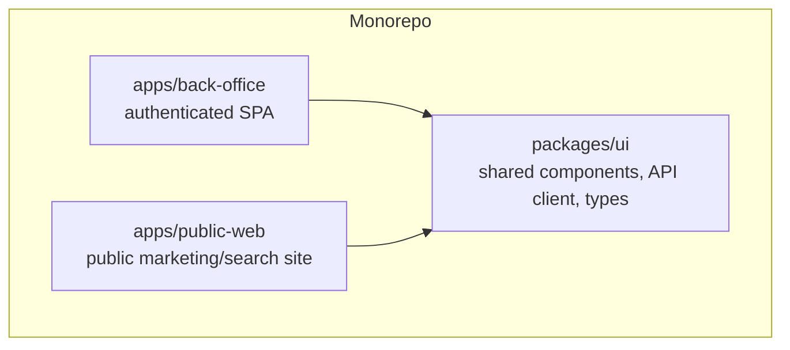

| App | Concerns | State/data approach |
|---|---|---|
| `back-office` | Auth-gated, role-aware routing, dense data tables/forms | React Query for server state, lightweight local state (Zustand/Context) for UI state |
| `public-web` | Public search/filter UX, SEO-friendly landing pages, performance-first | React Query for server state; static/prerendered content where possible |
| `packages/ui` | Design tokens, shared components, generated TypeScript types from the API (OpenAPI or a typed client) | — |

**Why a monorepo for two apps + a shared package?** Keeps the API contract and design system in one place so both apps evolve together without version-skew between two separate repos. A single `pnpm`/`turbo` (or npm workspaces) setup is enough at this scale — not adopting a heavier tool (Nx) until the number of apps/packages actually justifies it.

---

## 13. Backend Overview

Laravel 12 organized around the **module boundaries from §5**, not the framework's default flat `app/Http/Controllers` sprawl:

- Domain-oriented folders (`app/Domain/Fleet`, `app/Domain/Reservation`, etc.) each with their own Models, Actions/Services, Policies, and Requests.
- **Actions/Services over fat controllers** — controllers stay thin (validate → call action → return resource), business logic (pricing, availability checks, status transitions) lives in single-purpose Action classes that are easy to unit test in isolation from HTTP.
- **API Resources** (Laravel's `JsonResource`) for every response shape — no leaking Eloquent models directly into JSON.
- **Form Requests** for all input validation, colocated with the domain module they belong to.
- **Policies** for every tenant-scoped model, checked explicitly even where a global scope already applies (see §10).
- **Queued jobs** for anything slow or non-critical-path: PDF contract generation, invoice PDF generation, transactional email — keeps API response times fast and predictable.

Full package choices, exact directory tree, and coding conventions are detailed in the later Architecture and Backend Roadmap documents.

---

## 14. DevOps Roadmap

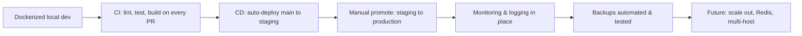

| Phase | Goal | Key deliverables |
|---|---|---|
| 1. Local Dev | Reproducible environment | `docker-compose.yml` for app, db, web, queue |
| 2. Continuous Integration | Catch regressions before merge | GitHub Actions: lint, static analysis, backend tests, frontend tests, build check |
| 3. Continuous Delivery | Fast, safe releases | Auto-build & push Docker images on merge to `main`; auto-deploy to staging |
| 4. Production Deployment | Real environment | Manual/gated promotion to production; zero/low-downtime deploy strategy |
| 5. Observability | Know when something breaks *before* a user reports it | Health checks, structured logs, uptime + error monitoring |
| 6. Resilience | Don't lose data | Automated DB backups + restore drills |
| 7. Scaling (future) | Handle real growth | Redis, horizontal app scaling, managed Postgres |

---

## 15. Development Roadmap

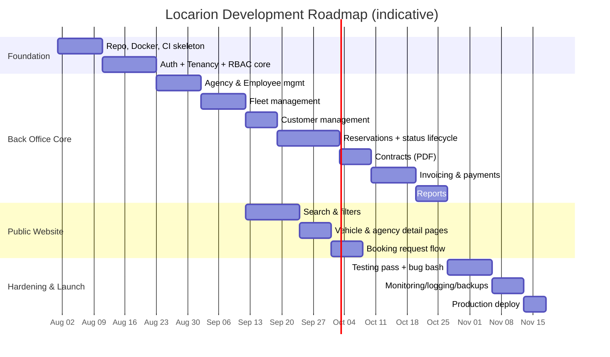

Notes:
- Public Website (`c1`–`c3`) starts once Fleet Management exists, since search reads from the same fleet data — it deliberately runs **in parallel** with later back-office modules rather than strictly after them.
- This Gantt is indicative for planning conversations, not a committed schedule — real dates land in the Sprint Planning document once resourcing is known.

---

## 16. Git Strategy

**Recommended: trunk-based development with short-lived feature branches**, not full GitFlow.

| Approach | Fits when | Trade-off |
|---|---|---|
| **GitHub Flow / trunk-based (chosen)** | Small team or solo, frequent small releases, CI/CD driven | Requires discipline around small PRs and feature flags for anything half-finished |
| GitFlow (`develop`, `release/*`, `hotfix/*`) | Larger teams, scheduled/versioned releases, multiple versions in production at once | More ceremony than this project's team size and release cadence justify |

```mermaid
graph LR
    main((main)) -->|feature/auth-sanctum| F1[PR + CI] --> main
    main -->|feature/fleet-crud| F2[PR + CI] --> main
    main -->|fix/tenant-scope-leak| F3[PR + CI, expedited| main
    main -->|tag| Rel[v0.3.0]
```

- `main` is always deployable; every feature branch is short-lived and merges via PR gated by CI (see §14, and the later CI/CD document).
- Conventional Commits (`feat:`, `fix:`, `chore:`, `docs:`...) are used from commit #1 so changelog generation and semantic versioning are automatic later — full convention detailed in the later Git & Release Strategy document.

---

## 17. Deployment Overview

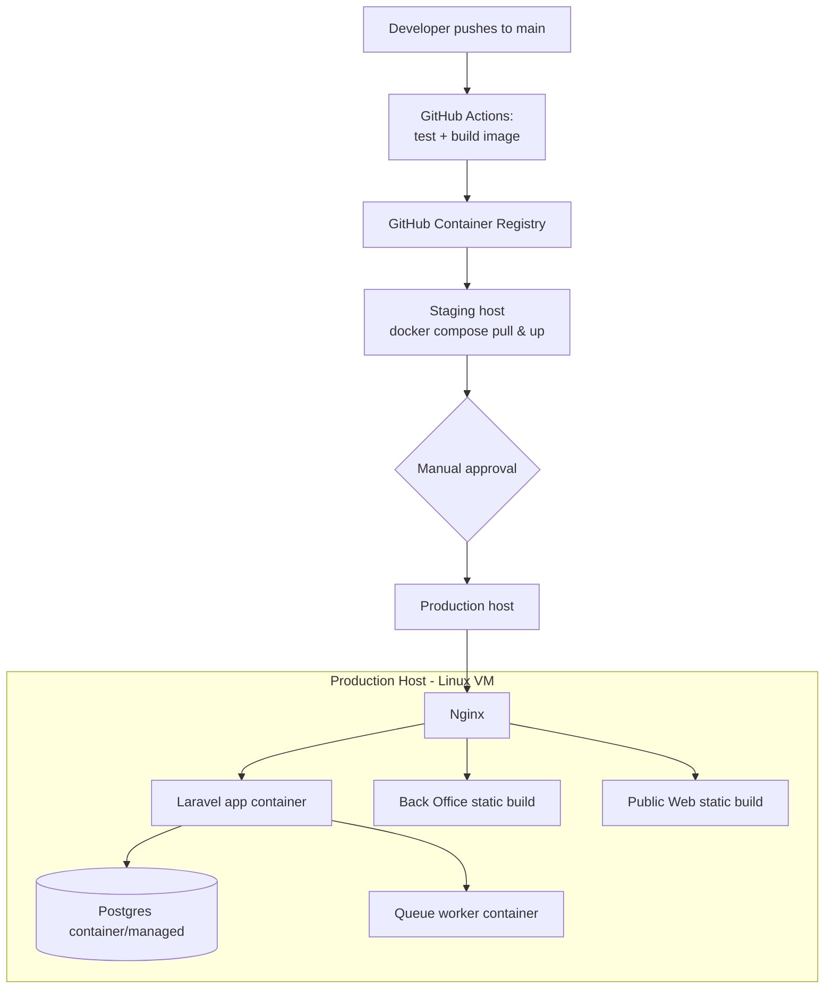

- **MVP target:** single Linux VM running the full Docker Compose stack behind Nginx — cheapest option that still demonstrates a real deployment pipeline end-to-end.
- **Promotion path:** image built once in CI, the *same* image is deployed to staging and then production (never rebuilt per-environment) — this is the detail that proves "what you tested is what you shipped."
- Full pipeline YAML structure, zero-downtime strategy, and rollback plan are in the later CI/CD & Deployment document.

---

## 18. Project Milestones

| Milestone | Description | Exit criteria |
|---|---|---|
| **M0 — Foundation** | Repo, Docker Compose, CI skeleton, base Laravel + React apps boot | `docker compose up` gives a working empty app; CI runs on every PR |
| **M1 — Identity & Tenancy** | Auth (Sanctum), roles/permissions, agency model, tenant scoping proven | A second agency's data is provably invisible to the first (test-covered) |
| **M2 — Fleet & Public Search MVP** | Vehicles, categories, availability; public search/filter/detail pages | An agency can list a car and a visitor can find it via search |
| **M3 — Reservations & Contracts** | Full booking lifecycle, PDF contract generation | An employee can create, confirm, and close a reservation with a generated contract |
| **M4 — Billing** | Invoices, payment recording, revenue reports | An agency can invoice a reservation and record a payment |
| **M5 — Hardening & Launch** | Test coverage pass, monitoring, logging, backups, production deploy | Staging and production both running, backups verified restorable |
| **M6 — Post-launch polish** | Bug fixes from real usage, documentation pass for portfolio presentation | Public repo/documentation is presentation-ready |

Detailed sprint-by-sprint breakdown lives in the later Project Management & Planning document.

---

## 19. Future Enhancements

Explicitly **out of scope for v1**, tracked here so scope creep is a conscious decision, not an accident:

- **Online payments** (Stripe/local payment gateway integration) for the booking-request flow.
- **Customer accounts** — self-service login, booking history, saved preferences (see §6 decision).
- **Subscription billing for agencies** (metered/tiered SaaS plans, currently just Super-Admin-managed accounts).
- **Redis** for caching (public search) and queue driver (replacing the database queue driver) once volume justifies it.
- **Notifications** — email/SMS for booking confirmations, reminders, contract expiry.
- **Multi-language support** (the founder's own project history suggests Arabic/French alongside English are realistic candidates given likely target markets).
- **Native mobile app** consuming the same API via Sanctum token auth (already accounted for in §11's auth design).
- **Elasticsearch/typesense** for public search if filter/facet complexity outgrows Postgres full-text/indexed queries.
- **Schema-per-tenant or DB-per-tenant** migration path for a specific large enterprise agency needing stronger contractual isolation (see §10).
- **Horizontal scaling / multi-host deployment**, managed Postgres, and a proper HA story once traffic justifies moving off the single-VM MVP topology.

---

## 20. Master Mind Map (Whole System, One Diagram)

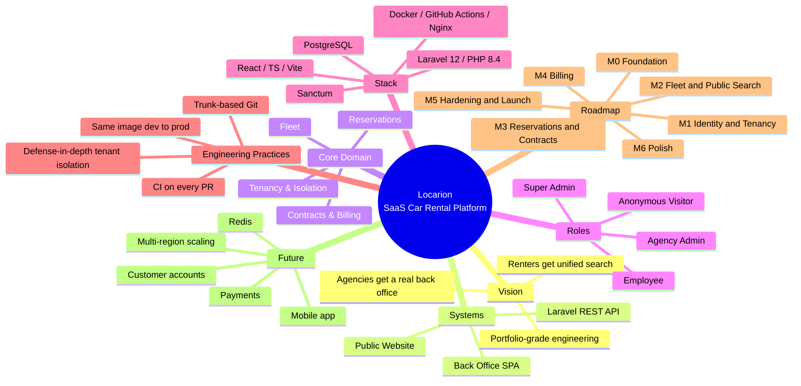

---

*This blueprint is the shared mental model for Locarion. Nothing here is final engineering spec — the next step, once this is approved, is expanding each section into its own detailed document (Vision, Functional/Non-functional Requirements, Architecture, Database Design, API Design, etc.) as originally scoped.*

**Awaiting confirmation before proceeding to detailed documentation.**
